## What is GSpawn - Level Designer?

GSpawn allows you to build and edit scenes inside the Unity Editor using a plethora of tools such as tile rules, curve spawn, modular snapping to name just a few. It can be used for creating modular & outdoor environments and tile worlds.

## Additional Info

In addition to the info provided in this document, you may also want to take a look at the tutorial videos listed [here](https://youtube.com/playlist?list=PLPwpt1oIEdwBiu6PkQLmj7xEbvn2TDVBu). It is recommended that you start with the following 2 intro tutorials before reading this document:

- [GSpawn - Intro (Part 1) (Getting Started with Modular Environments)](https://www.youtube.com/watch?v=moZyLynFbok)
- [GSpawn - Intro (Part 2)(Getting Started with Outdoor Environments)](https://www.youtube.com/watch?v=5hIt66ADm9Q&t=0s)

Although this document does discuss some of the hotkeys which are available, it doesn't contain a complete list.  For a complete list of hotkeys, please see the **GSpawn - Shortcuts** document in the **GSpawn - Level Designer/Docs** folder.

---

**Note: **This document will focus on the most important features and it doesn't contain a complete listing of the settings/UI controls. Most of the UI controls contain useful tooltips which can clarify their purpose.

---

## Support

For support, contact **octamodius@yahoo.com**

## Assets

The following assets are used in the screenshots and **are not part of the GSpawn - Level Designer package**:

- [Multistory Dungeons](https://assetstore.unity.com/packages/3d/environments/dungeons/multistory-dungeons-33955) by [Mana Station](https://assetstore.unity.com/publishers/12379)
- [Medieval Environment Pack](https://assetstore.unity.com/packages/3d/environments/historic/medieval-environment-pack-6859) by [Manufactura K4](https://assetstore.unity.com/publishers/585)
- [Fantastic Village Pack](https://assetstore.unity.com/packages/3d/environments/fantasy/fantastic-village-pack-152970) by [Tidal Flask Studios](https://assetstore.unity.com/publishers/43636)
- [Village Interiors Kit](https://assetstore.unity.com/packages/3d/environments/fantasy/village-interiors-kit-17033) by [3DForge](https://assetstore.unity.com/publishers/2970)
- [Voxel Blocks Pack](https://assetstore.unity.com/packages/3d/environments/fantasy/voxel-blocks-pack-52227) by [Tsunoa](https://assetstore.unity.com/publishers/18023)

## Installation

- create a new project in Unity;

- import the GSpawn - Level Designer package;

- in the top menu, click on  **Tools > GSpawn > Initialize**:

  

---

**Note**: Once you click on **Initialize**, the plugin will create a **Data** folder and populate it with some of the asset files that it needs to store different settings. This might require you to wait a little bit until the necessary files are created.

---

When finished, the hierarchy view will show a new object in the scene called **GSpawn** and the scene view will display a grid. At this point initialization is complete. **You need to have the GSpawn object selected in the hierarchy view in order to interact with the plugin**.

---

**Note: **You will need to perform this step for each scene in your project. So when you are done with one scene, and would like to create a new scene, you need to click on **Tools > GSpawn > Initialize** again.

---

## The Inspector

When the GSpawn object is selected, the Inspector will show a few toolbars:

The top toolbar has 3 buttons. Pressing one of these buttons will activate a new mode of operation. The different modes of operation, listed from left to right, are:

- **Object Spawn** - spawn objects in the scene using different spawn tools;
- **Object Selection** - select objects and manipulate them using different tools;
- **Object Erase** - erase objects using different erase tools;

In the image above, the first button is active which means object spawn mode is active. The toolbars sitting below the top toolbar contain different buttons that activate different spawn tools.

Clicking on these buttons will change the Inspector UI to contain the settings/controls that are specific to the tool you are using.

### Same UI-Different Settings

You will notice while working with the plugin, that some settings appear in multiple places. For example, **Modular Snap** and **Mirror Settings** are used by different tools and you will see their UIs appear in different contexts. It is important to remember that each UI is mapped to a unique instance of those settings. That means that these settings are **not shared**. For example, **Modular Snap** settings appear in the UI when working with the **Modular Snap Spawn**, **Modular Walls Spawn**, **Segments Spawn**, **Box Spawn** and in **Object Selection** mode. However, each of these tools/modes use their own copy of those settings. Making changes to the snap settings in one context, doesn't affect the other settings.

## Prefab Management

In order to use the plugin functionality, you need to specify the prefabs you are going to use.

In GSpawn, prefabs are organized in prefab libraries. Each prefab library can contain a certain category of prefabs.

In order to setup your prefabs, you need to open 2 windows: Prefab Library and Prefab Manager windows.

To open the Prefab Library Manager window:

- open **Tools > GSpawn > Windows > Prefab Library Manager...**

To open the Prefab Manager window:

- open **Tools > GSpawn > Windows > Prefab Manager...**

You can then dock these windows anywhere you wish. The next image shows these 2 windows docked next to each other:

### Creating Prefab Libraries

#### Dropping Prefab Folders

The easiest way to create prefab libraries and populate them with prefabs is by dropping prefab folders in the Prefab Library Manager window. Simply select a folder that contains prefabs and then drag and drop it onto the blank area inside the Prefab Library Manager.

The next image shows the state of these 2 windows after a prefab folder has been dropped inside the prefab library window:

The folder **Multistory Dungeons 2** was dropped in the prefab library manager and the plugin has created a **hierarchy** of prefab libraries that resembles the folder structure. Any folders that are **empty or which don't have any child folders that contain prefabs**, are excluded. 

The orange tinted libraries are empty, but they contain child libraries that contain prefabs. When a library contains prefabs, the number of prefabs will be shown to the far right of the library name.

Clicking on a prefab library will update the Prefab Manager window which will show a preview with all the prefabs that exist in that library. You can select multiple libraries at once by holding down **[CTRL]** when clicking. The prefab manager will always show the contents of all selected libraries.

#### Manual Library Creation

You can also create libraries manually by entering a name in the bottom most text field and then clicking on the plus icon. In order to populate a library that was created manually, you must select prefab assets in the project view and then drop them inside the **Prefab Manager** window.

### Library Visibility

Each library has an **eye** icon to the left of its name. Clicking on this icon will allow you to toggle the visibility of the library. When a library is visible, its prefabs will show up in the prefab manager. When invisible, its prefabs will be hidden. This can be used as a filtering mechanism.

If a library is hidden, all its child libraries will also be hidden.

### Moving/Copying Prefabs Between Libraries

You can copy prefabs from one library to another using the following steps:

- select prefabs in the prefab manager;
- press **[CTRL + C]**;
- select the library (or libraries) where you would like to copy the prefab;
- press **[CTRL + V]**;

OR

- select prefabs in the prefab manager;
- hold down **[ALT]**;
- drag and drop the prefabs into the destination library;

You can also copy entire libraries:

- select the libraries you wish to copy;
- press **[CTRL + C]** (the libraries will turn green);
- select the destination library (or libraries);
- press **[CTRL + V]**;

In order to move prefabs from a library to another library, follow the next steps:

- select prefabs in the prefab manager;
- drag and drop them in the destination library;

### Prefab Previews

Prefab previews can be rotated by holding down the **middle mouse button** and moving the mouse. 

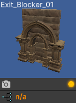

At the top of the preview you can see the name of the prefab asset.

The first row at the bottom, contains a small camera button which will reset the preview rotation back to **0** and a small yellow glowing button which will highlight the prefab asset in the project window.

The second row at the bottom informs you whether or not the prefab is linked to an [object group](##Object Groups). 

### Prefab Library Profiles

It is possible to organize your prefab libraries into **prefab library profiles**. Profiles are used in many places in the plugin. They are essentially a way to quickly switch between different **configurations of settings/data**. With respect to prefab libraries, you could for example, have a library profile that you use in one scene and a different profile that can be used in a different scene. There can only be **one active profile** and the prefab library will only show the libraries of the active profile.

#### Creating a Prefab Library Profile

In order to create a new library profile:

- in the prefab library manager window, click on the top-most drop-down menu (initially it will contain a single item called **Default**);

- then click on **Create new profile...**

  

- a new window will appear:

  

- enter a name for the profile and click on **Create**.

The new profile will be marked as the new active profile:

You can now populate the profile with libraries and prefabs using the methods discussed previously.

## Object Spawn Tools

The following spawn tools are available:

1. [Modular Snap Spawn](###Modular Snap Spawn)
2. [Modular Walls Spawn](###Modular Walls Spawn)
3. [Segments Spawn](###Segments Spawn)
4. [Box Spawn](###Box Spawn)
5. [Tile Rule Spawn](###Tile Rule Spawn)
6. [Props Spawn](###Props Spawn)
7. [Scatter Brush Spawn](###Scatter Brush Spawn)
8. [Curve Spawn](###Curve Spawn)
9. [Physics Spawn](###Physics Spawn)

### The Spawn Guide

Some of the spawn tools work by creating a spawn guide object in the scene which you can move with the mouse cursor in order to establish the spawn location. The spawn guide is simply an indicator of where the next object will be placed.

The following spawn tools use a spawn guide as indicator:

- **Modular Snap Spawn**;
- **Modular Walls Spawn**;
- **Segments Spawn**;
- **Box Spawn**;
- **Props Spawn**;

When using any of the tools mentioned above, you need to **double-click** on a prefab in the prefab manager window in order to create a spawn guide. Then, move the mouse in the scene to establish a spawn location. Left click to spawn. 

---

**Note: ** The way the spawn guide is moved in the scene with the mouse depends on the active spawn tool. For example, in **Modular Snap Spawn**, the guide will be snapped to the grid. In **Props Spawn**, it will be snapped to mesh or terrain surfaces.

---

#### Spawn Guide Rotation

You can rotate the spawn guide using the following hotkeys:

- **[X]** - rotate around grid X axis;
- **[Y]** - rotate around grid Y axis;
- **[Z]** - rotate around grid Z axis;

All the hotkeys above will use the spawn guide pivot as the rotation pivot. If you wish to use the spawn guide bounds center as the pivot, you have to also hold down **[SHIFT]** while pressing the **X/Y/Z** buttons.

You can press **[I]** to reset the object rotation to the rotation stored in the prefab asset

When rotating the spawn guide with these hotkeys, the default rotation is **90**. If you wish to change the rotation step, open **Edit > Preferences...**

This will open Unity's Preferences window. In the left pane, click on **Input** under the **GSpawn** parent item:

You can now change the keyboard rotation step for each axis individually.

#### Picking Prefabs From Scene Objects

Instead of **double clicking** on prefab previews in the prefab manager to change the spawn guide prefab, you can also pick prefabs from the scene directly. This is much faster instead of searching through prefabs in the manager.

Simply hold down **[ALT]** and left click on a scene object. 

---

**Note: **This only works as long as the object you click on **is an instance of a prefab that exists in the prefab manager**.

---

### Modular Snap Spawn

Modular snapping represents the act of snapping objects to the scene grid. When this spawn tool is active, the spawn guide will be snapped to the grid  as you move the mouse. **When you left click, a new object will be spawned in the scene**. This allows you to populate your environment by placing one object at a time.

---

**Note: **Although **Modular Snap** is a spawn tool, modular snapping is actually used in different places. Other spawn tools such as **Modular Walls, Segments and Box** also use modular snapping to snap the spawn guide. Also the **Object Selection** mode uses modular snapping to snap selected objects which is very handy when making changes to the scene.

---

#### Moving Up/Down

It is sometimes useful to be able to move the spawn guide up/down. You can use the **[Q]** & **[E]** hotkeys for this purpose. They will move the spawn guide down & up respectively. The amount of movement is the same as the **grid cell size along the Y axis**.

The same can be achieved if you hold down **[CTRL + SHIFT]** and use the mouse scroll wheel to offset the guide.

Press **[R]** in order to reset the offset back to **0**.

#### Y Axis Rotation

In Modular Snap, you can rotate the spawn guide by holding down **[SHIFT]** and using the mouse scroll wheel. This is in addition to the  **X/Y/Z** hotkeys discussed earlier.

#### Grid Snap Climb

Moving up/down using hotkeys or mouse scroll wheel is flexible, but sometimes you may desire a more automatic behavior. This behavior is called **grid snap climb** and you can find the associated field in the Inspector:

You can also toggle grid snap climb on/off using **[SHIFT + C]**.

When grid snap climb is active, the spawn guide will 'climb' objects in the scene and it will also be snapped to the grid. This works really well for objects that are supposed to sit on top of other objects (e.g. walls on top of floors, decorative elements on walls etc).

#### Object-to-Object Snap

Modular snapping has 2 modes of operation: grid snap (which we already discussed) and object-to-object snap. You can switch between these 2 by pressing **[S]**. 

When object-to-object snap is active, the spawn guide will no longer snap to the grid. Instead, it will snap to nearby objects. 

---

**Note: **Object-to-object snapping doesn't work well with prefabs that have bumps or decorative elements on the sides. It is ideal when working with walls, floors or any other similar structures that have flat side-surfaces. And it is especially suited for working with tile blocks (i.e. cubes).

---

#### Alignment Highlights & Hints

When snapping objects, you will usually want to be precise and sometimes you may want objects to line up in a certain direction. When using a smaller grid cell size (e.g. **0.5** or **1**) this can become difficult when objects are far apart because it is hard to tell wether their positions line up correctly.

The plugin assists you by highlighting nearby objects when they line up with the spawn guide along one of the grid axes. The next image shows an example of this:

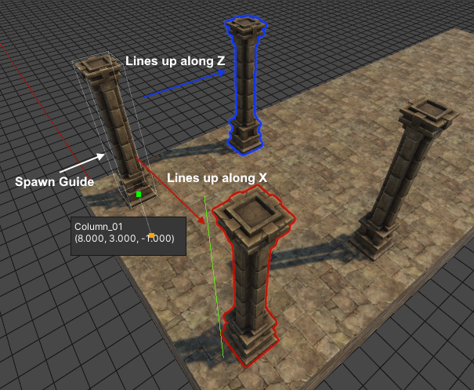

In the image above 3 columns have been spawned on top of a floor. The spawn guide has been placed in the corner and the highlights were used to ensure that it lines-up properly along the grid X and Z axes.

In conjunction with the **alignment highlights**, the plugin can also give you **alignment hints** which are labels attached to nearby objects. Only those objects that line-up with the span guide will display alignment hints.

In the image below, the hint labels were used to spawn 3 successive equally spaced columns:

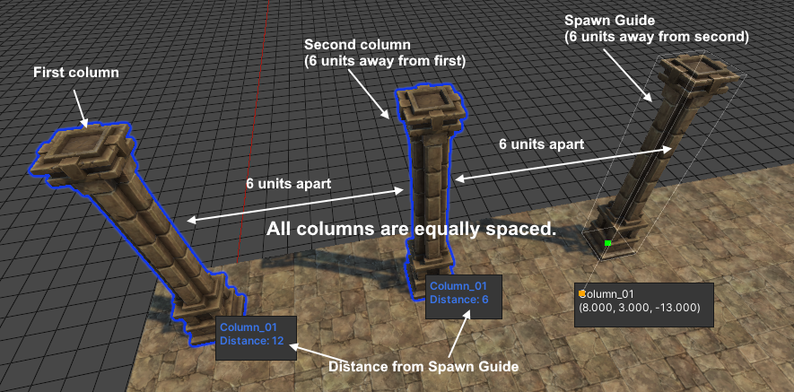

The labels show the name of the object to which they are attached and a distance value. This distance value represent the distance from the spawn guide. In this example, the columns were spawned from left to right at a distance of 6 units from each other. **By spawning each new column at a distance of 6 units away from the previous one, we can ensure that all columns are equally spaced.**

Although very handy in certain scenarios, the highlights and especially the labels can sometimes get in the way. You can toggle these helpers using the following shortcuts:

- **[SPACE]** - toggle alignment highlights;
- [**SHIFT + SPACE**] - toggle alignment hints;

##### Prefs

There a few settings that that you can change from the preferences window when it comes to alignment highlights and hints. Open **Edit > Preferences...** and in the left pane click on **GSpawn > Object Transform Sessions**:

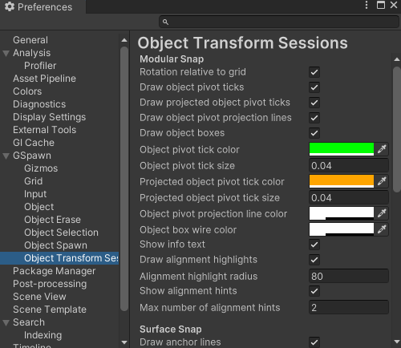

Under the **Modular Snap** section you have different settings that can be modified that affect modular snapping. We will talk about those that are related to alignment highlights and hints:

- **Draw alignment highlights** - toggle alignment highlights. Hotkey: **[SPACE]**;
- **Alignment highlight radius** - this number represents a world radius that is used to collect nearby objects that will be checked for alignment. Use bigger numbers to cover larger distances, although the default value should be more than enough in most cases;
- **Show alignment hints** - toggle alignment hints. Hotkey: **[SHIFT + SPACE]**;
- **Max number of alignment hints** - the maximum number of hint labels that will be shown in the scene view. For example, a value of **2** means that if there are **10** objects that line up with the spawn guide, only **2** of them will have hint labels shown in the scene view. A smaller number is generally desired in order to avoid clutter;

### Modular Walls Spawn

This spawn tool is very handy for creating walls. You could use **Modular Snap Spawn** to place one wall piece at a time. However, a faster approach would be to use **Modular Walls Spawn** which can spawn multiple wall segments in a few clicks while also handling inner and outer corners automatically.

#### Modular Wall Prefab Profiles

Before this tool can be used there is a bit of setup involved. If we take a look in the Inspector, we can see the following settings:

We can see that we need to specify a **Modular wall prefab profile**. This is a prefab profile that contains the necessary data which will be used by the plugin to spawn wall pieces.

Open **Tools > GSpawn > Windows > Modular Wall Prefabs...**

The above window will show up on the screen and this is where you need to specify the necessary data. 

#### Wall Pieces

In the left pane you can see there are 3 icons that represent different types of wall pieces. Let's talk about what each of these mean:

- **Straight Wall** - a straight wall piece is simply a regular wall piece that connects to 2 other adjacent wall pieces;
- **Inner Corner** - an inner corner piece is used when the wall makes a turn and the corner points towards the inside of the area surrounded by the wall;
- **Outer Corner** - an outer corner piece is used when the wall makes a turn and the corner points towards the outside of the area surrounded by the wall;

The following image shows the 3 prefabs that will be used in this example, each prefab being mapped to each of the wall pieces we just discussed:

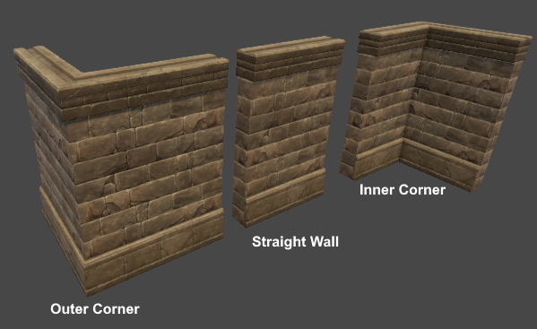

#### Prefab Data

At the bottom of the modular wall prefab window, there is a section labelled **Prefab Data**. 

The **Up axis** field allows you to specify the prefab local axis that points up. This will usually be the Y axis.

The second field is the most important and is called **Example prefab**.

#### Example Prefab

An example prefab is a prefab that you need to create that contains all the necessary wall pieces arranged in a certain configuration that will allow the plugin to detect how the wall pieces fit together.

In order to create the example, prefab follow the next steps:

- switch to **Object Selection** mode;
- find the **Straight Wall** piece in the prefab manager and drag and drop it in the scene. As soon as you release the left mouse button the object will start snapping to the grid. Left click to commit;
- make sure that the **Straight Wall** piece uses a rotation of **0** on all axes. This is important;
- spawn the **Inner** and **Outer** wall pieces in the scene using the same approach and connect them to the **Straight** piece. These can be rotated as necessary;
- spawn 2 other **Straight** wall pieces (you can use **[CTRL + D]** to duplicate the first one) and connect them to the **Outer** and **Inner** corners respectively;

The next image shows how this arrangement looks like for the prefab assets that we are using in this example:

The labels associated with each wall piece are not random. They have special meaning. We'll get back to this in just a bit.

Select the wall pieces you just created and inside the **Prefab Library Manager** window click on the **Create prefab...** button in the top toolbar:

This will bring up the following window:

You need to give the prefab asset a name and specify a destination folder. You can drag and drop the folder in the **Destination folder** field. The other fields are not important in this case.

Click on **Create**. If a prefab with the same name already exists, you will be asked if you wish to replace the old prefab.

Now click on the prefab asset you just created. And open the prefab:

Once the prefab window is open, click on each wall piece and assign it the right name as discussed earlier:

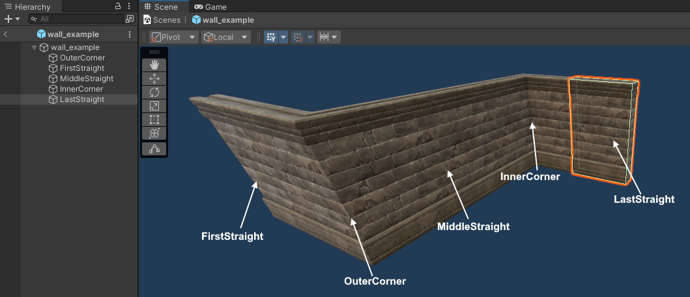

These names are important to the plugin because it allows it to identify the role of each piece. The names can be lower case, upper case or mixed. The important thing is that the names should spell exactly as shown in the image above.

Finally, drop the prefab asset inside the **Example prefab** in the **Modular Wall Prefab Profile** window:

If there are any errors with the prefabs (e.g. incorrect naming) the plugin will show an error message in the console window.

If you ever need to make changes to the example prefab, you have to press the **Refresh** button to instruct the plugin to refresh the data.

#### Assigning Prefabs

The final step is to assign the wall piece prefabs to the correct slot in the wall prefab profile window as shown in the image below:

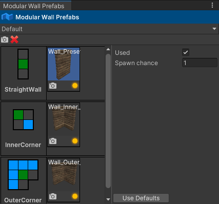

Each wall piece was assigned to the right slot (**Straight Wall, Inner Corner & Outer Corner**) by dragging a prefab from the **Prefab Manager** window into the left pane next to the corresponding slot.

At this point, the prefab profile is ready to use.

---

**Note: **If you need more than one profile, you will have to create an additional profile and a new example prefab for each profile. In this example, a single profile is needed and the **Default** profile was used.

---

#### Spawning Walls

Make sure the **Modular Walls** spawn mode is active. Select the wall prefab profile you would like to use in the **Modular wall prefab profile** field.

Double-click on any prefab in the prefab manager (any prefab will do). The plugin will create the spawn guide from the **Straight Wall** piece associated with the current profile.

To spawn:

- snap the spawn guide into the right position where you would like to place the wall. **Note: **The plugin will always keep the spawn guide's up axis aligned to the grid. This means you can't rotate the spawn guide around **X** or **Z**. Only the **Y** hotkey will work;
- left click to start. This will disable the spawn guide and box indicators will appear to approximate the wall pieces;
- each successive click will add 2 perpendicular wall segments;
- when the entire wall plan has been established, hold **[SHIFT]** and **left-click** to commit;

While laying down wall segments, you can hold down **[SHIFT]** and **right-click** to step back (i.e. remove the last 2 wall segments). You can also press **[ESCAPE]** to cancel.

The next image shows a wall that surrounds a floor plan:

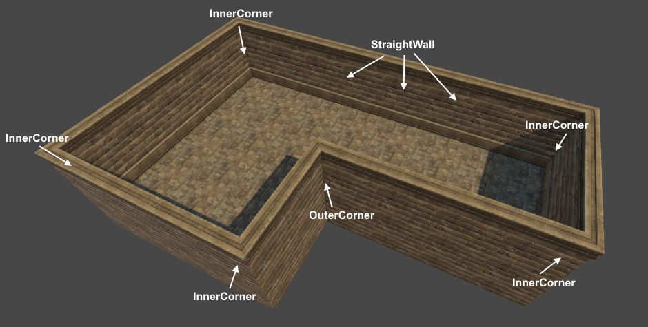

As you can see, even though there is a setup phase, once the setup phase is finished, spawning walls can be done in a matter of a few clicks with support for inner and outer corner detection.

#### Multiple Prefabs Per Wall Piece Slot

You can assign more than one prefab to the same slot as shown in the image below:

In the image above a damaged wall piece was added to the **Straight Wall** slot. Two damaged prefabs were added to the **Inner Corner** slot. The spawn chance field has been set to **0.3** for all damaged prefabs.

The result can be seen in the next image:

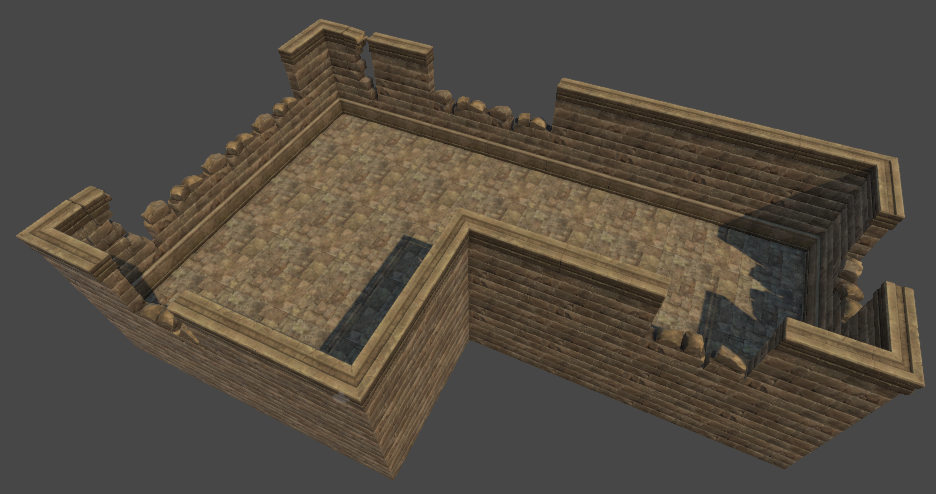

---

**Note: **This only works as long as all the prefabs which are assigned to a slot share the same pivot. For example, if you were to place all the **Inner Corner** wall pieces at the origin in the same rotation, the wall pieces would perfectly overlap.

---

#### Requirements

In order to use the **Modular Walls** spawn tool, the following conditions must be met:

- the straight wall piece must have flat sides where it connects to adjacent pieces;
- the straight wall piece must be larger along the connection axis than it is along its inner axis (e.g. don't use cubes);
- when creating the example prefab, the **MiddleStraight** piece must have a rotation of **0** for all axes;
- all wall prefab pieces must have the same up axis (i.e. if you set the rotation of all wall piece prefabs to **0** on all axes, they must all point up along the same axis);

#### Spawning Walls With No Inner/Outer Corners

If you would like to spawn walls that don't have **Inner/Outer** corners, you can do that by following the next steps:

1. create the example prefab as shown in the image below:

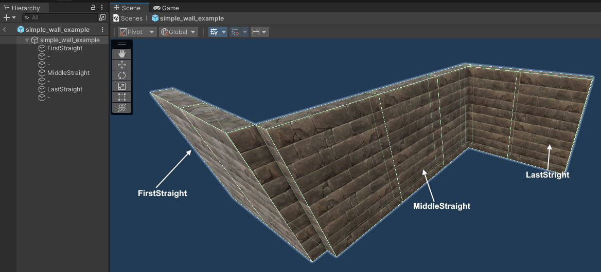

Note that in this case, because we don't have access to inner and outer corners, 2 straight wall pieces were used to create them. However, in this case, these pieces don't have to have a specific name. In fact, their name can be anything **except** for the recognized names. In this example, the name assigned to these objects was '-'. 

2. assign the example prefab to the **Example prefab** field;

3. in the wall prefab profile window, assign the straight wall piece to the **Straight Wall** slot; **Inner & Outer** slots have to be kept blank:

The next image shows an example of spawning walls using this new wall profile:

### Segments Spawn

**Segments Spawn** and its cousin [**Box Spawn**](###Box Spawn) are very handy when working with tile blocks. They can also be used when laying down floors in modular environments. In fact, the floor prefabs that you saw in the **Modular Walls Spawn** chapter images were spawned using **Box Spawn**.

In order to use **Segments Spawn**, make sure the tool button is active in the Inspector as shown in the image above. 

**Double-click** on a prefab in the prefab manager to activate the spawn guide. This will enable **modular snap** and you can move the spawn guide around in the scene and snap it to the grid just like you can do with other spawn tools that use snapping.

In order to spawn, follow the next steps:

- **left-click** to start (this will disable the spawn guide and show box indicators instead);
- each successive click adds 2 new perpendicular segment pairs;
- hold down **[SHIFT]** and **left-click** to commit and spawn;

You can hold down **[SHIFT]** and **right-click** to step back (i.e. remove the last 2 segments) if you make a mistake.

The next image shows a simple example of a series of tile blocks spawned using this tool:

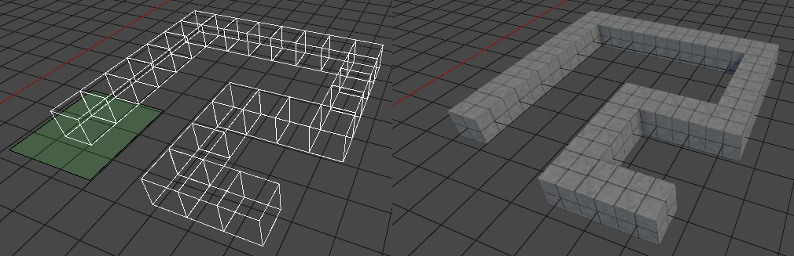

#### Extension Plane

When the spawn guide is created, you will see a transparent quad sitting below the spawn guide:

This is the **extension plane** and it is also used in **Box Spawn** mode. The extension plane represents the horizontal extension direction. This simply means that the segments chain (or box for **Box Spawn**) will extend along the surface of this plane.

The height of the segments chain (or box for **Box Spawn)** will extend perpendicular to this plane.

You can cycle through different plane orientations by holding down **[CTRL]** and using the mouse scroll wheel.

You can hold down **[CTRL + ALT]** and **left-click** to pick the orientation from the object under the mouse cursor or the grid. The plane will always be aligned with one of the spawn guide's bounding volume faces. So, when picking the orientation via left-click, the extension plane will be aligned with the volume face that is most aligned with the surface you picked with the mouse cursor.

---

**Note: **Since the orientation of the plane is linked to the spawn guide's volume faces, rotating the spawn guide will also change the orientation of the extension plane.

---

#### Height Modes

There are 3 height modes that allow you to change the height of the segment chain. Before we discuss these height modes it is important to talk about **cell stacks**. Each segment is a collection of **cell stacks** that extend along a certain direction. Each cell stack can have a different number of cells. The number of cells in a stack is called the **stack height**. Objects will be spawned in each cell.

The available height modes are:

- **Constant** - each stack has the same height value;

- **Random** - each stack will have a random height in a specified interval;
- **Pattern** - the height of each stack will be taken from an [integer pattern](##Integer Patterns);

The next image shows the height mode controls in the UI:

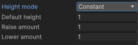

The **Default height** field allows you to specify a default height value that will be used when you start a segment chain. The **Raise/Lower amount** fields allow you to control how many cells are added/removed when changing the height using the scroll wheel.

The 3 fields (**Default height, Raise amount & Lower amount**) apply to all height modes. For the **Random** and **Pattern** modes, the default height acts as a base height value.

The following image shows an example of tiles spawned using each one of these height modes:

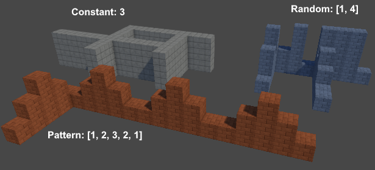

You can change the height by holding down **[SHIFT]** and using the mouse scroll wheel. When using the **Random** and **Pattern** modes, this will essentially allow you to apply a base height value to the generated height values.

#### Prefab Pick Mode

By default, when you spawn objects using the **Segments Spawn** tool, the objects will be spawned from the same prefab used by the spawn guide. But it is possible to randomize the prefabs that are used during spawn.

In the segments spawn settings UI, there is a field called **Prefab pick mode**. The following options are available:

- **Spawn Guide** - the objects will be spawned from the prefab associated with the spawn guide (the one you double-clicked in the prefab manager window to create the spawn guide);
- **Random** - the prefab will be picked from a [random prefab profile](##Random Prefab Profiles);
- **Height Range** - the prefab is picked from a [integer range prefab profile](##Integer Range Prefab Profiles);

The following image shows tiles which were spawned using the **Random** and **Height Range** pick modes:

---

**Note: **When using **Random** or **Height Range**, you should make sure all prefabs have the same size. Otherwise, you might encounter incorrect results.

---

#### Settings Profiles

The segment settings can be organized in profiles:

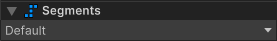

A **Default** profile is always available, but you could create more. This can be useful in situations where you need to switch between different configurations of settings. Having to change them manually each time you need to spawn tiles with a different strategy can be tedious. But if you organize the settings in profiles, you only need to select a new profile and the settings will automatically reflect the change.

---

**Note: **When changing settings, you actually make changes to the currently active profile.

---

### Box Spawn

**Box Spawn** is another spawn tool which is useful when working tile blocks or when laying down floors.

In order to use **Box Spawn**, make sure the tool button is active in the Inspector as shown in the image above. 

**Double-click** on a prefab in the prefab manager to activate the spawn guide. This will enable **modular snap** and you can move the spawn guide around in the scene and snap it to the grid just like you can do with other spawn tools that use snapping.

In order to spawn, follow the next steps:

- **left-click** to start (this will disable the spawn guide and show box indicators instead);
- **left-click** to spawn;

Box Spawn also supports the same [height modes](####Height Modes) as **Segments Spawn**. Also, the same [prefab picking strategies](####Prefab Pick Mode) can be used.

#### Fill Modes

In **Box Spawn** there are 3 fill modes available:

The default fill mode is **Solid**. This simply means that the box area will be filled with objects.

The second fill mode is **Border**. When this fill mode is active, you can also change the box border. The next image shows a few examples of spawning tiles with different border size width values:

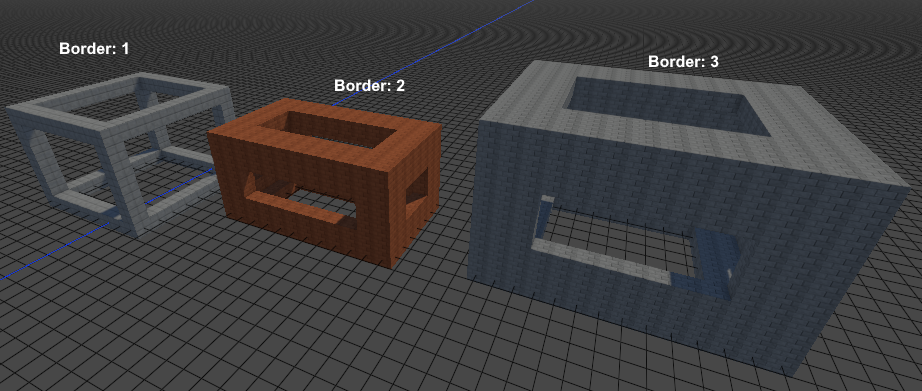

The next image shows the inside of the right most structure:

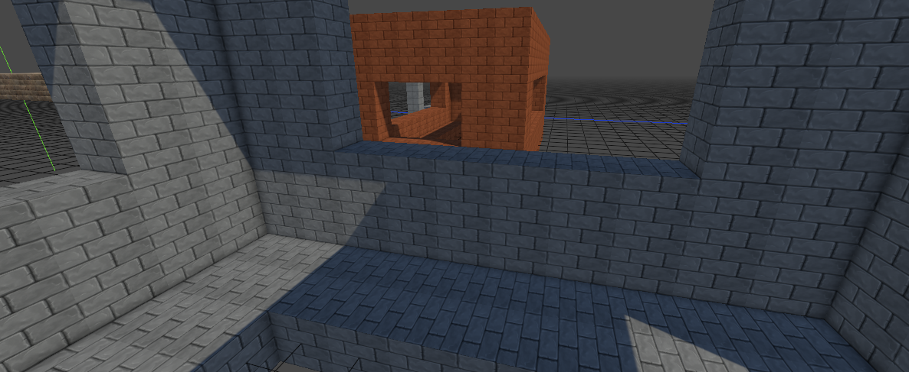

The third fill mode is **Hollow**. This essentially creates a hollow box volume. The next image shows the interior of such a structure:

When working with tile blocks, this fill mode can actually be used as an optimization strategy. From the outside, the structures will look the same as when using the **Solid** fill mode. But on the inside they are empty. Which means fewer tiles to process/render etc.

This depends of course on the game's needs. Sometimes it may be useful to use the **Solid** fill mode instead.

### Tile Rule Spawn

The **Tile Rule Spawn** tool allows you to paint tiles inside an infinite grid. When tiles are painted, adjacent tiles are automatically updated based on a series of specified **tile rules**. These tile rules define the way each tile opens up (i.e. connects) to adjacent tiles.

In order to use this tool, the next steps have to be performed:

1. create the tile prefabs;
2. create a **Tile Rule Prefab Profile**;
3. populate the tile rule profile with tile rules which define the way in which the tile prefabs open up (i.e. connect) to each other;
4. create a tile rule grid;
5. paint;

The **tile rule spawn** tool will work with any modular prefabs that can be connected. If you can create a bunch of tiles that can connect to each other using Unity's interface, you should be able to use those prefabs with the **Tile Rule Spawn** tool. There is an exception to this, namely walls. The tile rule system doesn't handle inner and outer corners properly. So if you need to create environments where floors must have walls sitting on top, it is best to use a combination of **Modular Snap Spawn** and **Modular Walls Spawn**.

#### Creating Tile Rule Prefabs

Assuming you have an asset package that contains modular prefabs and you would like to create a bunch of tiles that can be used with the tile rule spawn tool. The easiest way to do this would be to follow these steps:

1. activate **Object Selection** mode;
2. from the prefab manager, drag and drop prefabs into the scene. When a prefab is dropped into the scene, it will automatically start snapping to the grid. **Left-click** to stop snapping. Press **[D]** to enable snapping again if you want to make changes. You can also use the move gizmo with **[CTRL]** held down to snap. Press **[SHIFT + S]** to snap the object to the grid along all axes;
3. snap each object in the right place;
4. press the **Create prefab...** button in the **Prefab Library Manager** window;
5. enter the name of the prefab and pick a folder;
6. set the pivot to **TileRule** and enter the name of the **Pivot object name**;
7. make sure the objects are selected click on **Create**;

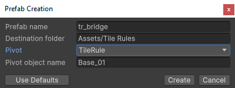

In the image above, the **Pivot object name** field was set to **Base_01**. The pivot object represents the main object in the tile. It is the object that will sit on top of the grid surface, usually a floor prefab. Decorations will usually be placed around this object. If you leave this field empty, the plugin will pick the object which has the greatest volume (the mesh bounding volume is used). This is ok in most situations, but if your tile is composed of different objects of similar sizes, you will have to enter the name of the pivot object in this field.

The next image shows an example of a tile prefab that was created:

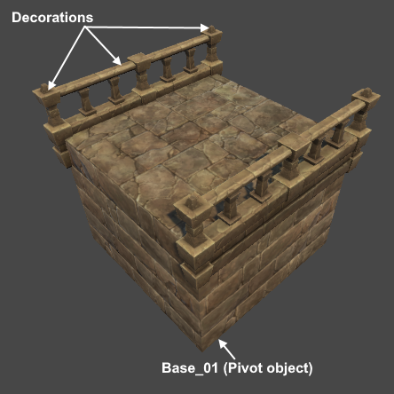

The next image shows the tiles that were created for the purposes of this discussion:

The labels below each tile are simply conventions and try to describe the tile rule associated with each tile. For example, the **Bridge** tile connects 2 adjacent tiles along a certain direction. The **Turn** tile connects 2 adjacent tiles when they meet in a corner.

After all tiles have been created, make sure to add them to a prefab library so that they can be picked from the **Prefab Manager**.

#### Creating Tile Rules

A tile rule specifies how a tile connects to adjacent tiles. After the tile prefabs have been created and assigned to a prefab library, you have to create a **tile rule profile**. Open **Tools > GSpawn > Windows > Tile Rules...**

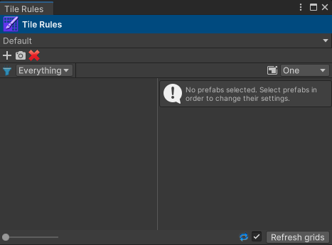

Use the topmost drop-down control to create a new profile. You can also use the **Default** profile if you wish.

A tile rule profile holds a collection of tile rules. Each tile rule can be associated with one or more prefabs.

In order to create a new tile rule, click on the left-most **plus icon** in the top toolbar. This will add a new tile rule in the left pane:

The small button grid allows you to define the rule. The middle button represents a tile that is painted inside the grid. The adjacent buttons represent its neighbor cells. If you **left-click** on one of the neighbor cells, it will turn **green**. When a tile is green, it means that the center tile opens up in that direction so a tile has to exist in that cell. If you **right-click** it will turn **red**. This means the center tile is closed off in this direction and no tile can reside in that cell. **Gray** cells are neutral (i.e. the rule doesn't care if a tile exists in that cell or not).

In order to assign prefabs to a tile rule, you have to select prefabs in the prefab manager and drag and drop them inside the tile rule drop area:

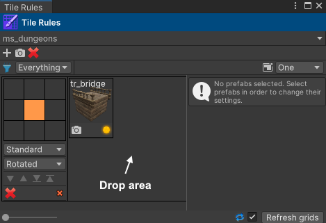

Next you have to **left/right-click** on the tile buttons to define the rule. The next image shows the tile rules that were created for each of the 5 tiles we created earlier:

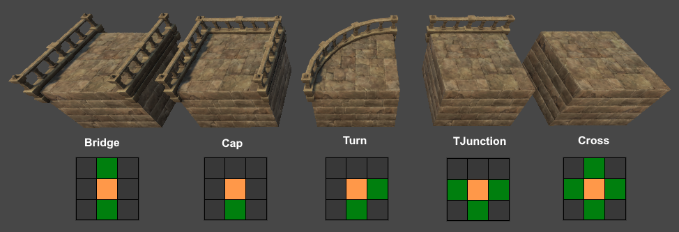

An important detail to remember here is that the coordinate system of the tile buttons in tile rule UI maps to the world axes as explained below:

- the **horizontal axis** of the button grid maps to the **world X axis**;
- the **vertical axis** of the button grid maps to the **world Z axis**;

So when clicking on the buttons to turn them green (or red) you first have to look at the tile objects and see where they open up and where they close off. In the image above, the tiles are lined up along the world X axis and the camera is looking roughly along the world Z axis.

The **Bridge** tile opens up along the Z axis, but is closed off along the X axis (the railings block the entrance). Therefore, the bottom and top tiles of the tile rule button grid were turned green.

The **Cap** tile opens up along the negative Z axis. Only the bottom tile was turned green in this case.

The **Turn** tile opens along the positive X axis and the negative Z axis. Therefore, the right and bottom cells were turned green.

The **TJunction** tile opens up along the X axis and along the negative Z axis. The left & right neighbors were turned green together with the bottom one.

The **Cross** tile opens up along the X and Z axes, so the horizontal and vertical neighbors were turned green.

Don't forget that you can also **right-click** on the cell/tile buttons to turn the red. This allows you to be more specific. For example, if you wanted to have a variation of the **Cross** tile that only spawns when **it is not** surrounded by neighbors on the diagonal, you could define the rule like this:

This variant will spawn **only** if the tile is surrounded by tiles along the X and Z axes **AND** it doesn't have any neighbor tiles along the diagonals.

Defining the tile rules may get a little bit of getting used to, especially if you haven't used tile rules before. It may take some trial and error until you get the results you are after. Although we haven't talked about painting yet, you should know that you can start painting tiles as soon as you have at least one rule defined. In this way, you can create a rule, create a grid, and paint a bunch of tiles for preview purposes and then see the grid update automatically when you add new rules or when making changes to existing rules. This makes it easy to spot mistakes early and make the necessary changes.

#### Creating a Tile Rule Grid

Once the tile rule profile is setup, you have to create a tile rule grid which will be used as a paint canvas.

---

**Note: **The tile rule grid should not be confused with the **scene grid**. They are different. When using the **Tile Rule Spawn** tool, you will be painting on the tile rule grid. When using **Modular Snap Spawn** or other tools that use modular snapping, you will be snapping to the scene grid.

---

Make sure the **Tile Rule Spawn** tool is active. Find the **Tile Rule Grid Creation** section and fill in the settings:

The mandatory fields are the following:

- **Tile rule profile** - the tile rule profile you created. This could be the **Default** profile if you chose not to create a new profile. In this example, the name of the tile rule profile is **ms_dungeons**;
- **Cell size**: the grid cell size. For the prefabs we have been using in this example, the cell size is **<4, 3, 4>**. In order to find out the grid cell size, you have to know the size of the pivot object (the main object that defines a tile). This is usually a floor prefab. You can hover a prefab preview in the **Tile Rule Profile** window in order to find its size:

Just make sure to pick a prefab without decorations on the side. If you don't have one, then pick any prefab, and truncate the values. For example, if the values show **<4.023, 3.1200, 4.08>** then you can use the size **<4, 3, 4>**.

Give the grid a name (in this case **dungeon**) and click on the **Create grid** button. This will create a game object in the scene with the same name. When painting tiles, all tiles will be spawned as children of this object.

Also, if you take a look in the Inspector, you will see that a tile rule grid item was added to the grid list:

You can have multiple grids in the same scene. The plugin uses the concept of **current grid** to establish the grid that is used as a paint canvas. You can click on a grid in the grid list to mark it as the current grid. The current grid is shown in green.

The next image shows the meaning of the controls which are associated with the tile rule grid item:

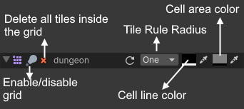

If you click on the left most arrow you can expand the UI:

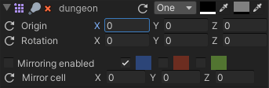

From here you can change the grid origin and its rotation. This will actually change the position and rotation of the grid object in the scene. 

The last few controls allow you to enable/disable mirroring, toggle mirror planes and move the mirror gizmo to a specified grid cell.

#### Tools & Brushes

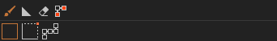

If you look in the Inspector, you will see these 2 toolbars when the **Tile Rule Spawn** tool is active.

The first toolbar allows you to select the current tool. There are 4 tools available:

- **Paint [Q]** - paint tiles using different types of brushes;
- **Ramp Paint [W]** - paint ramps;
- **Erase [E]** - erase tile using different types of brushes;
- **Connect [R]** - connect pairs of cells in the grid;

The second toolbar allows you to select the current brush. There are 3 brushes available:

- **Box Brush [SHIFT + Q]** - paint tiles using a box brush. **Left-click** &  drag to spawn tiles;
  - **[CTRL + scroll wheel]** - change horizontal size;
  - **[SHIFT + scroll wheel]**- change height;
  - **[CTRL + ALT + scroll wheel]** - move up/down;
- **Flexi Box Brush [SHIFT + W]** - similar to box brush, but instead of changing the horizontal size using the scroll wheel, you change it by moving the mouse. **Left-click**, move the mouse to establish the size, then **left-click** again to spawn;
  - **[SHIFT + scroll wheel]**- change height;
  - **[CTRL + ALT + scroll wheel]** - move up/down;
- **Segments Brush [SHIFT + E]** - spawn tiles along line segments. **Left-click** to start, move the mouse to establish the segment end-point, **left-click** to add a new segment, **[SHIFT + left-click]** to spawn. 
  - **[SHIFT + scroll wheel]** - change height;
  - [**CTRL + ALT + scroll wheel**] - move up/down;

---

**Note: **When the **Ramp Paint** tool is active, only the **Box Brush** can be used and it will always have a horizontal size and height of **1**.

---

The next image shows a simple dungeon environment which was painted using a combination of **Box** and **Flexi Box** brushes:

The next image shows a simple example of using the segments brush:

This is useful for quickly creating pathways.

#### Platform Rules

Let's take a look at the first environment that was shown earlier, but this time from another angle:

Notice that where the tiles stack on top of each other, the railings look a bit off. Although not entirely incorrect (it may be what you are looking after), it would be nice if we could somehow find a way to spawn only the floors (base) objects without decorations.

In order to do this, we can create a new tile rule and set its rule type to **Platform**:

Note that we are using the same prefab as we are using for the **Cross** rule. This is just a simple floor object with no decorations. 

Also, below the cell button grid, we set the rule type from **Standard** to **Platform**.

A single neighbor was set to green and it doesn't matter which one we pick in this case. This will ensure that whenever a platform is detected this rule will be picked.

Let's take another look at our tiles:

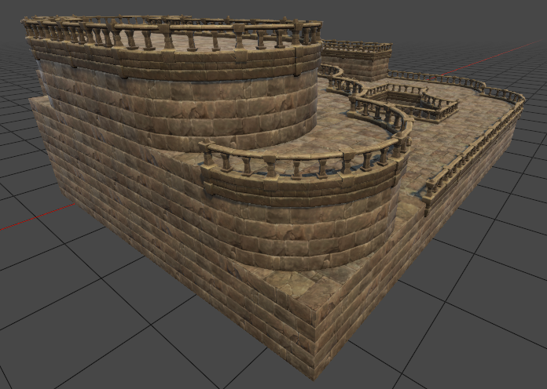

The railings have disappeared because the plugin can now use the platform rule instead. However, we are still not quite done yet. If we look at the bottom most platform tile (the one closest to the viewer), we can see that it sits below a rounded corner, but the platform tile has cubic shape. In order to fix this we will have to add a second platform rule that defines a turn:

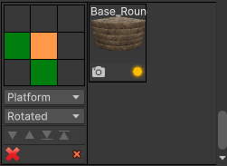

Let's have another look at our tiles:

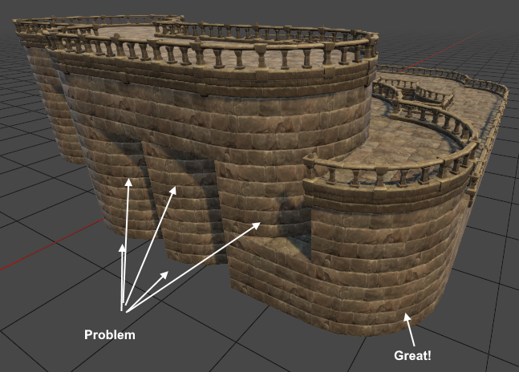

Our problem has been fixed, but now we have another one. Because we have added a new rule that uses 2 green tiles, some of the old platforms have been updated to correctly match this new rule. These tiles are actually **TJunction** rules. So let's go ahead and add one final platform rule:

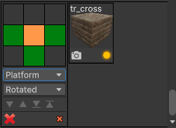

The result now looks like this which is exactly what we are after:

#### Ramp Rules

Another type of tile rule is the **Ramp** rule. You need to define at least one ramp rule in order to use the **Ramp Paint** tool.

The following ramp prefab was created for this example:

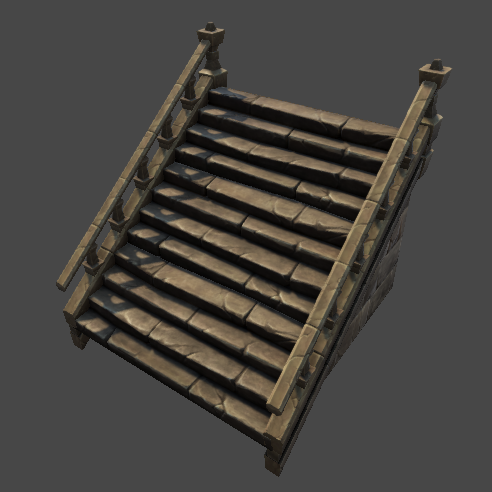

A ramp rule was created as shown below:

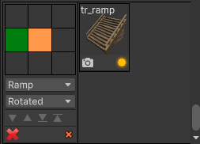

The ramp opens up along the negative X axis, so the left neighbor was made green.

At this point, you can activate the **Ramp Paint** tool and paint ramps.

The next image shows a new environment that uses ramp tiles:

When placing ramps it is possible to run into situations where the ramp is surrounded by more than one tile and the ramp rotation may be incorrect. For example, consider the following scenario:

The ramp points to the left tile, but we want it to point towards the forward tile. You could probably define multiple ramp rules, but that can be tedious. Instead, you can place the ramp brush over the ramp and press **[Y]** to rotate it:

---

**Note: **When the tile grid gets refreshed, the ramp rotations will be restored properly as long as all ramp prefabs open up along the same axis in their model pose. For example, if the ramp rule contains multiple ramp prefabs, when the grid is refreshed, a ramp will be picked using the prefabs' spawn chance property for each ramp tile in the grid. The picked ramp prefab might open up along a different axis compared to the old ramp tile and this can cause incorrect results to appear. The best way to avoid this is to make sure that all ramps open up along the same axis when creating the ramp prefabs.

---

#### The Connect Tool

The **Connect** tool can be very handy for creating suspended pathways.

In order to use, make sure you click on the **Connect** button in the Inspector to activate it:

Or press **[R]**.

Next, follow these steps:

1. move the mouse to establish a start point;
2. **left-click** to start. This will create 2 perpendicular tile segments;
3. move the mouse to establish and end-point;
4. **left-click** to spawn;

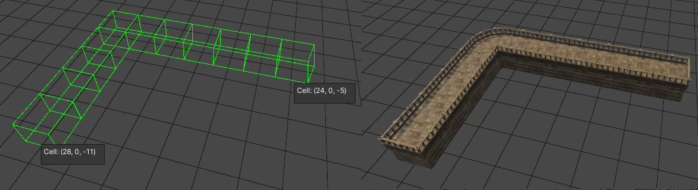

You can hold down **[CTRL + ALT]** and use the scroll wheel to change the Y offset for the start and end points. You can do this before **left-clicking** to set the start point offset and post **left-click** to change the end point offset. 

The Y offset is updated automatically when you hover a tile with the mouse cursor. In that case the start/end point will snap to the same cell in which the hovered tile resides.

Press **[SPACE]** to change the major axis. The major axis is the axis along which the first segment is travelling. In the image above, the first segment travels forward and the second  segment travels to the right. Pressing **[SPACE]** would reverse these travel directions. 

The next image shows an example where the start point sits on the grid and the end point has been raised above the grid:

Note that the ramps were added automatically in order to make the upper area accessible. Ramps will only be generated if a ramp rule is defined and if the **Generate ramps** toggle is checked inside the Inspector under the **Connect** UI section.

Also, towards the left, where the 2 segments meet in the corner, 2 tiles were inserted in order to make the ramp accessible.

The next image shows an example of a more complex path network:

When using this tool, you need to sometimes be careful not to accidentally block existing pathways as shown below:

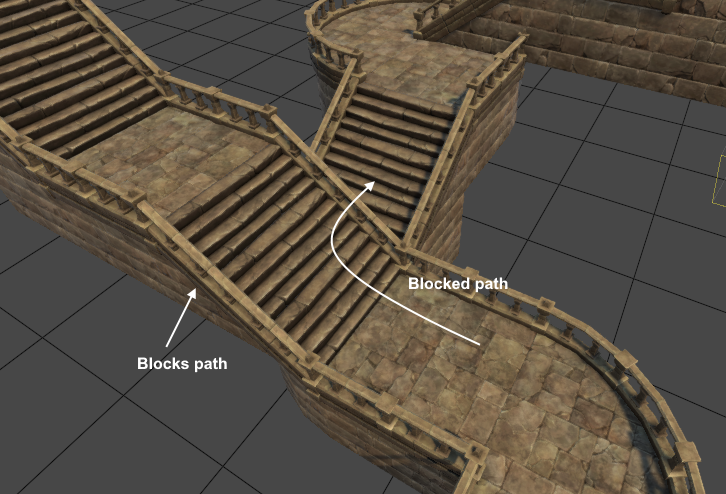

#### Tile Rule Priority

When painting tiles, the tile rules are evaluated **in the order in which they appear in the tile rule window for each rule type**. If you have 2 or more rules that use the same number of green tiles, the first one will be picked from bottom to top. This can produce incorrect results.

There are 2 ways to handle this:

- be more specific by turning more of the adjacent cells green or red. The less neutral tiles, the more specific you are and the easier it will be for the plugin to understand your intentions;
- use the **move up/move down/move to top/ move to bottom** buttons:

Pressing these buttons will move the rule up/down in the UI while also changing their priority.

#### Tile Rule Grid Refresh

When making changes to a tile rule profile (changing cell states, adding prefabs etc), all the grids which use that profile will automatically be updated.

As the number of tiles inside a grid grows, grid refreshing can become slow. In this case, you might want to turn off automatic updates, make the necessary changes to the tile rules, and update the grid manually:

In the image above, the toggle at the bottom right has been unchecked. This means automatic refresh is turned off. The grid(s) can be manually refreshed by pressing the **Refresh grids** buttons.

#### Tile Rule Radius

By default, the tile rules use a radius of **1**. This means that only the immediate neighbors are taken into account. In some situations you may want to use a larger radius. The largest radius you can have is **2**.

In order to set the tile rule radius you need to follow the next steps:

1. set the radius to the desired value in the tile rule window UI:

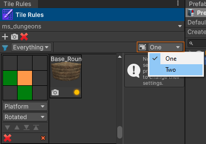

When you do that you'll notice that the cell button grid will change appearance because there are now more neighbors that can be worked with:

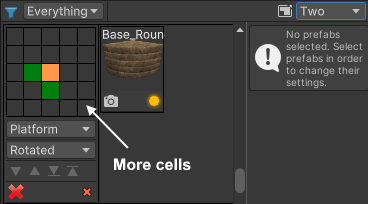

This step will only enable you to use a radius of 2 inside the UI, but it doesn't actually do anything besides that.

2. in the Inspector UI, you have to change the radius associated with the tile rule grid:

At this point, the new radius is taken into account when painting/erasing tiles.

#### Prefab Settings

When you click on prefabs in the tile rule profile window, the right pane will display a few settings:

The **spawn chance** is useful when you have more than one prefab per rule. For example, you might have damaged versions of the same prefab that you would like to spawn. In that case, you can select the damaged versions and change their spawn chance to something like **0.2** or more depending on how often you would like those prefabs to appear in the scene.

The **Cell X/Y/Z condition** fields allow you to define a cell range where the prefab can appear in the tile grid. For example, let's suppose you had 2 versions of a ramp rule prefab: one with railings on the side and another one with no railings. You may want to spawn the simple ram (no railings) when the Y coordinate is in the interval **[0, 1]** and the more majestic version (with rails) for all Y coordinates starting at **2** and upwards.

The next image shows the updated ramp rule:

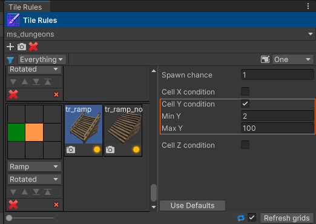

Note that there are now 2 ramp prefabs: one simple and one with railings on the sides. The one with railings on the sides has the **Cell Y condition** checked and the Y interval has been set to **[2, 100]**. A value of 100 in this case means "infinity" since it's rare that you will have grids that go so high up.

The simple ramp uses an interval of **[0, 1]**.

The next image shows a simple environment that was created using these updated ramp rules:

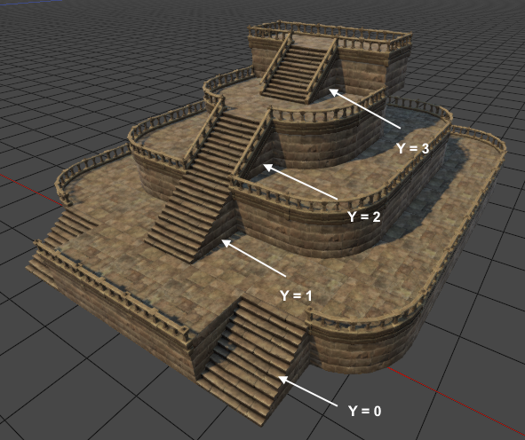

When any one of the **Cell X/Y/Z condition** toggles are checked, the prefab is said to be **conditioned**. When painting tiles, the plugin will first process the conditioned prefabs first and check if any one of these satisfies all conditions for the current cell that is being painted. The first prefab that satisfies all conditions will be picked. If all prefabs are conditioned, but no prefab satisfies the conditions, the **spawn chance** will be used to randomly pick a prefab.

#### Fixing Overlaps

The tiles that we have been using have these pillars attached to them and the pillars sit right where the tiles connect with adjacent tiles which also have pillars. This causes a problem to appear where the pillars from 2 or more connecting tiles overlap with each other. The next image shows an example of this:

This can cause rendering artifacts. Although we can't see the artifacts in the image, when moving the camera, there is flickering effect because the 2 pillars are fighting with each other over which one gets rendered. 

In order to solve this, you have to go to the tile rule grid list in the Inspector and click on the **Fix overlaps** button as shown below:

This will hide the renderers of the overlapping pillars so that a single pillar gets rendered.

As you can see, this is a manual step. When you paint/erase tiles, the same issue can appear again because new tiles are created so it is best to perform this step at the end, when your game level is finished.

### Props Spawn

The **Props Spawn** tool is great for populating your scenes with props. For example, you could use it to populate your terrains with trees, houses, fences, barrels and the like. You can also spawn directly on other mesh surfaces. If you are creating a modular environment, you could use this tool to spawn props on the floor or on the walls.

In order to use, **double-click** on a prefab in the **Prefab Manager** window. This will activate the spawn guide and you can move it around in the scene. Instead of snapping to the grid (as is the case with the previous tools that were discussed), it will snap directly to mesh or terrain surfaces.

The following hotkeys are available when working with **Props Spawn**:

- **[SHIFT + mouse move]** - rotate the spawn guide around the surface normal if axis alignment is turned on; rotate around the grid Y axis if axis alignment is turned off;
- **[CTRL + mouse move]** - scale the spawn guide;
- **[ALT + mouse move]** - offset the spawn guide from the surface (useful for embedding on steep surfaces);
- **[R]** - reset the offset applied by moving the mouse back to **0**;

The **[X/Y/Z] & [SHIFT + X/Y/Z]** hotkeys are also available for rotating the spawn guide using the keyboard.  You can press **[I]** to reset the object rotation to the rotation stored in the prefab asset and **[O]** will reset the scale to the prefab scale.

#### Axis Alignment

Axis alignment refers to the idea of aligning one of the spawn guide's axes to the surface on which it resides. By default, it is turned off, but you can turn it on/off by either pressing **[SHIFT + A]** or by checking/unchecking the **Align axis** toggle in the Inspector:

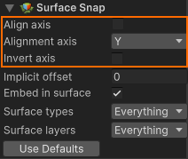

If **Align axis** is checked, you also need to specify an alignment axis using the **Alignment axis** field. The alignment axis is considered to be the positive axis. If you wish to use the corresponding negative axis, check **Invert axis**.

Typically, you will want to leave this off. For example, if you want to populate terrains with trees, axis alignment should be turned off. Trees grow upwards and they don't look right when aligned with the terrain surface. Houses also usually stand straight up.

Axis alignment could be useful if for example you were placing objects on an incline or a ramp or some kind of decorative elements such as elongated crystals on top of rock surfaces.

#### Surface Offset & Embed in Surface

Although you can change the offset from the surface using the mouse, you can also use an implicit offset by changing the value of the **Implicit offset** field. This can be useful when placing objects on steep surfaces with axis alignment turned off in order to avoid floating.

The field **Embed in surface** can sometimes help, but for objects that are more irregular at the base where they meet with the surface, it won't always avoid floating. In this case a combination of implicit offset and mouse applied offset should do the trick.

The next image shows an example of a barrel placed on a steep terrain surface with and without **Embed in surface**:

#### Surface Types & Surface Layers

By default, every object in the scene can be used as a surface on which the spawn guide can sit. However, there may be times where you would like to ignore certain objects. For example, if you are placing props in a dense forest, you will most likely want to ignore the trees and snap to the terrain only.

The **Surface types** field allows you to select the types of surface the spawn guide can sit on:

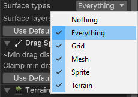

Another thing that you can do is to ignore certain surfaces based on the layer to which they are assigned. In this case, the **Surface layers** field can be used.

#### Spawn Guide Randomization

A useful feature when working with **Props Spawn** is **Spawn Guide Randomization**. This feature allows you to randomize the spawn guide's rotation, scale and prefab. The randomization parameters are applied after you spawn a new game object:

1. **left-click** to spawn;
2. object gets spawn with current rotation/scale/prefab;
3. spawn guide is randomized;

Randomization also works with [drag spawn](####Drag Spawn).

---

**Note: **This feature is also available when using **Modular Snap Spawn** although it is not as useful. Usually, the objects that you spawn with **Modular Snap Spawn** should keep their original size and rotation. For example, you definitely wouldn't want to randomize the scale of a wall piece or a floor. These were designed in a specific manner by the artist to allow for the easy construction of modular environments.

---

##### Rotation Randomization

In order to randomize the rotation, check the **Randomize rotation** toggle and then pick the randomization axis. The default is **Surface normal** which is what you will usually want for props placement.

The **Randomization mode** field can be set to **Step** or **MinMax**. **Step** will apply a random multiple of the specified rotation step, whereas **MinMax** will generate a random rotation value in a specified interval.

##### Scale randomization

Check the **Randomize scale** toggle. This will cause 2 new fields to show up which will allow you to define a minimum and maximum scale value. Very useful for adding more variation to certain types of objects.

##### Prefab Randomization

Prefab randomization refers to the fact that **after** you spawn a new object, the spawn guide will pick a new prefab for the next spawn. Simply check the **Randomize prefab** toggle and then select the [random prefab profile](##Random Prefab Profiles) that contains all the prefabs that you wish to use.

#### Drag Spawn

When working with the **Props Spawn** tool, you can hold down the left mouse button and drag to spawn. 

While dragging, a new object will be spawned when the mouse cursor travels a world distance >= **Min drag distance**. This allows you to adjust the distance between objects that get spawned during drag.

It is recommended to keep the **Clamp min drag distance to object volume** field checked in order to avoid any overlaps between the spawn guide and the previously spawned object. **Note: **When this field is checked, the radius of the sphere that encloses the object volume will be used as a minimum drag distance.

The next image shows a few barrels that were spawned using **spawn guide scale & prefab randomization** and **drag spawn**:

#### Terrain Flattening

**Props Spawn** supports a feature called **Terrain Flattening**. When enabled, it allows you to flatten the terrain area surrounding the spawn guide when you spawn objects either during **left-click** or **drag spawn**.

Make sure you have the **Flatten** field checked in the **Terrain Flatten** UI section to enable flattening.

Use the **Terrain quad radius** field to establish the flatten radius or hold down **[CTRL]** and use the mouse scroll wheel.

The **Mode** field allows you to specify how the new terrain height is calculated. Possible values are:

- **Lowest** - the height of the terrain will be set to the lowest height value inside the flatten radius;
- **Average** - the height of the terrain will be set to the average height value inside the flatten radius;
- **Highest** - the height of the terrain will be set to the highest height value inside the flatten radius;

Checking **Apply falloff** can sometimes help smooth out hard transitions.

---

**Note: **As you might have seen in the image above, terrain flattening comes with some limitations. First, it is extremely slow for heightmap resolutions of **1025 x 1025** and above (this of course also depends on the system on which the Unity Editor is running). One way to get around this is to change the terrain's heightmap resolution to a lower value if it doesn't degrade the quality of the terrain too much. In order to change the heightmap resolution, follow the next steps:

1.  select the terrain object in the hierarchy view;
2. in the Inspector, click on the **Terrain Settings** button:

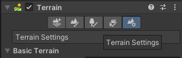

3. scroll down to **Texture Resolutions (On Terrain Data)** and change the heightmap resolution:

Secondly, it doesn't support tiled terrains. When tiled terrains are used, you will see the flatten radius being clipped to the tile the spawn guide is sitting on.

---

### Scatter Brush Spawn

The **Scatter  Brush Spawn** tool allows you to paint objects using a circular brush. This can be very handy for painting forests for example. You can use it to paint objects on terrains, but you can also paint on top of planar meshes (e.g. floors, walls);

In order to paint objects, you first need to create a **Scatter Brush Prefab Profile** which holds all the prefabs that will be used for painting.

Then, you need to select the profile you created inside the Inspector (the **Default** profile will be used in this discussion):

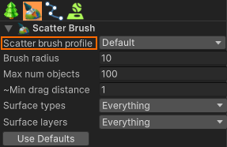

Finally, hold down the left mouse button and drag to paint objects.

You can use **[CTRL + scroll wheel]** to change the brush radius, or simply set it inside the Inspector using the **Brush radius** field.

#### Creating a Scatter Brush Prefab Profile

Open **Tools > GSpawn > Windows > Scatter Brush Prefabs...**

The following window will appear on the screen:

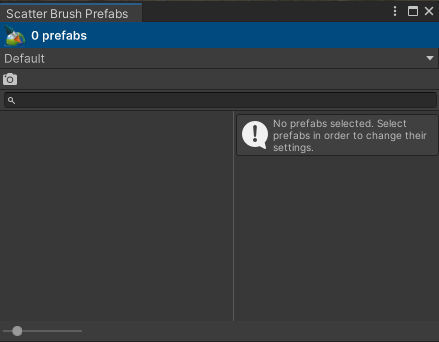

You can use the **Default** profile or click on the drop-down and create a new profile. The **Default** profile will be used in this discussion.

Next, you need to drag prefabs from the **Prefab Manager** window and drop them into the left pane inside the **Scatter Brush Prefabs** window. The following image shows the same window after it has been populated with prefabs:

The **Used** property can be useful for temporarily disabling prefabs. A disabled prefab will not be spawned while painting. The **Spawn chance** defines how frequently a prefab will be picked. Valid values are in the **[0, 1]** interval.

#### Volume Radius

The volume radius represents an approximation of the **original** (i.e. no scale applied) prefab size. By default, when a prefab is added to the scatter brush profile, its volume radius will be set to the **flat volume radius**. This radius represents the radius of a cylinder that surrounds the prefab around the Y axis.

The **Volume radius** field can be used to set a custom radius. There are also 2 buttons which can be used to change the volume radius:

- **Use prefab radius** - sets the volume radius to the radius of a sphere which encloses the prefab. This is rarely useful (unless you are working with sphere prefabs) as it can lead to really large values especially for tall objects such as trees;
- **Use flat prefab radius** - sets the volume radius to the radius of a cylinder the surrounds the prefab around the Y axis;

The next image shows a few trees painted using the default volume radius (i.e. flat prefab radius):

As you can see, the trees are quite far apart. This is because of the volume radius. If we decrease the volume radius, we can get more density. The following image shows some trees which were painted with a volume radius of **2**:

---

**Note: **When the scatter brush prefab profile uses too many prefabs and the prefabs use fairly large volumes, you will need to increase the brush radius. Otherwise, most prefabs won't have a chance to be picked. This happens for 2 reasons:

1. too many prefabs means less chance to be picked;
2. a large volume radius occupies more space so even if these prefabs will eventually be picked, there will be no more room left for them.

---

The volume radius can also be used as a simple repel mechanism. The following image shows an example of this:

The rock in the middle of the trees uses a volume radius of **8.23**. Note how there is quite a bit of space between the rock object and the surrounding trees. 

The next image shows a similar situation, but this time the radius of the rock prefab has been set to **2**:

This time the trees are much closer to the rock.

#### Embed in Surface & Offset from Surface

The **Embed in surface** field will attempt to project the objects onto the surface on which they reside in order to avoid floating. This usually works best with objects that have a somewhat flat area where they connect to the surface. For more irregular objects, such as rocks for example, you might want to also set a small negative value in the **Offset from surface** field to push them down a bit.

#### Slopes

Each prefab has a field called **Enable slope check**. When checked, it will allow you to enter 2 values which represent a minimum and a maximum slope:

This allows you to prevent objects from being spawned on steep inclines. For example, the minimum and maximum slope values of **0** and **45** respectively mean that the prefab will only be spawned on surfaces whose angle with the horizontal XZ plane is <= 45 degrees.

If we were to use a minimum slope value of **60** and a maximum slope of **90**, the objects will only spawn on very steep surfaces. Flat surfaces will be ignored in this case.

In general, if you want a prefab to spawn on relatively flat surfaces a pair of values such as **[0, 15]** will do.

### Curve Spawn

The **Curve Spawn** tool is very handy for spawning fences, forests, house rows and the like.

Before you can use this tool you need to create one or more **Curve Prefab Profiles**. 

#### Curve Prefab Profiles

A curve prefab profile holds a collection of prefabs that can be spawned along a curve. For example, if you wanted to create fences, you can create a profile that holds different fence prefabs. These can be regular or damaged fence parts for example.

In order to create a profile open **Tools > GSpawn > Windows > Curve Prefabs...**

The following window will appear on the screen:

Click on the drop-down control, select **Create new profile...** to create a new profile. The next image shows the same window after a new profile has been created to hold fence prefabs:

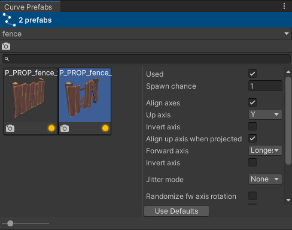

2 fence prefabs have been added that can be used to spawn fences. In order to add prefabs, you need to drag them from the **Prefab Manager** window and drop them inside the left pane in the **Curve Prefab Profile** window.

#### Curve Creation Settings

In the Inspector you can see a bunch of settings under the **Curve Creation** UI section:

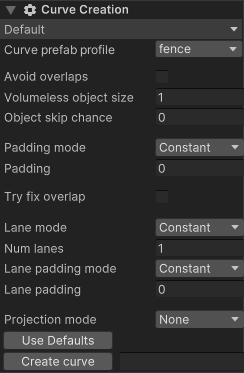

Each curve that you create has its own settings associated with it, but the settings you see above are the initial settings that are used for newly created curves. Once a curve is created, you can change its settings.

The most important field is the **Curve prefab profile** field which allows you to pick the prefab profile you would like to use with the new curve you are about to create. You can also change the profile after the curve is created if you wish. In this example, the **fence** profile that we created earlier was used.

An important thing to note is that these settings can be organized in profiles. This is not mandatory, but it can be useful if you are creating different categories of curves because it allows you to avoid having to change the settings all the time. If you organize your settings in profiles, you can simply select the profile and the settings will update automatically.

#### Creating a Curve

In order to create a curve, give the curve a name and click on the **Create curve** button. This will create a new curve and add it to the **Curves** list in the Inspector:

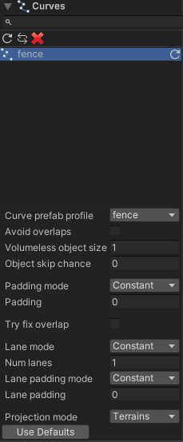

You can have as many curves as you wish and you can select them in this list and make changes to them. Note the settings that exist below the curves list. These can be used to change the settings for each created curve.

Moving the mouse over the scene view, you will see a small tick. This represents the first control point of the curve. In order to actually build the curve, follow the next steps:

1. **left-click** to add a new control point;
2. keep adding control points and move the mouse to establish their position;
3. when done, hold down **[SHIFT]** and **left-click** to commit;

The next image shows a simple fence that was constructed using the **fence** profile:

#### Manipulating Control Points

You can select control points by clicking on them. You can hold down **[CTRL]** and **left-click** to append. You can press **[CTRL + A]** to select all control points inside a curve.

You can insert a new control point by pressing **[C]**. This will allow you to move the mouse cursor next to the curve and **left-click** to insert a new control point.

There are 3 gizmos available:

- move gizmo - move selected control points;
- rotation gizmo - rotate the entire curve around its center point;
- scale gizmo - scale the curve from its center point;

You can press **[SHIFT + F]** to project the curve on the object that resides under the mouse cursor or the grid.

#### Duplicating Curves

You can press **[CTRL + D]** to duplicate the curves that are selected inside the curves list. **Note: **The scene view has to have focus for this to work. So make sure you click (any mouse button will do) in the scene view first before duplicating. This can be useful in some situations because it helps you avoid having to build a curve from scratch:

#### Terrain Projection

When placing curves on top of terrains that have many hills or bumps, moving the control points around might cause certain objects to become embedded inside the terrain or float above it. You can fix this by projecting control points using the **[SHIFT + F]** hotkey discussed earlier, but sometimes there is simply not enough control point granularity and adding more may not be feasible and/or may not fix the problem.

The best way to handle this is to enable terrain projection for all objects that reside inside a curve. Control points won't be affected, but the objects will always sit on top of the terrain.

This will ensure that the spawned objects will be projected on top of the terrain that is sitting below them no matter where the control points are positioned. 

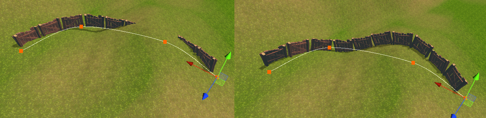

The image on the left shows how a curve might look like without projection enabled. The image on the right shows the result after the projection feature has been enabled.

By default, when the objects are projected on the terrain, their up axis will be aligned to the terrain surface normal. If you wish to change this, go to the **Curve Prefab Profile** window, select the prefabs and uncheck the **Align up axis when projected** field:

#### Multiple Lanes & Overlaps

You can spawn objects along multiple lanes that run parallel to the same curve. The following image shows a new curve that uses a different prefab profile and has had its lane count set to 3:

The curve settings have been changed as shown below:

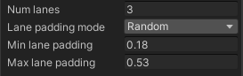

---

**Note: ** When using more than 1 lane, it is possible for objects to overlap in places where the curve takes a steep curve. You might need to adjust the position of control points to reduce overlap.

---

---

**Note: **When any kind of randomization is used, the objects will swirl around when you move the control points. This is because moving the control points causes the entire curve to be refreshed and randomization causes different values to be used each time.

---

Overlap can also happen even when using a single lane:

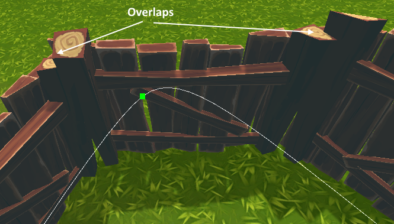

For the one lane case, you can check the **Try fix overlap** toggle in the curve settings to eliminate the overlap:

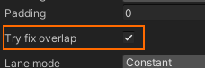

The next image shows the same curve but with this toggle checked:

---

**Note: **As the name suggests, the **Try fix overlap** functionality will **attempt** to fix the overlap but there are edge cases where this won't work.  Also, sometimes you might see objects being pushed aside (i.e. away from the curve). When this happens you will need to move some of the control points around the area where this happens.

---

#### Prefab Forward & Up Axes

Each prefab used inside a curve has 2 axes associated with it:

- **forward axis** - points in the direction the curve is moving/extending;
- up axis - runs perpendicular to the curve;

These can be set from the **Curve Prefab Profile** window:

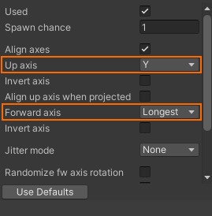

A visual representation of these axes can be seen below:

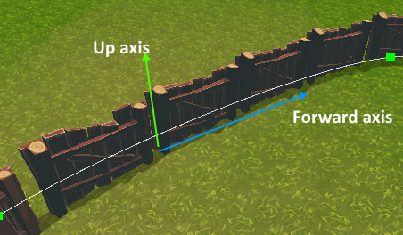

Possible values are:

- **X**- the prefab local X axis;
- **Y** - the prefab local Y axis;
- **Z** - the prefab local Z axis;
- **Longest** - the lonest prefab local axis;
- **Shortest** - the shortest prefab local axis;

---

**Note: **You might see strange/incorrect results if the forward and up axes are mapped to the same prefab local axis. For example, you might set the forward axis to **Longest** and the up axis to **Y**. But if the longest axis is **Y**, then the 2 are actually the same. As a rule of thumb, if objects look weird along the curve, this should be the first thing to look into.

---

### Physics Spawn

**Physics Spawn** allows you to spawn objects using physics simulation.

## Mirroring

## Integer Patterns

## Integer Range Prefab Profiles

## Random Prefab Profiles

## The Scene Grid

The scene grid is used for snapping objects. If you plan on building modular environments, it is important to establish a proper grid cell size.

Open **Tools > GSpawn > Grid Settings...**

The default cell size is set to **1** for all axes. This is value works well with prefabs whose size along X and Z are whole numbers such as **3.0, 4.0** etc. However, if you are working with prefabs whose size have a fractional part such as **2.5** or **3.5**, you should set the grid cell size to a lower value such as **0.5** or **0.25**.

### Picking a Grid Cell Size

Start with a grid cell size of **1** along all axes. Try to test it out by snapping a bunch of wall/floor pieces together. If the pieces don't connect to each other as they are supposed to, then follow the next steps:

- check if the art pack you are using comes with a readme file or doc. It's possible to find the cell size you should be using written in those documents. If not:
  - make sure the spawn guide uses one of the main building-block pieces such as a wall corner or floor;
  - press **[K]** on the keyboard. This will automatically set the grid cell size along the X and Z axes to the size of the prefab;
  - check the cell size in the **Grid Settings** window. If the cell size has a **0.5** fractional part (e.g. **1.5, 3.5**), set the **X & Z** cell size to **0.5**. For numbers that use other fractional parts (e.g. **1.25, 3.75**) set the **X & Z** cell size to **0.25**.

### Changing the Cell Size

You can also change the cell size by holding down **[CTRL + SHIFT + ALT]** and use the mouse scroll wheel. The **X & Z** cell size will change in increments of **0.25** units. A label will appear in the middle of the screen showing you the current grid cell size:

### The Y/Vertical Cell Size

The cell size along the Y axis is not something you can see in the scene view. But it is used during modular snapping when moving the spawn guide up/down using the hotkeys. The spawn guide will be moved in increments of the Y cell size Also, when objects are snapped to the grid, their position will also snap along the Y axis. 

Generally, you can leave this to **1**.

### Moving the Grid Up/Down

You can change the position of the grid along its local Y axis, using the **Local Y offset** field inside the grid settings window. You can also use the **[ [ ]** and **[ ] ]** keys to move the grid up/down in increments of the Y cell size.

You can also hold down **[G]** and **left-click** on an object to snap the grid to the position that lies under the mouse cursor. Holding down **[G]** and **double-clicking** will snap to object bounds extents. This works as follows:

- if the cursor lies **above the lower half** of the object, it will snap the grid to sit on top of the object;
- if the cursor lies **below the upper half** of the object, it will snap the grid to sit below the object;

This functionality can be useful when working with multistory environments.

## Object Selection

## Object Erase

## Object Groups

## Object Layers

