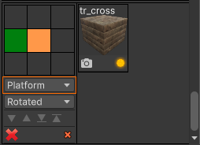
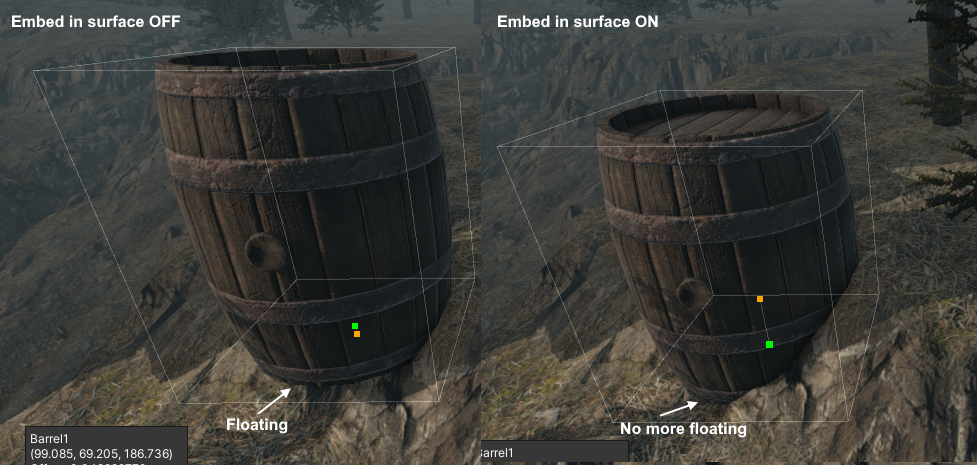
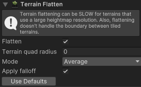
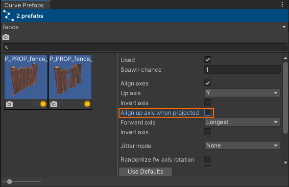
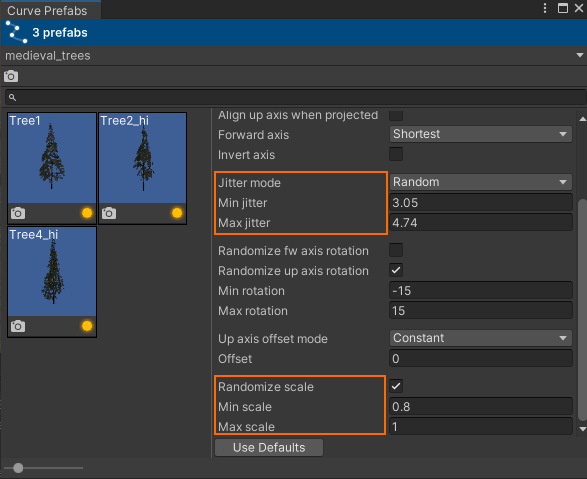
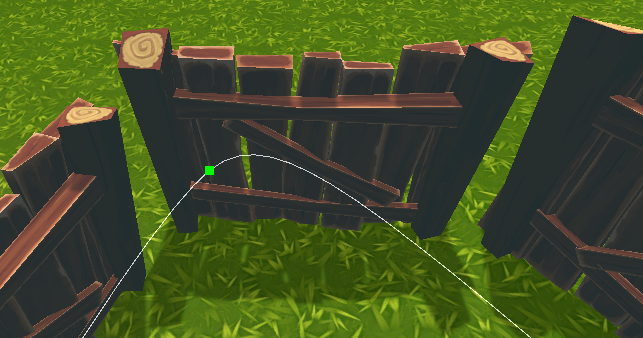
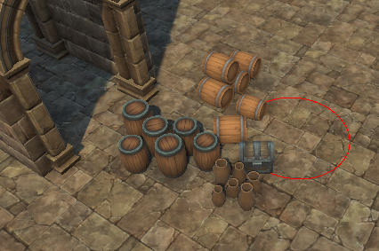
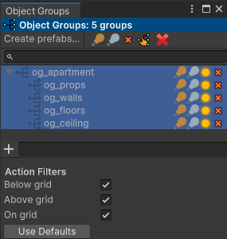
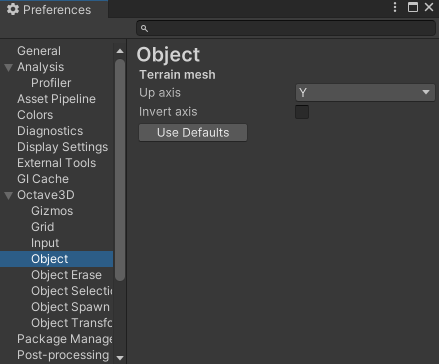
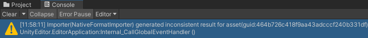

.. image:: logo.png

What is GSpawn - Level Designer?
--------------------------------

GSpawn is a powerful tool designed to streamline the process of
creating, editing, and managing levels for various types of video games
inside the Unity Editor using a plethora of tools that will be detailed
inside this document.

Getting Started
---------------

Get started with the 2 part intro video tutorial.

-  `GSpawn - Intro (Part 1) (Getting Started with Modular
   Environments) <https://www.youtube.com/watch?v=moZyLynFbok>`__
-  `GSpawn - Intro (Part 2)(Getting Started with Outdoor
   Environments) <https://www.youtube.com/watch?v=5hIt66ADm9Q&t=0s>`__

Although this document does discuss some of the hotkeys which are
available, it doesn’t contain a complete list. For a complete list of
hotkeys, please see the **GSpawn - Shortcuts** document in the **GSpawn
- Level Designer/Docs** folder.

Support
-------

For support, contact **octamodius@yahoo.com**

Or post on the `support
forum <https://forum.unity.com/threads/released-gspawn-level-designer-3d-tile-rules-curve-spawn-scatter-brush-modular-walls.1447273/>`__.

Assets
------

The following assets are used in the screenshots and **are not part of
the GSpawn - Level Designer package**:

-  `Multistory
   Dungeons <https://assetstore.unity.com/packages/3d/environments/dungeons/multistory-dungeons-33955>`__
   by `Mana Station <https://assetstore.unity.com/publishers/12379>`__
-  `Medieval Environment
   Pack <https://assetstore.unity.com/packages/3d/environments/historic/medieval-environment-pack-6859>`__
   by `Manufactura K4 <https://assetstore.unity.com/publishers/585>`__
-  `Fantastic Village
   Pack <https://assetstore.unity.com/packages/3d/environments/fantasy/fantastic-village-pack-152970>`__
   by `Tidal Flask
   Studios <https://assetstore.unity.com/publishers/43636>`__
-  `Village Interiors
   Kit <https://assetstore.unity.com/packages/3d/environments/fantasy/village-interiors-kit-17033>`__
   by `3DForge <https://assetstore.unity.com/publishers/2970>`__
-  `Voxel Blocks
   Pack <https://assetstore.unity.com/packages/3d/environments/fantasy/voxel-blocks-pack-52227>`__
   by `Tsunoa <https://assetstore.unity.com/publishers/18023>`__

Installation
------------

-  create a new project in Unity;

-  import the GSpawn - Level Designer package;

-  in the top menu, click on **Tools > GSpawn > Initialize**:

   .. image:: init.png

--------------

**Note**: Once you click on **Initialize**, the plugin will create a
**Data** folder and populate it with some of the asset files that it
needs to store different settings. This might require you to wait a
little bit until the necessary files are created.

--------------

When finished, the hierarchy view will show a new object in the scene
called **GSpawn** and the scene view will display a grid. At this point
initialization is complete. **You need to have the GSpawn object
selected in the hierarchy view in order to interact with the plugin**.

--------------

**Note:**\ You will need to perform this step for each scene in your
project. So when you are done with one scene, and would like to create a
new scene, you need to click on **Tools > GSpawn > Initialize** again.

--------------

The Inspector
-------------

When the GSpawn object is selected, the Inspector will show a few
toolbars:

The top toolbar has 3 buttons. Pressing one of these buttons will
activate a new mode of operation. The different modes of operation,
listed from left to right, are:

-  **Object Spawn** - spawn objects in the scene using different spawn
   tools;
-  **Object Selection** - select objects and manipulate them using
   different tools;
-  **Object Erase** - erase objects using different erase tools;

In the image above, the first button is active which means object spawn
mode is active. The toolbars sitting below the top toolbar contain
different buttons that activate different spawn tools.

Clicking on these buttons will change the Inspector UI to contain the
settings/controls that are specific to the tool you are using.

Same UI-Different Settings
~~~~~~~~~~~~~~~~~~~~~~~~~~

You will notice while working with the plugin, that some settings appear
in multiple places. For example, **Modular Snap** and **Mirror
Settings** are used by different tools and you will see their UIs appear
in different contexts. It is important to remember that each UI is
mapped to a unique instance of those settings. That means that these
settings are **not shared**. For example, **Modular Snap** settings
appear in the UI when working with the **Modular Snap Spawn**, **Modular
Walls Spawn**, **Segments Spawn**, **Box Spawn** and in **Object
Selection** mode. However, each of these tools/modes use their own copy
of those settings. Making changes to the snap settings in one context,
doesn’t affect the other settings.

Prefab Management
-----------------

In order to use the plugin functionality, you need to specify the
prefabs you are going to use.

In GSpawn, prefabs are organized in prefab libraries. Each prefab
library can contain a certain category of prefabs.

In order to setup your prefabs, you need to open 2 windows: Prefab
Library and Prefab Manager windows.

To open the Prefab Library Manager window:

-  open **Tools > GSpawn > Windows > Prefab Library Manager…**

To open the Prefab Manager window:

-  open **Tools > GSpawn > Windows > Prefab Manager…**

You can then dock these windows anywhere you wish. The next image shows
these 2 windows docked next to each other:

Creating Prefab Libraries
~~~~~~~~~~~~~~~~~~~~~~~~~

Dropping Prefab Folders
^^^^^^^^^^^^^^^^^^^^^^^

The easiest way to create prefab libraries and populate them with
prefabs is by dropping prefab folders in the Prefab Library Manager
window. Simply select a folder that contains prefabs and then drag and
drop it onto the blank area inside the Prefab Library Manager.

The next image shows the state of these 2 windows after a prefab folder
has been dropped inside the prefab library window:

The folder **Multistory Dungeons 2** was dropped in the prefab library
manager and the plugin has created a **hierarchy** of prefab libraries
that resembles the folder structure. Any folders that are **empty or
which don’t have any child folders that contain prefabs**, are excluded.

The orange tinted libraries are empty, but they contain child libraries
that contain prefabs. When a library contains prefabs, the number of
prefabs will be shown to the far right of the library name.

Clicking on a prefab library will update the Prefab Manager window which
will show a preview with all the prefabs that exist in that library. You
can select multiple libraries at once by holding down **[CTRL]** when
clicking. The prefab manager will always show the contents of all
selected libraries.

--------------

**Note:**\ It is recommended that you try to keep the number of prefab
libraries under control. When you use **Undo/Redo**, the plugin needs to
refresh the UI and this can cause small lags if the number of libraries
gets too large.

--------------

Manual Library Creation
^^^^^^^^^^^^^^^^^^^^^^^

You can also create libraries manually by entering a name in the bottom
most text field and then clicking on the plus icon. In order to populate
a library that was created manually, you must select prefab assets in
the project view and then drop them inside the **Prefab Manager**
window.

Library Visibility
~~~~~~~~~~~~~~~~~~

Each library has an **eye** icon to the left of its name. Clicking on
this icon will allow you to toggle the visibility of the library. When a
library is visible, its prefabs will show up in the prefab manager. When
invisible, its prefabs will be hidden. This can be used as a filtering
mechanism.

If a library is hidden, all its child libraries will also be hidden.

Moving/Copying Prefabs Between Libraries
~~~~~~~~~~~~~~~~~~~~~~~~~~~~~~~~~~~~~~~~

You can copy prefabs from one library to another using the following
steps:

-  select prefabs in the prefab manager;
-  press **[CTRL + C]**;
-  select the library (or libraries) where you would like to copy the
   prefab;
-  press **[CTRL + V]**;

OR

-  select prefabs in the prefab manager;
-  hold down **[ALT]**;
-  drag and drop the prefabs into the destination library;

You can also copy entire libraries:

-  select the libraries you wish to copy;
-  press **[CTRL + C]** (the libraries will turn green);
-  select the destination library (or libraries);
-  press **[CTRL + V]**;

In order to move prefabs from a library to another library, follow the
next steps:

-  select prefabs in the prefab manager;
-  drag and drop them in the destination library;

Prefab Previews
~~~~~~~~~~~~~~~

Prefab previews can be rotated by holding down the **middle mouse
button** and moving the mouse.

.. image:: prefab_preview_ui.png

At the top of the preview you can see the name of the prefab asset.

The first row at the bottom, contains a small camera button which will
reset the preview rotation back to **0** and a small yellow glowing
button which will highlight the prefab asset in the project window.

The second row at the bottom informs you whether or not the prefab is
linked to an `object group <##Object%20Groups>`__.

Prefab Library Profiles
~~~~~~~~~~~~~~~~~~~~~~~

It is possible to organize your prefab libraries into **prefab library
profiles**. Profiles are used in many places in the plugin. They are
essentially a way to quickly switch between different **configurations
of settings/data**. With respect to prefab libraries, you could for
example, have a library profile that you use in one scene and a
different profile that can be used in a different scene. There can only
be **one active profile** and the prefab library will only show the
libraries of the active profile.

Creating a Prefab Library Profile
^^^^^^^^^^^^^^^^^^^^^^^^^^^^^^^^^

In order to create a new library profile:

-  in the prefab library manager window, click on the top-most drop-down
   menu (initially it will contain a single item called **Default**);

-  then click on **Create new profile…**

   .. image:: create_lib_profile.png

-  a new window will appear:

   .. image:: create_lib_profile_wnd.png

-  enter a name for the profile and click on **Create**.

The new profile will be marked as the new active profile:

You can now populate the profile with libraries and prefabs using the
methods discussed previously.

Object Spawn Tools
------------------

The following spawn tools are available:

1. `Modular Snap Spawn <###Modular%20Snap%20Spawn>`__
2. `Modular Walls Spawn <###Modular%20Walls%20Spawn>`__
3. `Segments Spawn <###Segments%20Spawn>`__
4. `Box Spawn <###Box%20Spawn>`__
5. `Tile Rule Spawn <###Tile%20Rule%20Spawn>`__
6. `Props Spawn <###Props%20Spawn>`__
7. `Scatter Brush Spawn <###Scatter%20Brush%20Spawn>`__
8. `Curve Spawn <###Curve%20Spawn>`__
9. `Physics Spawn <###Physics%20Spawn>`__

The Spawn Guide
~~~~~~~~~~~~~~~

Some of the spawn tools work by creating a spawn guide object in the
scene which you can move with the mouse cursor in order to establish the
spawn location. The spawn guide is simply an indicator of where the next
object will be placed.

The following spawn tools use a spawn guide as indicator:

-  **Modular Snap Spawn**;
-  **Modular Walls Spawn**;
-  **Segments Spawn**;
-  **Box Spawn**;
-  **Props Spawn**;

When using any of the tools mentioned above, you need to
**double-click** on a prefab in the prefab manager window in order to
create a spawn guide. Then, move the mouse in the scene to establish a
spawn location. Left click to spawn.

--------------

**Note:** The way the spawn guide is moved in the scene with the mouse
depends on the active spawn tool. For example, in **Modular Snap
Spawn**, the guide will be snapped to the grid. In **Props Spawn**, it
will be snapped to mesh or terrain surfaces.

--------------

Spawn Guide Rotation
^^^^^^^^^^^^^^^^^^^^

You can rotate the spawn guide using the following hotkeys:

-  **[X]** - rotate around grid X axis;
-  **[Y]** - rotate around grid Y axis;
-  **[Z]** - rotate around grid Z axis;

All the hotkeys above will use the spawn guide pivot as the rotation
pivot. If you wish to use the spawn guide bounds center as the pivot,
you have to also hold down **[SHIFT]** while pressing the **X/Y/Z**
buttons.

You can press **[I]** to reset the object rotation to the rotation
stored in the prefab asset

When rotating the spawn guide with these hotkeys, the default rotation
is **90**. If you wish to change the rotation step, open **Edit >
Preferences…**

This will open Unity’s Preferences window. In the left pane, click on
**Input** under the **GSpawn** parent item:

You can now change the keyboard rotation step for each axis
individually.

Picking Prefabs From Scene Objects
^^^^^^^^^^^^^^^^^^^^^^^^^^^^^^^^^^

Instead of **double clicking** on prefab previews in the prefab manager
to change the spawn guide prefab, you can also pick prefabs from the
scene directly. This is much faster instead of searching through prefabs
in the manager.

Simply hold down **[ALT]** and left click on a scene object.

--------------

**Note:**\ This only works as long as the object you click on **is an
instance of a prefab that exists in the prefab manager**.

--------------

Modular Snap Spawn
~~~~~~~~~~~~~~~~~~

Modular snapping represents the act of snapping objects to the scene
grid. When this spawn tool is active, the spawn guide will be snapped to
the grid as you move the mouse. **When you left click, a new object will
be spawned in the scene**. This allows you to populate your environment
by placing one object at a time.

--------------

**Note:**\ Although **Modular Snap** is a spawn tool, modular snapping
is actually used in different places. Other spawn tools such as
**Modular Walls, Segments and Box** also use modular snapping to snap
the spawn guide. Also the **Object Selection** mode uses modular
snapping to snap selected objects which is very handy when making
changes to the scene.

--------------

Moving Up/Down
^^^^^^^^^^^^^^

It is sometimes useful to be able to move the spawn guide up/down. You
can use the **[Q]** & **[E]** hotkeys for this purpose. They will move
the spawn guide down & up respectively. The amount of movement is the
same as the **grid cell size along the Y axis**.

The same can be achieved if you hold down **[CTRL + SHIFT]** and use the
mouse scroll wheel to offset the guide.

Press **[R]** in order to reset the offset back to **0**.

Y Axis Rotation
^^^^^^^^^^^^^^^

In Modular Snap, you can rotate the spawn guide by holding down
**[SHIFT]** and using the mouse scroll wheel. This is in addition to the
**X/Y/Z** hotkeys discussed earlier.

Grid Snap Climb
^^^^^^^^^^^^^^^

Moving up/down using hotkeys or mouse scroll wheel is flexible, but
sometimes you may desire a more automatic behavior. This behavior is
called **grid snap climb** and you can find the associated field in the
Inspector:

You can also toggle grid snap climb on/off using **[SHIFT + C]**.

When grid snap climb is active, the spawn guide will ‘climb’ objects in
the scene and it will also be snapped to the grid. This works really
well for objects that are supposed to sit on top of other objects
(e.g. walls on top of floors, decorative elements on walls etc).

Object-to-Object Snap
^^^^^^^^^^^^^^^^^^^^^

Modular snapping has 2 modes of operation: grid snap (which we already
discussed) and object-to-object snap. You can switch between these 2 by
pressing **[S]**.

When object-to-object snap is active, the spawn guide will no longer
snap to the grid. Instead, it will snap to nearby objects.

--------------

**Note:**\ Object-to-object snapping doesn’t work well with prefabs that
have bumps or decorative elements on the sides. It is ideal when working
with walls, floors or any other similar structures that have flat
side-surfaces. And it is especially suited for working with tile blocks
(i.e. cubes).

--------------

Alignment Highlights & Hints
^^^^^^^^^^^^^^^^^^^^^^^^^^^^

When snapping objects, you will usually want to be precise and sometimes
you may want objects to line up in a certain direction. When using a
smaller grid cell size (e.g. **0.5** or **1**) this can become difficult
when objects are far apart because it is hard to tell wether their
positions line up correctly.

The plugin assists you by highlighting nearby objects when they line up
with the spawn guide along one of the grid axes. The next image shows an
example of this:

.. image:: alignment_highlights.png

In the image above 3 columns have been spawned on top of a floor. The
spawn guide has been placed in the corner and the highlights were used
to ensure that it lines-up properly along the grid X and Z axes.

In conjunction with the **alignment highlights**, the plugin can also
give you **alignment hints** which are labels attached to nearby
objects. Only those objects that line-up with the span guide will
display alignment hints.

In the image below, the hint labels were used to spawn 3 successive
equally spaced columns:

.. image:: alignment_hints.png

The labels show the name of the object to which they are attached and a
distance value. This distance value represent the distance from the
spawn guide. In this example, the columns were spawned from left to
right at a distance of 6 units from each other. **By spawning each new
column at a distance of 6 units away from the previous one, we can
ensure that all columns are equally spaced.**

Although very handy in certain scenarios, the highlights and especially
the labels can sometimes get in the way. You can toggle these helpers
using the following shortcuts:

-  **[SPACE]** - toggle alignment highlights;
-  [**SHIFT + SPACE**] - toggle alignment hints;

Prefs
'''''

There a few settings that that you can change from the preferences
window when it comes to alignment highlights and hints. Open **Edit >
Preferences…** and in the left pane click on **GSpawn > Object Transform
Sessions**:

.. image:: alignment_highlights_prefs.png

Under the **Modular Snap** section you have different settings that can
be modified that affect modular snapping. We will talk about those that
are related to alignment highlights and hints:

-  **Draw alignment highlights** - toggle alignment highlights. Hotkey:
   **[SPACE]**;
-  **Alignment highlight radius** - this number represents a world
   radius that is used to collect nearby objects that will be checked
   for alignment. Use bigger numbers to cover larger distances, although
   the default value should be more than enough in most cases;
-  **Show alignment hints** - toggle alignment hints. Hotkey: **[SHIFT +
   SPACE]**;
-  **Max number of alignment hints** - the maximum number of hint labels
   that will be shown in the scene view. For example, a value of **2**
   means that if there are **10** objects that line up with the spawn
   guide, only **2** of them will have hint labels shown in the scene
   view. A smaller number is generally desired in order to avoid
   clutter;

Grid Snap Axis Lock
^^^^^^^^^^^^^^^^^^^

When snapping to the grid, it may sometimes be useful to lock the
movement of the spawn guide along a single direction (i.e. one of the
grid’s axes, either the X or Z axis). You can do that by holding down
the **[CTRL]** key:

In the image above the **[CTRL]** key is held down and the spawn guide
con only move left or right when moving the mouse. In this manner you
can easily ensure that it lines up with the other columns.

The plugin will pick the axis that runs horizontally across the screen.
In the image above it just happens that this is the grid X axis. You can
however, hold down **[CTRL + SHIFT]** to change the axis. In the
previous example, this would change the lock axis so that it corresponds
to the grid Z axis (blue axis).

Modular Walls Spawn
~~~~~~~~~~~~~~~~~~~

This spawn tool is very handy for creating walls. You could use
**Modular Snap Spawn** to place one wall piece at a time. However, a
faster approach would be to use **Modular Walls Spawn** which can spawn
multiple wall segments in a few clicks while also handling inner and
outer corners automatically.

Modular Wall Prefab Profiles
^^^^^^^^^^^^^^^^^^^^^^^^^^^^

Before this tool can be used there is a bit of setup involved. If we
take a look in the Inspector, we can see the following settings:

We can see that we need to specify a **Modular wall prefab profile**.
This is a prefab profile that contains the necessary data which will be
used by the plugin to spawn wall pieces.

Open **Tools > GSpawn > Windows > Modular Wall Prefabs…**

The above window will show up on the screen and this is where you need
to specify the necessary data.

Wall Pieces
^^^^^^^^^^^

In the left pane you can see there are 3 icons that represent different
types of wall pieces. Let’s talk about what each of these mean:

-  **Straight Wall** - a straight wall piece is simply a regular wall
   piece that connects to 2 other adjacent wall pieces;
-  **Inner Corner** - an inner corner piece is used when the wall makes
   a turn and the corner points towards the inside of the area
   surrounded by the wall;
-  **Outer Corner** - an outer corner piece is used when the wall makes
   a turn and the corner points towards the outside of the area
   surrounded by the wall;

The following image shows the 3 prefabs that will be used in this
example, each prefab being mapped to each of the wall pieces we just
discussed:

.. image:: wall_pieces_ex.png

Profile Settings
^^^^^^^^^^^^^^^^

At the bottom of the modular wall prefab window, there is a section
labelled **Profile Settings**.

The first field is the most important and is called **Example prefab**.

The **Up axis** field allows you to specify the prefab local axis that
points up. This will usually be the Y axis.

The field **Truncate forward size** is used in situations where the
walls have small bumps at the sides where they connect to adjacent
pieces. If these bumps exist, this toggle has to be checked, otherwise
gaps can appear between the wall pieces.

The **Spawn pillars** toggle allows you to work with
`pillars <####Spawning%20Pillars>`__.

Example Prefab
^^^^^^^^^^^^^^

An example prefab is a prefab that you need to create that contains all
the necessary wall pieces arranged in a certain configuration that will
allow the plugin to detect how the wall pieces fit together.

In order to create the example, prefab follow the next steps:

-  switch to **Object Selection** mode;
-  find the **Straight Wall** piece in the prefab manager and drag and
   drop it in the scene. As soon as you release the left mouse button
   the object will start snapping to the grid. Left click to commit;
-  make sure that the **Straight Wall** piece uses a rotation of **0**
   on all axes. This is important;
-  spawn the **Inner** and **Outer** wall pieces in the scene using the
   same approach and connect them to the **Straight** piece. These can
   be rotated as necessary;
-  spawn 2 other **Straight** wall pieces (you can use **[CTRL + D]** to
   duplicate the first one) and connect them to the **Outer** and
   **Inner** corners respectively;

The next image shows how this arrangement looks like for the prefab
assets that we are using in this example:

The labels associated with each wall piece are not random. They have
special meaning. We’ll get back to this in just a bit.

Select the wall pieces you just created and inside the **Prefab Library
Manager** window click on the **Create prefab…** button in the top
toolbar:

This will bring up the following window:

You need to give the prefab asset a name and specify a destination
folder. You can drag and drop the folder in the **Destination folder**
field. The other fields are not important in this case.

Click on **Create**. If a prefab with the same name already exists, you
will be asked if you wish to replace the old prefab.

Now click on the prefab asset you just created. And open the prefab:

Once the prefab window is open, click on each wall piece and assign it
the right name as discussed earlier:

.. image:: opened_ex_prefab.png

These names are important to the plugin because it allows it to identify
the role of each piece. The names can be lower case, upper case or
mixed. The important thing is that the names should spell exactly as
shown in the image above.

Finally, drop the prefab asset inside the **Example prefab** in the
**Modular Wall Prefab Profile** window:

If there are any errors with the prefabs (e.g. incorrect naming) the
plugin will show an error message in the console window.

If you ever need to make changes to the example prefab, you have to
press the **Refresh** button to instruct the plugin to refresh the data.

Assigning Prefabs
^^^^^^^^^^^^^^^^^

The final step is to assign the wall piece prefabs to the correct slot
in the wall prefab profile window as shown in the image below:

.. image:: wall_prefab_assignment.png

Each wall piece was assigned to the right slot (**Straight Wall, Inner
Corner & Outer Corner**) by dragging a prefab from the **Prefab
Manager** window into the left pane next to the corresponding slot.

At this point, the prefab profile is ready to use.

--------------

**Note:**\ If you need more than one profile, you will have to create an
additional profile and a new example prefab for each profile. In this
example, a single profile is needed and the **Default** profile was
used.

--------------

Spawning Walls
^^^^^^^^^^^^^^

Make sure the **Modular Walls** spawn mode is active. Select the wall
prefab profile you would like to use in the **Modular wall prefab
profile** field.

Double-click on any prefab in the prefab manager (any prefab will do).
The plugin will create the spawn guide from the **Straight Wall** piece
associated with the current profile.

To spawn:

-  snap the spawn guide into the right position where you would like to
   place the wall. **Note:**\ The plugin will always keep the spawn
   guide’s up axis aligned to the grid. This means you can’t rotate the
   spawn guide around **X** or **Z**. Only the **Y** hotkey will work;
-  left click to start. This will disable the spawn guide and box
   indicators will appear to approximate the wall pieces;
-  each successive click will add 2 perpendicular wall segments;
-  when the entire wall plan has been established, hold **[SHIFT]** and
   **left-click** to commit;

While laying down wall segments, you can hold down **[SHIFT]** and
**right-click** to step back (i.e. remove the last 2 wall segments). You
can also press **[ESCAPE]** to cancel.

The next image shows a wall that surrounds a floor plan:

.. image:: wall_spawn_example.png

As you can see, even though there is a setup phase, once the setup phase
is finished, spawning walls can be done in a matter of a few clicks with
support for inner and outer corner detection.

Multiple Prefabs Per Wall Piece Slot
^^^^^^^^^^^^^^^^^^^^^^^^^^^^^^^^^^^^

You can assign more than one prefab to the same slot as shown in the
image below:

In the image above a damaged wall piece was added to the **Straight
Wall** slot. Two damaged prefabs were added to the **Inner Corner**
slot. The spawn chance field has been set to **0.3** for all damaged
prefabs.

The result can be seen in the next image:

.. image:: wall_spawn_example_damaged.png

--------------

**Note:**\ This only works as long as all the prefabs which are assigned
to a slot share the same pivot. For example, if you were to place all
the **Inner Corner** wall pieces at the origin in the same rotation, the
wall pieces would perfectly overlap.

--------------

Requirements
^^^^^^^^^^^^

In order to use the **Modular Walls** spawn tool, the following
conditions must be met:

-  the straight wall piece must be larger along the connection axis than
   it is along its inner axis (e.g. don’t use cubes);

-  when creating the example prefab, the **MiddleStraight** piece must
   have a rotation of **0** for all axes;

-  all wall prefab pieces must have the same up axis (i.e. if you set
   the rotation of all wall piece prefabs to **0** on all axes, they
   must all point up along the same axis);

-  when using wall profiles with inner and outer corners, you should
   avoid situations where you create a turn immediately after a corner
   piece. This can create overlaps or gaps in the wall. The next image
   shows an example of this situation:

Spawning Walls With No Inner/Outer Corners
^^^^^^^^^^^^^^^^^^^^^^^^^^^^^^^^^^^^^^^^^^

If you would like to spawn walls that don’t have **Inner/Outer**
corners, you can do that by following the next steps:

1. create the example prefab as shown in the image below:

.. image:: simple_wall_example_prefab.png

Note that in this case, because we don’t have access to inner and outer
corners, 2 straight wall pieces were used to create them. However, in
this case, these pieces don’t have to have a specific name. In fact,
their name can be anything **except** for the recognized names. In this
example, the name assigned to these objects was ‘-’.

2. assign the example prefab to the **Example prefab** field;

3. in the wall prefab profile window, assign the straight wall piece to
   the **Straight Wall** slot; **Inner & Outer** slots have to be kept
   blank;

The next image shows an example of spawning walls using this new wall
profile:

Spawning Arches
^^^^^^^^^^^^^^^

You are not limited to spawning walls only with this tool. For example,
the next image shows how this spawn tool was used to spawn arches:

The left image shows the example prefab and the right image shows the
final result.

Spawning Pillars
^^^^^^^^^^^^^^^^

You can also spawn pillars that sit between the different wall pieces.
The next image shows an example of spawning railings with pillars:

In order to support pillars, you will need to add 4 pillar objects to
the example prefab. The next image shows the example prefab that was
constructed for the railing example above:

.. image:: railing_pillars_example_prefab.png

There are 2 pairs of pillars that have to be added to the example
prefab:

1. at the beginning and the end of the outer corner
   (**PillerOuterCornerBegin** & **PillerOuterCornerEnd**);
2. at the beginning and the end of the inner corner
   (**PillerInnerCornerBegin** & **PillerInnerCornerEnd**);

--------------

**Note:**\ Don’t forget that the names are important. Case doesn’t
matter, but the name has to be spelled exactly as it is shown in the
image above.

--------------

Next, you need to check the **Spawn pillars** toggle in the wall profile
settings and select a `random prefab
profile <##Random%20Prefab%20Profiles>`__ that contains the pillar
prefabs:

At this point you are ready to spawn walls/railings with pillars.

Reusing Example Prefabs
^^^^^^^^^^^^^^^^^^^^^^^

Some asset packs contain different types of walls. They wall prefabs
look different, but the walls connect to each other in the same manner.
In this case, it is possible to reuse the same example prefab between
different wall profiles.

For example, the following example prefab can be used to create walls
for a village interior basement:

But using the same example prefab, different types of walls can be
created:

--------------

**Note:**\ You still need to create a new wall prefab profile for each
type of wall, but the example prefab can be reused between profiles.

--------------

Segments Spawn
~~~~~~~~~~~~~~

**Segments Spawn** and its cousin `Box Spawn <###Box%20Spawn>`__ are
very handy when working with tile blocks. They can also be used when
laying down floors in modular environments. In fact, the floor prefabs
that you saw in the **Modular Walls Spawn** chapter images were spawned
using **Box Spawn**.

In order to use **Segments Spawn**, make sure the tool button is active
in the Inspector as shown in the image above.

**Double-click** on a prefab in the prefab manager to activate the spawn
guide. This will enable **modular snap** and you can move the spawn
guide around in the scene and snap it to the grid just like you can do
with other spawn tools that use snapping.

In order to spawn, follow the next steps:

-  **left-click** to start (this will disable the spawn guide and show
   box indicators instead);
-  each successive click adds 2 new perpendicular segment pairs;
-  hold down **[SHIFT]** and **left-click** to commit and spawn;

You can hold down **[SHIFT]** and **right-click** to step back
(i.e. remove the last 2 segments) if you make a mistake.

The next image shows a simple example of a series of tile blocks spawned
using this tool:

.. image:: segments_spawn_example.png

Extension Plane
^^^^^^^^^^^^^^^

When the spawn guide is created, you will see a transparent quad sitting
below the spawn guide:

This is the **extension plane** and it is also used in **Box Spawn**
mode. The extension plane represents the horizontal extension direction.
This simply means that the segments chain (or box for **Box Spawn**)
will extend along the surface of this plane.

The height of the segments chain (or box for **Box Spawn)** will extend
perpendicular to this plane.

You can cycle through different plane orientations by holding down
**[CTRL]** and using the mouse scroll wheel.

You can hold down **[CTRL + ALT]** and **left-click** to pick the
orientation from the object under the mouse cursor or the grid. The
plane will always be aligned with one of the spawn guide’s bounding
volume faces. So, when picking the orientation via left-click, the
extension plane will be aligned with the volume face that is most
aligned with the surface you picked with the mouse cursor.

--------------

**Note:**\ Since the orientation of the plane is linked to the spawn
guide’s volume faces, rotating the spawn guide will also change the
orientation of the extension plane.

--------------

Height Modes
^^^^^^^^^^^^

There are 3 height modes that allow you to change the height of the
segment chain. Before we discuss these height modes it is important to
talk about **cell stacks**. Each segment is a collection of **cell
stacks** that extend along a certain direction. Each cell stack can have
a different number of cells. The number of cells in a stack is called
the **stack height**. Objects will be spawned in each cell.

The available height modes are:

-  **Constant** - each stack has the same height value;

-  **Random** - each stack will have a random height in a specified
   interval;

-  **Pattern** - the height of each stack will be taken from an `integer
   pattern <##Integer%20Patterns>`__;

The next image shows the height mode controls in the UI:

.. image:: seg_height_mode_const.png

The **Default height** field allows you to specify a default height
value that will be used when you start a segment chain. The
**Raise/Lower amount** fields allow you to control how many cells are
added/removed when changing the height using the scroll wheel.

The 3 fields (**Default height, Raise amount & Lower amount**) apply to
all height modes. For the **Random** and **Pattern** modes, the default
height acts as a base height value.

The following image shows an example of tiles spawned using each one of
these height modes:

.. image:: seg_spawn_height_mode_ex.png

You can change the height by holding down **[SHIFT]** and using the
mouse scroll wheel. When using the **Random** and **Pattern** modes,
this will essentially allow you to apply a base height value to the
generated height values.

Prefab Pick Mode
^^^^^^^^^^^^^^^^

By default, when you spawn objects using the **Segments Spawn** tool,
the objects will be spawned from the same prefab used by the spawn
guide. But it is possible to randomize the prefabs that are used during
spawn.

In the segments spawn settings UI, there is a field called **Prefab pick
mode**. The following options are available:

-  **Spawn Guide** - the objects will be spawned from the prefab
   associated with the spawn guide (the one you double-clicked in the
   prefab manager window to create the spawn guide);
-  **Random** - the prefab will be picked from a `random prefab
   profile <##Random%20Prefab%20Profiles>`__;
-  **Height Range** - the prefab is picked from a `integer range prefab
   profile <##Integer%20Range%20Prefab%20Profiles>`__;

The following image shows tiles which were spawned using the **Random**
and **Height Range** pick modes:

--------------

**Note:**\ When using **Random** or **Height Range**, you should make
sure all prefabs have the same size. Otherwise, you might encounter
incorrect results.

--------------

Settings Profiles
^^^^^^^^^^^^^^^^^

The segment settings can be organized in profiles:

.. image:: segments_profiles_ui.png

A **Default** profile is always available, but you could create more.
This can be useful in situations where you need to switch between
different configurations of settings. Having to change them manually
each time you need to spawn tiles with a different strategy can be
tedious. But if you organize the settings in profiles, you only need to
select a new profile and the settings will automatically reflect the
change.

--------------

**Note:**\ When changing settings, you actually make changes to the
currently active profile.

--------------

Box Spawn
~~~~~~~~~

.. image:: box_spawn_btn.png

**Box Spawn** is another spawn tool which is useful when working tile
blocks or when laying down floors.

In order to use **Box Spawn**, make sure the tool button is active in
the Inspector as shown in the image above.

**Double-click** on a prefab in the prefab manager to activate the spawn
guide. This will enable **modular snap** and you can move the spawn
guide around in the scene and snap it to the grid just like you can do
with other spawn tools that use snapping.

In order to spawn, follow the next steps:

-  **left-click** to start (this will disable the spawn guide and show
   box indicators instead);
-  **left-click** to spawn;

Box Spawn also supports the same `height modes <####Height%20Modes>`__
as **Segments Spawn**. Also, the same `prefab picking
strategies <####Prefab%20Pick%20Mode>`__ can be used.

Fill Modes
^^^^^^^^^^

In **Box Spawn** there are 3 fill modes available:

The default fill mode is **Solid**. This simply means that the box area
will be filled with objects.

The second fill mode is **Border**. When this fill mode is active, you
can also change the box border. The next image shows a few examples of
spawning tiles with different border size width values:

.. image:: box_spawn_border_width_ex.png

The next image shows the inside of the right most structure:

.. image:: box_border_inside.png

The third fill mode is **Hollow**. This essentially creates a hollow box
volume. The next image shows the interior of such a structure:

When working with tile blocks, this fill mode can actually be used as an
optimization strategy. From the outside, the structures will look the
same as when using the **Solid** fill mode. But on the inside they are
empty. Which means fewer tiles to process/render etc.

This depends of course on the game’s needs. Sometimes it may be useful
to use the **Solid** fill mode instead.

Tile Rule Spawn
~~~~~~~~~~~~~~~

The **Tile Rule Spawn** tool allows you to paint tiles inside an
infinite grid. When tiles are painted, adjacent tiles are automatically
updated based on a series of specified **tile rules**. These tile rules
define the way each tile opens up (i.e. connects) to adjacent tiles.

In order to use this tool, the next steps have to be performed:

1. create the tile prefabs;
2. create a **Tile Rule Prefab Profile**;
3. populate the tile rule profile with tile rules which define the way
   in which the tile prefabs open up (i.e. connect) to each other;
4. create a tile rule grid;
5. paint;

The **tile rule spawn** tool will work with any modular prefabs that can
be connected. If you can create a bunch of tiles that can connect to
each other using Unity’s interface, you should be able to use those
prefabs with the **Tile Rule Spawn** tool. There is an exception to
this, namely walls. The tile rule system doesn’t handle inner and outer
corners properly. So if you need to create environments where floors
must have walls sitting on top, it is best to use a combination of
**Modular Snap Spawn** and **Modular Walls Spawn**.

--------------

**Note:**\ After you paint an environment using **Tile Rules**, you can
then populate it using **Modular Snap Spawn** or **Props Spawn** or any
other spawn tool for that matter.

--------------

Creating Tile Rule Prefabs
^^^^^^^^^^^^^^^^^^^^^^^^^^

Assuming you have an asset package that contains modular prefabs and you
would like to create a bunch of tiles that can be used with the tile
rule spawn tool. The easiest way to do this would be to follow these
steps:

1. activate **Object Selection** mode;
2. from the prefab manager, drag and drop prefabs into the scene. When a
   prefab is dropped into the scene, it will automatically start
   snapping to the grid. **Left-click** to stop snapping. Press **[D]**
   to enable snapping again if you want to make changes. You can also
   use the move gizmo with **[CTRL]** held down to snap. Press **[SHIFT
   + S]** to snap the object to the grid along all axes;
3. snap each object in the right place;
4. press the **Create prefab…** button in the **Prefab Library Manager**
   window;
5. enter the name of the prefab and pick a folder;
6. set the pivot to **TileRule** and enter the name of the **Pivot
   object name**;
7. make sure the objects are selected click on **Create**;

.. image:: tr_prefab_create_wnd.png

In the image above, the **Pivot object name** field was set to
**Base_01**. The pivot object represents the main object in the tile. It
is the object that will sit on top of the grid surface, usually a floor
prefab. Decorations will usually be placed around this object. If you
leave this field empty, the plugin will pick the object which has the
greatest volume (the mesh bounding volume is used). This is ok in most
situations, but if your tile is composed of different objects of similar
sizes, you will have to enter the name of the pivot object in this
field.

The next image shows an example of a tile prefab that was created:

.. image:: tr_bridge_prefab.png

The next image shows the tiles that were created for the purposes of
this discussion:

The labels below each tile are simply conventions and try to describe
the tile rule associated with each tile. For example, the **Bridge**
tile connects 2 adjacent tiles along a certain direction. The **Turn**
tile connects 2 adjacent tiles when they meet in a corner.

After all tiles have been created, make sure to add them to a prefab
library so that they can be picked from the **Prefab Manager**.

Creating Tile Rules
^^^^^^^^^^^^^^^^^^^

A tile rule specifies how a tile connects to adjacent tiles. After the
tile prefabs have been created and assigned to a prefab library, you
have to create a **tile rule profile**. Open **Tools > GSpawn > Windows
> Tile Rules…**

.. image:: empty_tile_rule_wnd.png

Use the topmost drop-down control to create a new profile. You can also
use the **Default** profile if you wish.

A tile rule profile holds a collection of tile rules. Each tile rule can
be associated with one or more prefabs.

In order to create a new tile rule, click on the left-most **plus icon**
in the top toolbar. This will add a new tile rule in the left pane:

The small button grid allows you to define the rule. The middle button
represents a tile that is painted inside the grid. The adjacent buttons
represent its neighbor cells. If you **left-click** on one of the
neighbor cells, it will turn **green**. When a tile is green, it means
that the center tile opens up in that direction so a tile has to exist
in that cell. If you **right-click** it will turn **red**. This means
the center tile is closed off in this direction and no tile can reside
in that cell. **Gray** cells are neutral (i.e. the rule doesn’t care if
a tile exists in that cell or not).

In order to assign prefabs to a tile rule, you have to select prefabs in
the prefab manager and drag and drop them inside the tile rule drop
area:

.. image:: assign_prefabs_to_tile_rule_ex.png

Next you have to **left/right-click** on the tile buttons to define the
rule. The next image shows the tile rules that were created for each of
the 5 tiles we created earlier:

.. image:: tile_rule_prefab_mapping.png

An important detail to remember here is that the coordinate system of
the tile buttons in tile rule UI maps to the world axes as explained
below:

-  the **horizontal axis** of the button grid maps to the **world X
   axis**;
-  the **vertical axis** of the button grid maps to the **world Z
   axis**;

So when clicking on the buttons to turn them green (or red) you first
have to look at the tile objects and see where they open up and where
they close off. In the image above, the tiles are lined up along the
world X axis and the camera is looking roughly along the world Z axis.

The **Bridge** tile opens up along the Z axis, but is closed off along
the X axis (the railings block the entrance). Therefore, the bottom and
top tiles of the tile rule button grid were turned green.

The **Cap** tile opens up along the negative Z axis. Only the bottom
tile was turned green in this case.

The **Turn** tile opens along the positive X axis and the negative Z
axis. Therefore, the right and bottom cells were turned green.

The **TJunction** tile opens up along the X axis and along the negative
Z axis. The left & right neighbors were turned green together with the
bottom one.

The **Cross** tile opens up along the X and Z axes, so the horizontal
and vertical neighbors were turned green.

Don’t forget that you can also **right-click** on the cell/tile buttons
to turn the red. This allows you to be more specific. For example, if
you wanted to have a variation of the **Cross** tile that only spawns
when **it is not** surrounded by neighbors on the diagonal, you could
define the rule like this:

This variant will spawn **only** if the tile is surrounded by tiles
along the X and Z axes **AND** it doesn’t have any neighbor tiles along
the diagonals.

Defining the tile rules may get a little bit of getting used to,
especially if you haven’t used tile rules before. It may take some trial
and error until you get the results you are after. Although we haven’t
talked about painting yet, you should know that you can start painting
tiles as soon as you have at least one rule defined. In this way, you
can create a rule, create a grid, and paint a bunch of tiles for preview
purposes and then see the grid update automatically when you add new
rules or when making changes to existing rules. This makes it easy to
spot mistakes early and make the necessary changes.

Creating a Tile Rule Grid
^^^^^^^^^^^^^^^^^^^^^^^^^

Once the tile rule profile is setup, you have to create a tile rule grid
which will be used as a paint canvas.

--------------

**Note:**\ The tile rule grid should not be confused with the **scene
grid**. They are different. When using the **Tile Rule Spawn** tool, you
will be painting on the tile rule grid. When using **Modular Snap
Spawn** or other tools that use modular snapping, you will be snapping
to the scene grid.

--------------

Make sure the **Tile Rule Spawn** tool is active. Find the **Tile Rule
Grid Creation** section and fill in the settings:

The mandatory fields are the following:

-  **Tile rule profile** - the tile rule profile you created. This could
   be the **Default** profile if you chose not to create a new profile.
   In this example, the name of the tile rule profile is
   **ms_dungeons**;
-  **Cell size**: the grid cell size. For the prefabs we have been using
   in this example, the cell size is **<4, 3, 4>**. In order to find out
   the grid cell size, you have to know the size of the pivot object
   (the main object that defines a tile). This is usually a floor
   prefab. You can hover a prefab preview in the **Tile Rule Profile**
   window in order to find its size:

Just make sure to pick a prefab without decorations on the side. If you
don’t have one, then pick any prefab, and truncate the values. For
example, if the values show **<4.023, 3.1200, 4.08>** then you can use
the size **<4, 3, 4>**.

Give the grid a name (in this case **dungeon**) and click on the
**Create grid** button. This will create a game object in the scene with
the same name. When painting tiles, all tiles will be spawned as
children of this object.

Also, if you take a look in the Inspector, you will see that a tile rule
grid item was added to the grid list:

You can have multiple grids in the same scene. The plugin uses the
concept of **current grid** to establish the grid that is used as a
paint canvas. You can click on a grid in the grid list to mark it as the
current grid. The current grid is shown in green.

The next image shows the meaning of the controls which are associated
with the tile rule grid item:

.. image:: tile_rule_grid_item_actions_settings.png

If you click on the left most arrow you can expand the UI:

.. image:: tile_rule_grid_item_expanded.png

From here you can change the grid origin and its rotation. This will
actually change the position and rotation of the grid object in the
scene.

The last few controls allow you to enable/disable mirroring, toggle
mirror planes and move the mirror gizmo to a specified grid cell.

Tools & Brushes
^^^^^^^^^^^^^^^

.. image:: tile_rule_spawn_toolbars.png

If you look in the Inspector, you will see these 2 toolbars when the
**Tile Rule Spawn** tool is active.

The first toolbar allows you to select the current tool. There are 4
tools available:

-  **Paint [Q]** - paint tiles using different types of brushes;
-  **Ramp Paint [W]** - paint ramps;
-  **Erase [E]** - erase tile using different types of brushes (can also
   erase non-tiles, that is objects spawned with other spawn tools if
   the **Erase foreign objects** toggle is checked in the Inspector);
-  **Connect [R]** - connect pairs of cells in the grid;

The second toolbar allows you to select the current brush. There are 3
brushes available:

-  **Box Brush [SHIFT + Q]** - paint tiles using a box brush.
   **Left-click** & drag to spawn tiles;

   -  **[CTRL + scroll wheel]** - change horizontal size;
   -  **[SHIFT + scroll wheel]**- change height;
   -  **[CTRL + ALT + scroll wheel]** - move up/down;

-  **Flexi Box Brush [SHIFT + W]** - similar to box brush, but instead
   of changing the horizontal size using the scroll wheel, you change it
   by moving the mouse. **Left-click**, move the mouse to establish the
   size, then **left-click** again to spawn;

   -  **[SHIFT + scroll wheel]**- change height;
   -  **[CTRL + ALT + scroll wheel]** - move up/down;

-  **Segments Brush [SHIFT + E]** - spawn tiles along line segments.
   **Left-click** to start, move the mouse to establish the segment
   end-point, **left-click** to add a new segment, **[SHIFT +
   left-click]** to spawn.

   -  **[SHIFT + scroll wheel]** - change height;
   -  [**CTRL + ALT + scroll wheel**] - move up/down;

--------------

**Note:**\ When the **Ramp Paint** tool is active, only the **Box
Brush** can be used and it will always have a horizontal size and height
of **1**.

--------------

By default, the brushes will snap to the tile hovered by the mouse
cursor. This is useful in order to avoid using the **[CTRL + ALT]**
hotkey all the time when you wish to move up and down. When painting,
the brush will snap adjacent to the tile and when erasing, the brush
will snap to the actual tile position.

If you wish to disable this automatic snapping behavior, you can uncheck
the **Snap to tiles** toggle in the Inspector:

The next image shows a simple dungeon environment which was painted
using a combination of **Box** and **Flexi Box** brushes:

.. image:: simple_tile_rule_example_dungeon.png

The next image shows a simple example of using the segments brush:

This is useful for quickly creating pathways.

Platform Rules
^^^^^^^^^^^^^^

Let’s take a look at the first environment that was shown earlier, but
this time from another angle:

Notice that where the tiles stack on top of each other, the railings
look a bit off. Although not entirely incorrect (it may be what you are
looking after), it would be nice if we could somehow find a way to spawn
only the floors (base) objects without decorations.

In order to do this, we can create a new tile rule and set its rule type
to **Platform**:

Note that we are using the same prefab as we are using for the **Cross**
rule. This is just a simple floor object with no decorations.

Also, below the cell button grid, we set the rule type from **Standard**
to **Platform**.

A single neighbor was set to green and it doesn’t matter which one we
pick in this case. This will ensure that whenever a platform is detected
this rule will be picked.

Let’s take another look at our tiles:

.. image:: platform_tiles_ex_0.png

The railings have disappeared because the plugin can now use the
platform rule instead. However, we are still not quite done yet. If we
look at the bottom most platform tile (the one closest to the viewer),
we can see that it sits below a rounded corner, but the platform tile
has cubic shape. In order to fix this we will have to add a second
platform rule that defines a turn:

.. image:: turn_rule_ui.png

Let’s have another look at our tiles:

.. image:: updated_tiles_with_2_platform_rules.png

Our problem has been fixed, but now we have another one. Because we have
added a new rule that uses 2 green tiles, some of the old platforms have
been updated to correctly match this new rule. These tiles are actually
**TJunction** rules. So let’s go ahead and add one final platform rule:

.. image:: platform_rule_tjunction.png

The result now looks like this which is exactly what we are after:

Ramp Rules
^^^^^^^^^^

Another type of tile rule is the **Ramp** rule. You need to define at
least one ramp rule in order to use the **Ramp Paint** tool.

The following ramp prefab was created for this example:

.. image:: tr_ramp.png

A ramp rule was created as shown below:

.. image:: ramp_rule_ui.png

The ramp opens up along the negative X axis, so the left neighbor was
made green.

At this point, you can activate the **Ramp Paint** tool and paint ramps.

The next image shows a new environment that uses ramp tiles:

When placing ramps it is possible to run into situations where the ramp
is surrounded by more than one tile and the ramp rotation may be
incorrect. For example, consider the following scenario:

.. image:: ramp_direction.png

The ramp points to the left tile, but we want it to point towards the
forward tile. You could probably define multiple ramp rules, but that
can be tedious. Instead, you can place the ramp brush over the ramp and
press **[Y]** to rotate it:

.. image:: ramp_direction_correct.png

--------------

**Note:**\ When the tile grid gets refreshed, the ramp rotations will be
restored properly as long as all ramp prefabs open up along the same
axis in their model pose. For example, if the ramp rule contains
multiple ramp prefabs, when the grid is refreshed, a ramp will be picked
using the prefabs’ spawn chance property for each ramp tile in the grid.
The picked ramp prefab might open up along a different axis compared to
the old ramp tile and this can cause incorrect results to appear. The
best way to avoid this is to make sure that all ramps open up along the
same axis when creating the ramp prefabs.

--------------

The Connect Tool
^^^^^^^^^^^^^^^^

The **Connect** tool can be very handy for creating suspended pathways.

In order to use, make sure you click on the **Connect** button in the
Inspector to activate it:

Or press **[R]**.

Next, follow these steps:

1. move the mouse to establish a start point;
2. **left-click** to start. This will create 2 perpendicular tile
   segments;
3. move the mouse to establish and end-point;
4. **left-click** to spawn;

.. image:: connect_example.png

You can hold down **[CTRL + ALT]** and use the scroll wheel to change
the Y offset for the start and end points. You can do this before
**left-clicking** to set the start point offset and post **left-click**
to change the end point offset.

The Y offset is updated automatically when you hover a tile with the
mouse cursor. In that case the start/end point will snap to the same
cell in which the hovered tile resides.

Press **[SPACE]** to change the major axis. The major axis is the axis
along which the first segment is travelling. In the image above, the
first segment travels forward and the second segment travels to the
right. Pressing **[SPACE]** would reverse these travel directions.

The next image shows an example where the start point sits on the grid
and the end point has been raised above the grid:

Note that the ramps were added automatically in order to make the upper
area accessible. Ramps will only be generated if a ramp rule is defined
and if the **Generate ramps** toggle is checked inside the Inspector
under the **Connect** UI section.

Also, towards the left, where the 2 segments meet in the corner, 2 tiles
were inserted in order to make the ramp accessible.

The next image shows an example of a more complex path network:

When using this tool, you need to sometimes be careful not to
accidentally block existing pathways as shown below:

.. image:: connect_blocked_path.png

Tile Rule Priority
^^^^^^^^^^^^^^^^^^

When painting tiles, the tile rules are evaluated **in the order in
which they appear in the tile rule window for each rule type**. If you
have 2 or more rules that use the same number of green tiles, the first
one will be picked from bottom to top. This can produce incorrect
results.

There are 2 ways to handle this:

-  be more specific by turning more of the adjacent cells green or red.
   The less neutral tiles, the more specific you are and the easier it
   will be for the plugin to understand your intentions;
-  use the **move up/move down/move to top/ move to bottom** buttons:

Pressing these buttons will move the rule up/down in the UI while also
changing their priority.

Tile Rule Grid Refresh
^^^^^^^^^^^^^^^^^^^^^^

When making changes to a tile rule profile (changing cell states, adding
prefabs etc), all the grids which use that profile will automatically be
updated.

As the number of tiles inside a grid grows, grid refreshing can become
slow. In this case, you might want to turn off automatic updates, make
the necessary changes to the tile rules, and update the grid manually:

.. image:: auto_tr_grid_refresh_toggle.png

In the image above, the toggle at the bottom right has been unchecked.
This means automatic refresh is turned off. The grid(s) can be manually
refreshed by pressing the **Refresh grids** buttons.

Tile Rule Radius
^^^^^^^^^^^^^^^^

By default, the tile rules use a radius of **1**. This means that only
the immediate neighbors are taken into account. In some situations you
may want to use a larger radius. The largest radius you can have is
**2**.

In order to set the tile rule radius you need to follow the next steps:

1. set the radius to the desired value in the tile rule window UI:

.. image:: change_tile_rule_radius.png

When you do that you’ll notice that the cell button grid will change
appearance because there are now more neighbors that can be worked with:

.. image:: more_tr_cells_radius_2.png

This step will only enable you to use a radius of 2 inside the UI, but
it doesn’t actually do anything besides that.

2. in the Inspector UI, you have to change the radius associated with
   the tile rule grid:

.. image:: enable_2_radius_tile_grid.png

At this point, the new radius is taken into account when
painting/erasing tiles.

Prefab Settings
^^^^^^^^^^^^^^^

When you click on prefabs in the tile rule profile window, the right
pane will display a few settings:

The **spawn chance** is useful when you have more than one prefab per
rule. For example, you might have damaged versions of the same prefab
that you would like to spawn. In that case, you can select the damaged
versions and change their spawn chance to something like **0.2** or more
depending on how often you would like those prefabs to appear in the
scene.

The **Cell X/Y/Z condition** fields allow you to define a cell range
where the prefab can appear in the tile grid. For example, let’s suppose
you had 2 versions of a ramp rule prefab: one with railings on the side
and another one with no railings. You may want to spawn the simple ram
(no railings) when the Y coordinate is in the interval **[0, 1]** and
the more majestic version (with rails) for all Y coordinates starting at
**2** and upwards.

The next image shows the updated ramp rule:

.. image:: updated_ramp_rule_cond.png

Note that there are now 2 ramp prefabs: one simple and one with railings
on the sides. The one with railings on the sides has the **Cell Y
condition** checked and the Y interval has been set to **[2, 100]**. A
value of 100 in this case means “infinity” since it’s rare that you will
have grids that go so high up.

The simple ramp uses an interval of **[0, 1]**.

The next image shows a simple environment that was created using these
updated ramp rules:

.. image:: tile_rule_env_cond_ramps.png

When any one of the **Cell X/Y/Z condition** toggles are checked, the
prefab is said to be **conditioned**. When painting tiles, the plugin
will first process the conditioned prefabs first and check if any one of
these satisfies all conditions for the current cell that is being
painted. The first prefab that satisfies all conditions will be picked.
If all prefabs are conditioned, but no prefab satisfies the conditions,
the **spawn chance** will be used to randomly pick a prefab.

Fixing Overlaps
^^^^^^^^^^^^^^^

The tiles that we have been using have these pillars attached to them
and the pillars sit right where the tiles connect with adjacent tiles
which also have pillars. This causes a problem to appear where the
pillars from 2 or more connecting tiles overlap with each other. The
next image shows an example of this:

This can cause rendering artifacts. Although we can’t see the artifacts
in the image, when moving the camera, there is flickering effect because
the 2 pillars are fighting with each other over which one gets rendered.

In order to solve this, you have to go to the tile rule grid list in the
Inspector and click on the **Fix overlaps** button as shown below:

This will hide the renderers of the overlapping pillars so that a single
pillar gets rendered.

As you can see, this is a manual step. When you paint/erase tiles, the
same issue can appear again because new tiles are created so it is best
to perform this step at the end, when your game level is finished.

Props Spawn
~~~~~~~~~~~

The **Props Spawn** tool is great for populating your scenes with props.
For example, you could use it to populate your terrains with trees,
houses, fences, barrels and the like. You can also spawn directly on
other mesh surfaces. If you are creating a modular environment, you
could use this tool to spawn props on the floor or on the walls.

In order to use, **double-click** on a prefab in the **Prefab Manager**
window. This will activate the spawn guide and you can move it around in
the scene. Instead of snapping to the grid (as is the case with the
previous tools that were discussed), it will snap directly to mesh or
terrain surfaces.

The following hotkeys are available when working with **Props Spawn**:

-  **[SHIFT + mouse move]** - rotate the spawn guide around the surface
   normal if axis alignment is turned on; rotate around the grid Y axis
   if axis alignment is turned off;
-  **[CTRL + mouse move]** - scale the spawn guide;
-  **[ALT + mouse move]** - offset the spawn guide from the surface
   (useful for embedding on steep surfaces);
-  **[R]** - reset the offset applied by moving the mouse back to **0**;

The **[X/Y/Z] & [SHIFT + X/Y/Z]** hotkeys are also available for
rotating the spawn guide using the keyboard. You can press **[I]** to
reset the object rotation to the rotation stored in the prefab asset and
**[O]** will reset the scale to the prefab scale.

Axis Alignment
^^^^^^^^^^^^^^

Axis alignment refers to the idea of aligning one of the spawn guide’s
axes to the surface on which it resides. By default, it is turned off,
but you can turn it on/off by either pressing **[SHIFT + A]** or by
checking/unchecking the **Align axis** toggle in the Inspector:

.. image:: surface_snap_axis_controls_ui.png

If **Align axis** is checked, you also need to specify an alignment axis
using the **Alignment axis** field. The alignment axis is considered to
be the positive axis. If you wish to use the corresponding negative
axis, check **Invert axis**.

Typically, you will want to leave this off. For example, if you want to
populate terrains with trees, axis alignment should be turned off. Trees
grow upwards and they don’t look right when aligned with the terrain
surface. Houses also usually stand straight up.

Axis alignment could be useful if for example you were placing objects
on an incline or a ramp or some kind of decorative elements such as
elongated crystals on top of rock surfaces.

Surface Offset & Embed in Surface
^^^^^^^^^^^^^^^^^^^^^^^^^^^^^^^^^

Although you can change the offset from the surface using the mouse, you
can also use an implicit offset by changing the value of the **Implicit
offset** field. This can be useful when placing objects on steep
surfaces with axis alignment turned off in order to avoid floating.

The field **Embed in surface** can sometimes help, but for objects that
are more irregular at the base where they meet with the surface, it
won’t always avoid floating. In this case a combination of implicit
offset and mouse applied offset should do the trick.

The next image shows an example of a barrel placed on a steep terrain
surface with and without **Embed in surface**:

Surface Types & Surface Layers
^^^^^^^^^^^^^^^^^^^^^^^^^^^^^^

By default, every object in the scene can be used as a surface on which
the spawn guide can sit. However, there may be times where you would
like to ignore certain objects. For example, if you are placing props in
a dense forest, you will most likely want to ignore the trees and snap
to the terrain only.

The **Surface types** field allows you to select the types of surface
the spawn guide can sit on:

.. image:: props_spawn_surface_types.png

Another thing that you can do is to ignore certain surfaces based on the
layer to which they are assigned. In this case, the **Surface layers**
field can be used.

Spawn Guide Randomization
^^^^^^^^^^^^^^^^^^^^^^^^^

A useful feature when working with **Props Spawn** is **Spawn Guide
Randomization**. This feature allows you to randomize the spawn guide’s
rotation, scale and prefab. The randomization parameters are applied
after you spawn a new game object:

1. **left-click** to spawn;
2. object gets spawn with current rotation/scale/prefab;
3. spawn guide is randomized;

Randomization also works with `drag spawn <####Drag%20Spawn>`__.

--------------

**Note:**\ This feature is also available when using **Modular Snap
Spawn** although it is not as useful. Usually, the objects that you
spawn with **Modular Snap Spawn** should keep their original size and
rotation. For example, you definitely wouldn’t want to randomize the
scale of a wall piece or a floor. These were designed in a specific
manner by the artist to allow for the easy construction of modular
environments.

--------------

Rotation Randomization
''''''''''''''''''''''

In order to randomize the rotation, check the **Randomize rotation**
toggle and then pick the randomization axis. The default is **Surface
normal** which is what you will usually want for props placement.

The **Randomization mode** field can be set to **Step** or **MinMax**.
**Step** will apply a random multiple of the specified rotation step,
whereas **MinMax** will generate a random rotation value in a specified
interval.

Scale randomization
'''''''''''''''''''

Check the **Randomize scale** toggle. This will cause 2 new fields to
show up which will allow you to define a minimum and maximum scale
value. Very useful for adding more variation to certain types of
objects.

Prefab Randomization
''''''''''''''''''''

Prefab randomization refers to the fact that **after** you spawn a new
object, the spawn guide will pick a new prefab for the next spawn.
Simply check the **Randomize prefab** toggle and then select the `random
prefab profile <##Random%20Prefab%20Profiles>`__ that contains all the
prefabs that you wish to use.

Drag Spawn
^^^^^^^^^^

When working with the **Props Spawn** tool, you can hold down the left
mouse button and drag to spawn.

While dragging, a new object will be spawned when the mouse cursor
travels a world distance >= **Min drag distance**. This allows you to
adjust the distance between objects that get spawned during drag.

It is recommended to keep the **Use safe drag distance** field checked
in order to avoid any overlaps between the spawn guide and the
previously spawned object. **Note:**\ When this field is checked, the
radius of the sphere that encloses the object volume will be used as a
minimum drag distance.

The next image shows a few barrels that were spawned using **spawn guide
scale & prefab randomization** and **drag spawn**:

Terrain Flattening
^^^^^^^^^^^^^^^^^^

**Props Spawn** supports a feature called **Terrain Flattening**. When
enabled, it allows you to flatten the terrain area surrounding the spawn
guide when you spawn objects either during **left-click** or **drag
spawn**.

Make sure you have the **Flatten** field checked in the **Terrain
Flatten** UI section to enable flattening.

Use the **Terrain quad radius** field to establish the flatten radius or
hold down **[CTRL]** and use the mouse scroll wheel.

The **Mode** field allows you to specify how the new terrain height is
calculated. Possible values are:

-  **Lowest** - the height of the terrain will be set to the lowest
   height value inside the flatten radius;
-  **Average** - the height of the terrain will be set to the average
   height value inside the flatten radius;
-  **Highest** - the height of the terrain will be set to the highest
   height value inside the flatten radius;

Checking **Apply falloff** can sometimes help smooth out hard
transitions.

--------------

**Note:**\ As you might have seen in the image above, terrain flattening
comes with some limitations. First, it is extremely slow for heightmap
resolutions of **1025 x 1025** and above (this of course also depends on
the system on which the Unity Editor is running). One way to get around
this is to change the terrain’s heightmap resolution to a lower value if
it doesn’t degrade the quality of the terrain too much. In order to
change the heightmap resolution, follow the next steps:

1. select the terrain object in the hierarchy view;
2. in the Inspector, click on the **Terrain Settings** button:

.. image:: terrain_settings_btn.png

3. scroll down to **Texture Resolutions (On Terrain Data)** and change
   the heightmap resolution:

Secondly, it doesn’t support tiled terrains. When tiled terrains are
used, you will see the flatten radius being clipped to the tile the
spawn guide is sitting on.

--------------

Scatter Brush Spawn
~~~~~~~~~~~~~~~~~~~

The **Scatter Brush Spawn** tool allows you to paint objects using a
circular brush. This can be very handy for painting forests for example.
You can use it to paint objects on terrains, but you can also paint on
top of planar meshes (e.g. floors, walls);

In order to paint objects, you first need to create a **Scatter Brush
Prefab Profile** which holds all the prefabs that will be used for
painting.

Then, you need to select the profile you created inside the Inspector
(the **Default** profile will be used in this discussion):

.. image:: scatter_brush_profile_field.png

Finally, hold down the left mouse button and drag to paint objects.

You can use **[CTRL + scroll wheel]** to change the brush radius, or
simply set it inside the Inspector using the **Brush radius** field.

Creating a Scatter Brush Prefab Profile
^^^^^^^^^^^^^^^^^^^^^^^^^^^^^^^^^^^^^^^

Open **Tools > GSpawn > Windows > Scatter Brush Prefabs…**

The following window will appear on the screen:

.. image:: scatter_brush_prefabs_wnd.png

You can use the **Default** profile or click on the drop-down and create
a new profile. The **Default** profile will be used in this discussion.

Next, you need to drag prefabs from the **Prefab Manager** window and
drop them into the left pane inside the **Scatter Brush Prefabs**
window. The following image shows the same window after it has been
populated with prefabs:

The **Used** property can be useful for temporarily disabling prefabs. A
disabled prefab will not be spawned while painting. The **Spawn chance**
defines how frequently a prefab will be picked. Valid values are in the
**[0, 1]** interval.

Volume Radius
^^^^^^^^^^^^^

The volume radius represents an approximation of the **original**
(i.e. no scale applied) prefab size. By default, when a prefab is added
to the scatter brush profile, its volume radius will be set to the
**flat volume radius**. This radius represents the radius of a cylinder
that surrounds the prefab around the Y axis.

The **Volume radius** field can be used to set a custom radius. There
are also 2 buttons which can be used to change the volume radius:

-  **Use prefab radius** - sets the volume radius to the radius of a
   sphere which encloses the prefab. This is rarely useful (unless you
   are working with sphere prefabs) as it can lead to really large
   values especially for tall objects such as trees;
-  **Use flat prefab radius** - sets the volume radius to the radius of
   a cylinder the surrounds the prefab around the Y axis;

The next image shows a few trees painted using the default volume radius
(i.e. flat prefab radius):

.. image:: scatter_brush_trees.png

As you can see, the trees are quite far apart. This is because of the
volume radius. If we decrease the volume radius, we can get more
density. The following image shows some trees which were painted with a
volume radius of **2**:

--------------

**Note:**\ When the scatter brush prefab profile uses too many prefabs
and the prefabs use fairly large volumes, you will need to increase the
brush radius. Otherwise, most prefabs won’t have a chance to be picked.
This happens for 2 reasons:

1. too many prefabs means less chance to be picked;
2. a large volume radius occupies more space so even if these prefabs
   will eventually be picked, there will be no more room left for them.

--------------

The volume radius can also be used as a simple repel mechanism. The
following image shows an example of this:

The rock in the middle of the trees uses a volume radius of **8.23**.
Note how there is quite a bit of space between the rock object and the
surrounding trees.

The next image shows a similar situation, but this time the radius of
the rock prefab has been set to **2**:

This time the trees are much closer to the rock.

Embed in Surface & Offset from Surface
^^^^^^^^^^^^^^^^^^^^^^^^^^^^^^^^^^^^^^

The **Embed in surface** field will attempt to project the objects onto
the surface on which they reside in order to avoid floating. This
usually works best with objects that have a somewhat flat area where
they connect to the surface. For more irregular objects, such as rocks
for example, you might want to also set a small negative value in the
**Offset from surface** field to push them down a bit.

Slopes
^^^^^^

Each prefab has a field called **Enable slope check**. When checked, it
will allow you to enter 2 values which represent a minimum and a maximum
slope:

This allows you to prevent objects from being spawned on steep inclines.
For example, the minimum and maximum slope values of **0** and **45**
respectively mean that the prefab will only be spawned on surfaces whose
angle with the horizontal XZ plane is <= 45 degrees.

If we were to use a minimum slope value of **60** and a maximum slope of
**90**, the objects will only spawn on very steep surfaces. Flat
surfaces will be ignored in this case.

In general, if you want a prefab to spawn on relatively flat surfaces a
pair of values such as **[0, 15]** will do.

Curve Spawn
~~~~~~~~~~~

The **Curve Spawn** tool is very handy for spawning fences, forests,
house rows and the like.

Before you can use this tool you need to create one or more **Curve
Prefab Profiles**.

Curve Prefab Profiles
^^^^^^^^^^^^^^^^^^^^^

A curve prefab profile holds a collection of prefabs that can be spawned
along a curve. For example, if you wanted to create fences, you can
create a profile that holds different fence prefabs. These can be
regular or damaged fence parts for example.

In order to create a profile open **Tools > GSpawn > Windows > Curve
Prefabs…**

The following window will appear on the screen:

Click on the drop-down control, select **Create new profile…** to create
a new profile. The next image shows the same window after a new profile
has been created to hold fence prefabs:

.. image:: fence_curve_profile.png

2 fence prefabs have been added that can be used to spawn fences. In
order to add prefabs, you need to drag them from the **Prefab Manager**
window and drop them inside the left pane in the **Curve Prefab
Profile** window.

Curve Creation Settings
^^^^^^^^^^^^^^^^^^^^^^^

In the Inspector you can see a bunch of settings under the **Curve
Creation** UI section:

.. image:: curve_creation_settings.png

Each curve that you create has its own settings associated with it, but
the settings you see above are the initial settings that are used for
newly created curves. Once a curve is created, you can change its
settings.

The most important field is the **Curve prefab profile** field which
allows you to pick the prefab profile you would like to use with the new
curve you are about to create. You can also change the profile after the
curve is created if you wish. In this example, the **fence** profile
that we created earlier was used.

An important thing to note is that these settings can be organized in
profiles. This is not mandatory, but it can be useful if you are
creating different categories of curves because it allows you to avoid
having to change the settings all the time. If you organize your
settings in profiles, you can simply select the profile and the settings
will update automatically.

Creating a Curve
^^^^^^^^^^^^^^^^

In order to create a curve, give the curve a name and click on the
**Create curve** button. This will create a new curve and add it to the
**Curves** list in the Inspector:

.. image:: curves_list_and_settings.png

You can have as many curves as you wish and you can select them in this
list and make changes to them. Note the settings that exist below the
curves list. These can be used to change the settings for each created
curve.

Moving the mouse over the scene view, you will see a small tick. This
represents the first control point of the curve. In order to actually
build the curve, follow the next steps:

1. **left-click** to add a new control point;
2. keep adding control points and move the mouse to establish their
   position;
3. when done, hold down **[SHIFT]** and **left-click** to commit;

The next image shows a simple fence that was constructed using the
**fence** profile:

Manipulating Control Points
^^^^^^^^^^^^^^^^^^^^^^^^^^^

You can select control points by clicking on them. You can hold down
**[CTRL]** and **left-click** to append. You can press **[CTRL + A]** to
select all control points inside a curve.

You can insert a new control point by pressing **[C]**. This will allow
you to move the mouse cursor next to the curve and **left-click** to
insert a new control point.

There are 3 gizmos available:

-  move gizmo **[W]** - move selected control points;
-  rotation gizmo **[E]** - rotate the entire curve around its center
   point;
-  scale gizmo **[R]** - scale the curve from its center point;

You can also change the current gizmo from the gizmo toolbar:

You can press **[SHIFT + F]** to project the curve on the object that
resides under the mouse cursor or the grid.

Duplicating Curves
^^^^^^^^^^^^^^^^^^

You can press **[CTRL + D]** to duplicate the curves that are selected
inside the curves list. **Note:**\ The scene view has to have focus for
this to work. So make sure you click (any mouse button will do) in the
scene view first before duplicating. This can be useful in some
situations because it helps you avoid having to build a curve from
scratch:

Terrain Projection
^^^^^^^^^^^^^^^^^^

When placing curves on top of terrains that have many hills or bumps,
moving the control points around might cause certain objects to become
embedded inside the terrain or float above it. You can fix this by
projecting control points using the **[SHIFT + F]** hotkey discussed
earlier, but sometimes there is simply not enough control point
granularity and adding more may not be feasible and/or may not fix the
problem.

The best way to handle this is to enable terrain projection for all
objects that reside inside a curve. Control points won’t be affected,
but the objects will always sit on top of the terrain.

This will ensure that the spawned objects will be projected on top of
the terrain that is sitting below them no matter where the control
points are positioned.

.. image:: pre_post_curve_terrain_projection.png

The image on the left shows how a curve might look like without
projection enabled. The image on the right shows the result after the
projection feature has been enabled.

By default, when the objects are projected on the terrain, their up axis
will be aligned to the terrain surface normal. If you wish to change
this, go to the **Curve Prefab Profile** window, select the prefabs and
uncheck the **Align up axis when projected** field:

Multiple Lanes & Overlaps
^^^^^^^^^^^^^^^^^^^^^^^^^

You can spawn objects along multiple lanes that run parallel to the same
curve. The following image shows a new curve that uses a different
prefab profile and has had its lane count set to 3:

The curve settings have been changed as shown below:

.. image:: curve_lane_settings_random_padding.png

If you wish to build forests using the curve spawn tool, you should set
the **Lane mode** field to random:

This will randomize the number of lanes for each slice giving you a less
uniform result. Randomizing the scale of the curve prefabs and enabling
jittering can also help:

The next image shows a snapshot of the prefab settings:

--------------

**Note:** When using more than 1 lane, it is possible for objects to
overlap in places where the curve takes a steep curve. You might need to
adjust the position of control points to reduce overlap.

--------------

--------------

**Note:**\ When any kind of randomization is used, the objects will
swirl around when you move the control points. This is because moving
the control points causes the entire curve to be refreshed and
randomization causes different values to be used each time.

--------------

Overlap can also happen even when using a single lane:

.. image:: one_lane_overlap_example.png

For the one lane case, you can check the **Try fix overlap** toggle in
the curve settings to eliminate the overlap:

.. image:: try_fix_overlap_ui.png

The next image shows the same curve but with this toggle checked:

--------------

**Note:**\ As the name suggests, the **Try fix overlap** functionality
will **attempt** to fix the overlap but there are edge cases where this
won’t work. Also, sometimes you might see objects being pushed aside
(i.e. away from the curve). When this happens you will need to move some
of the control points around the area where this happens.

--------------

Prefab Forward & Up Axes
^^^^^^^^^^^^^^^^^^^^^^^^

Each prefab used inside a curve has 2 axes associated with it:

-  **forward axis** - points in the direction the curve is
   moving/extending;
-  up axis - runs perpendicular to the curve;

These can be set from the **Curve Prefab Profile** window:

.. image:: fw_and_up_axes_curve_prefabs.png

A visual representation of these axes can be seen below:

.. image:: fw_up_axes_visual.png

Possible values are:

-  **X**- the prefab local X axis;
-  **Y** - the prefab local Y axis;
-  **Z** - the prefab local Z axis;
-  **Longest** - the lonest prefab local axis;
-  **Shortest** - the shortest prefab local axis;

--------------

**Note:**\ You might see strange/incorrect results if the forward and up
axes are mapped to the same prefab local axis. For example, you might
set the forward axis to **Longest** and the up axis to **Y**. But if the
longest axis is **Y**, then the 2 are actually the same. As a rule of
thumb, if objects look weird along the curve, this should be the first
thing to look into.

--------------

Physics Spawn
~~~~~~~~~~~~~

**Physics Spawn** allows you to spawn objects using physics simulation.

The first thing you need to do is to setup one or more `random prefab
profiles <##Random%20Prefab%20Profiles>`__. Then, you have to set the
**Random prefab profile** field to the profile you created. When
spawning objects, the tool will randomly pick a prefab inside this
profile and drop it in the scene with physics simulation.

To spawn:

-  **left-click**

OR

-  hold down the left mouse button and drag;

The image above shows how the **Physics Spawn** tool was used to spawn
barrels and crates.

The green circle represents the drop area. Prefabs are randomly picked
from the random prefab pool and a random position is generated inside
this circle. You can hold down **[CTRL]** and use the scroll wheel to
change the radius.

The white line represents the drop height. Hold down **[SHIFT]** and use
the scroll wheel to change the height.

**Drop interval** specifies the drop frequency. For example, a value of
0.1 means that when dragging the mouse, objects will be dropped every
0.1 seconds.

The **Instant** toggle allows you to specify if the simulation should
play out instantly. By default, this is unchecked, which means that you
will actually get to see how objects fall to the ground and collide with
the environment.

You should keep the **Simulation step** field to a value smaller than
**0.03** as suggested in the `Unity
Docs <https://docs.unity3d.com/ScriptReference/Physics.Simulate.html>`__.

The **Out of bounds Y** field allows you specify the Y position where
physics objects are considered to be out of bounds. When an object
reaches this position, it will automatically be destroyed. This is
useful because some objects might spawn in places where there might not
be any ground below them or they might roll off a surface such as a
terrain and begin to fall down ‘forever’.

Undo/Redo
^^^^^^^^^

When the **Instant** field is unchecked, you should wait until the
simulation has finished before you **Undo & Redo**. Otherwise, if you
**Undo** and then **Redo**, the object positions will be incorrect. If
you have to **Undo & Redo** frequently, it is best to check the
**Instant** toggle.

Decor Rules
-----------

When decorating environments with the **Props Spawn** tool, it may
sometimes be difficult to spawn objects in the exact desired position.
The next image shows an example where a lid sits next to a sarcophagus
object, but its stance can not be reproduced using the vanilla **Props
Spawn** tool:

Even if you tried placing the lid on top of the sarcophagus it would
still be difficult. This is where the **Decor Rules** feature comes to
the rescue. This is a feature that needs an example scene as input.
Luckily, virtually all asset packs that you can purchase from the store
are delivered with high quality demo scenes created by the artists. Once
this scene is loaded, the plugin can parse the scene and detect the way
in which objects decorate each other. Then, you can use this information
to decorate your objects in your own scenes.

Creating Decor Rules
~~~~~~~~~~~~~~~~~~~~

Drag and drop the prefab asset folders inside the **Prefab Library**
window to populate it with libraries and prefabs and then switch to one
of the demo scenes that comes with the asset pack you wish to use. In
this example, an asset pack called `Village Interiors
Kit <https://assetstore.unity.com/packages/3d/environments/fantasy/village-interiors-kit-17033>`__
by `3DForge <https://assetstore.unity.com/publishers/2970>`__ was used
and the demo scene that was loaded is called **The Crypt - TopDown**.

Make sure to also initialize GSpawn in this scene before you can use it.

Next, open up the **Prefab Library** window and click on the **Generate
decor rules** button in the top toolbar as shown in the image below:

A progress bar will appear and once the process is finished, you are
ready to use the generated decoration rules.

Using Decor Rules
~~~~~~~~~~~~~~~~~

In order to use the generated rules, you need to activate the **Props
Spawn** tool and inside the Inspector, under the **Spawn Guide**
section, you need to check the **Apply decor rules** button as shown
below:

From now on, when you move the spawn guide with the mouse, the plugin
will check if the object under the mouse cursor is decorated by the
spawn guide’s prefab. If it is, the spawn guide will automatically
change its position and rotation based on the decor rules that was
detected.

You can toggle the decor rules by pressing **[SHIFT + V]** instead of
using the **Inspector UI.**

--------------

**Note:**\ Because decor rules override the spawn guide position and
rotation, you can no longer change the rotation with the mouse. However,
you can still change the spawn guide rotation using the **X/Y/Z** keys.

--------------

--------------

**Note:**\ When you want to left click to spawn, make sure the **[ALT]**
key isn’t pressed. Otherwise, it will replace spawn guide prefab.

--------------

Because a prefab can decorate an object in more than one way, there may
be more than one decor rule available. You can change the current rule
by holding down **[ALT]** and using the mouse scroll wheel. When you do
this, you will see the spawn guide changing its position and rotation
based on the new rule that was activated.

The image below shows how the lid can be placed near the sarcophagus:

The spawn guide uses one of the lid prefabs and the mouse cursor was
placed over the sarcophagus. The plugin has detected that the lid
decorates the sarcophagus in 5 different ways (notice the green label
that shows the number of available rules) and picked one of the rules to
snap the position and rotation of the lid.

Here are the other rules that apply in this case:

By holding down **[ALT]** and using the mouse scroll wheel, different
decor rules were traversed. This allows you to quickly decorate objects
in different ways with automatic position and rotation snapping.

Here is another example of when decor rules can be usefu:

In the image above, the example scene shows 2 coffins that are resting
against a wall and the floor. Again, using vanilla **Props Spawn** will
be a bit difficult to place these coffins in this position, but when
using decor rules, the coffins will automatically snap into place:

We can also palce a skeleton using the same approach:

Adding New Rules
~~~~~~~~~~~~~~~~

Let’s assume that some of the prefabs that you would like to use don’t
contain enough rules. In this case, you can follow these steps:

-  create a copy of the demo scene that you would like to use;
-  inside the demo scene copy, create the decor rules that you would
   like using a combination of **Props Spawn** and **move & rotate
   gizmos**. For example, you might want to add more rules for the
   sarcophagus lid. For each rule you would like to create, place a new
   sarcophagus and place the lid in the desired position and rotation.
-  In the **Prefab Manager**, select the prefabs (lid prefabs in this
   example) and click on the button highlighted in the image below:

.. image:: gen_decor_rule_selected_prefabs.png

--------------

**Note:**\ Whenever you generate decor rules for prefabs, the old ones
are going to be erased and replaced by the rules detected in the
currently active scene. This is why it is important to use a single
example scene where all possible rules exist.

--------------

Limitations
~~~~~~~~~~~

The **Decor Rules** feature really depends on the example input
provided. If a prefab doesn’t decorate objects in the example scene, it
won’t be able to take advantage of decor rules. The plugin tries to use
name matching to borrow rules between prefabs and this can help a lot
sometimes. For example, if the artists has created 3 versions of the
same object: sarcophagus_01, sarcophagus_02, sarcophagus_03, but only
sarcophagus_01 exists in the example scene, the plugin will copy the
rules from sarcophagus_01 to the other 2 versions.

Some rules may snap the spawn guide such that it floats above the
ground. This can happen when prefabs decorate more than one object at a
time in the same area.

Mirroring
---------

Mirroring is a very handy feature which allows you to work on areas of
your levels that contain symmetry. This feature works by giving you
control over a gizmo that defines the mirror planes against which
objects can be mirrored.

Mirroring is available in selection mode and also in spawn mode for the
following spawn tools:

-  **Modular Snap**;
-  **Segments**;
-  **Box**;
-  **Props**;
-  **Tile Rules**;

The Mirror Gizmo
~~~~~~~~~~~~~~~~

The next image shows how a mirror gizmo looks like:

The cone handles allow you to move the gizmo around in the scene. Hold
down **[CTRL]** to enable snapping.

The circles allow you to rotate the gizmo. Again, **[CTRL]** enables
snapping. By default the rotation handles are hidden. You need to check
the **Rotation handles** field in the mirror gizmo settings to make them
visible.

The white cube handle in the middle allows you to drag the mirror around
in the scene by snapping it to the grid or to object bounding volumes.
When the mouse hovers an object, the mirror will snap to the
intersection point between the mouse cursor and the object and then it
will snap it to the scene grid.

To toggle the gizmo, press **[CTRL + Q]**.

To snap the mirror into view, press **[CTRL + F]**.

Multiple Mirror Planes
~~~~~~~~~~~~~~~~~~~~~~

In the previous example, only a single mirror plane is enabled, but a
maximum of 3 planes can be used at the same time to mirror along
different axes at once. The next image shows the same gizmo with 2 and 3
planes enabled:

Mirror Gizmo Settings
~~~~~~~~~~~~~~~~~~~~~

The next image shows the mirror gizmo settings which can be changed from
the UI:

The **Position** and **Rotation** fields allow you to modify the
position and rotation values form the UI. Although the handles can be
used for the same purpose, the UI allows you to be precise.

The **Mirror rotation** toggle should be checked if object rotations
should also be mirrored. If unchecked, only the object positions will be
mirrored.

**Mirror spanning** allows you to specify if objects that are spanning
one of the mirror planes should be mirrored or ignored.

**Move snap step** allows you to control the amount of movement applied
when moving the gizmo with the handles while snapping is enabled.

Pressing the **Use grid cell size** button will set the move snap step
to the grid cell size. You will have to press this button again if you
change the grid cell size later.

The **Rotation handles** toggle allows you to toggle the visibility of
the rotation handles. For example, if you don’t wish to apply any
rotations to the gizmo (at least not using the circle handles), then you
can uncheck this toggle.

**Rotation snap step** defines the rotation step used when rotating with
the circle handles while snapping is enabled.

Finally, the 3 colored squares allow you to toggle the visibility of the
mirror planes. They are color coded so you can easily match them.

--------------

**Note:**\ The gizmo settings are not shared between different contexts.
For example, the mirror settings used in **Selection Mode** are not
shared with the mirror setting used in **Modular Snap**, **Segments**,
**Box** etc. Each tool that supports mirroring has their own mirror
settings.

--------------

Rotation Mirroring
^^^^^^^^^^^^^^^^^^

In the previous section the mirror gizmo settings were discussed and the
**Mirror rotation** field was mentioned. This section will discuss this
field in a bit more detail.

Not all objects require this field to be checked. For example, the image
below shows a few examples of objects that don’t require rotation
mirroring:

The next image shows an example of a few object that do require rotation
mirroring to be enabled:

Let’s the **inner corner** object from the image above and mirror it
**without** rotation mirroring enabled and see what this looks like:

Although this may sometimes be what you need, most of the times this
will probably be incorrect. What you will need is something like this:

And this can be accomplished by checking the **Mirror rotation** toggle.

When the **Mirror rotation** toggle is checked, the plugin will have to
set the scale of the object to a negative value along one if is local
axes. This means that if you use physics, you might get the following
warning show up in the console window:

.. image:: box_colliders_neg_scale_msg.png

This is meant to inform you that in some situations the negative scale
can cause issues with the collision detection. For the most part, you
can safely ignore this message.

However, in case you are using objects whose box colliders have their
**center** offset from the mesh such that the collider sits on one side
of the mesh, issues can indeed arise.

For example, the following image shows an example of a situation where
negative scale can cause issues:

--------------

**Note:**\ The box collider center has been offset along the X axis
intentionally for the purposes of this discussion.

--------------

Note how the box collider sits right next to the actual mesh object.
Now, if we were to set the scale of the object to -1 along the X axis,
the position of the box collider would be flipped:

This means that you were expecting the box collider to be sitting to the
right, the negative scale has flipped it on the other side without you
being aware of it and collisions would no longer happen as expected.

Object Spawn Mirroring
~~~~~~~~~~~~~~~~~~~~~~

In order to use the mirror gizmo in **Spawn Mode**, switch to a spawn
mode that supports mirroring and activate the mirror gizmo. From the on,
every object spawned using that tool will be mirrored accordingly.

The next image shows an example of using the mirror gizmo using the
**Segments Spawn** mode:

In the next example **Box Spawn** is used and the mirror gizmo has 2
planes:

Mirroring is more restricted when using it with **Tile Rule Spawn**. The
mirror gizmo doesn’t have rotation handles and you can’t rotate the
mirror in any way. Also, the mirror gizmo settings are unique to each
tile rule grid.

Also, if you mirror vertically, placing ramps may produce unexpected
results:

Due to the nature of mirroring, the mirrored ramp tile is placed below
the upper tiles and it becomes a platform. The same happens to the tiles
that the ramp is connected to. They are all turned into platforms. For
this sort of environment, mirroring along the vertical axis doesn’t make
much sense. You can however, mirror along the horizontal axes (X & Z
axes).

Vertical mirroring might be useful if you were using the **Tile Rule
Spawn** tool with tile blocks.

Selection Mirroring
~~~~~~~~~~~~~~~~~~~

In order to mirror the selected objects, activate the mirror gizmo and
then press **[M]** on the keyboard.

Integer Patterns
----------------

An integer pattern is simply a collection of integer values such as
**<1, 2, 3, 2, 1>** for example.

They are used with:

-  **Segments Spawn** - a pattern defines the height of each stack
   inside the segment chain (height mode must be set to **Pattern**);
-  **Box Spawn** - a pattern defines the height of the box shape along a
   certain direction (height mode must be set to **Pattern**);
-  **Tile Rule Spawn** - available for the segments brush (height mode
   must be set to **Pattern**);

Creating an Integer Pattern
~~~~~~~~~~~~~~~~~~~~~~~~~~~

Open **Tools > GSpawn > Windows > Integer patterns…**

The following window will appear on the screen:

Enter a name in the text field at the bottom left and click on the
**plus** icon to create a new pattern.

In the image above a pattern called **triangle** was created. In the
right pane, we can see the pattern syntax.

Press **Compile** to compile the pattern. If there are no syntax errors,
the pattern is now ready to be used. You need to press **Compile**
whenever you make changes to the pattern.

Let’s see what happen if we use this with **Segments Spawn**:

-  activate the **Segments Spawn** mode;
-  set the **Height mode** to **Pattern**;
-  set the **Pattern** field to **triangle**;

This is the result we get:

Notice how the integer pattern is used to control the height of each
stack of objects.

Wherever patterns are used (Segments, Box, Tile Rules), there is a
**Wrap mode** field available in the Inspector.

The **Wrap mode** field controls what happens when exceeding the number
of values inside the pattern. Patterns will most likely be quite short,
but the structures you build, will probably be a lot longer. Settings
the **Wrap mode** to **Repeat** will cause the height pattern to wrap
around. In the image above, the pattern repeats 3 times.

Setting the **Wrap mode** to **Clamp** will cause the plugin to use the
last value in the pattern when no more values are available.

You can also mirror the pattern by setting the **Wrap mode** to
**Mirror**.

Integer Pattern Syntax
~~~~~~~~~~~~~~~~~~~~~~

In order to construct a pattern, you need to write ‘code’ in the right
pane inside the pattern window.

The **add** command appends a sequence of values to the pattern and we
have already seen it in action.

An **expression** produces a sequence of values. In the previous
example, the expression is a list of values such as **1, 2, 3, 2, 1**
separated by comas.

In order to add values to a pattern you need to write **add(expr);**
(note the semicolon) where **expr** is a valid expression that produces
a sequence of integer values.

Here are a few examples:

-  **add(3, 2, 2, 3)**;

-  **add(isoTriangle(4))**;

   The **isoTriangle** expression creates and isosceles triangle and the
   argument (**4** in this case) represents the triangle height. The
   pattern produced is **<1, 2, 3, 4, 3, 2, 1>**.

-  **add(isoTriangle(-4));**

   Same as above, but produces an upside down triangle: **<-1, -2, -3,
   -4, -3, -2, -1>**;

-  **add(steps(5, 2, false));**

   The **steps** expression can be used to create a stair-like pattern.
   The first argument (**5**) represents the number of steps, the second
   argument **(2)** represents the step length and the last argument
   must be set to either **true** or **false**. **false** means the
   stairs will grow upwards. **true** means the stairs will grow
   downwards. The pattern produced in this example is **<1, 1, 2, 2, 3,
   3, 4, 4, 5, 5>**.

You can add an offset to an expression: **add(isoTriangle(4) + 3);**

This produces **<4, 5, 6, 7, 6, 5, 4>**:

Negative offsets are also allowed: **add(isoTriangle(-4) - 3);**

This produces:

Another example: **add({1, 2, 2, 2, 4} + 2);**

Produces:

--------------

**Note:**\ Instead of using offsets when defining the pattern, you can
also hold down **[SHIFT]** and use the mouse scroll wheel to offset the
patterns up and down. This is a much better approach because it makes
the patterns less restrictive (i.e. when you encode an offset inside the
pattern it is always there and you can’t change it unless you recompile
the pattern).

--------------

Integer Range Prefab Profiles
-----------------------------

An **Integer Range Prefab Profile** holds a collection of prefabs where
each prefab has 2 associated fields called **Min** and **Max**. These 2
fields define an **integer range**.

This is useful when working with the **Segments** & **Box** spawn tools
when the `Prefab pick mode <####Prefab%20Pick%20Mode>`__ is set to
**HeightRange**.

Creating an Integer Range Prefab Profile
~~~~~~~~~~~~~~~~~~~~~~~~~~~~~~~~~~~~~~~~

Open **Tools > GSpawn > Windows > Integer Range Prefabs…**

Click on the drop-down that says **Default** and create a new profile.
The next image shows an integer range prefab profile with some prefabs
assigned to it:

The prefabs were assigned by dragging them from the **Prefab Manager**
window and dropping them onto the integer range prefab profile window.

The **Used** field can be used to temporarily ignore/disable prefabs.
When **Used** is unchecked, the corresponding prefab(s) will not be
picked.

Using Integer Range Prefab Profiles
~~~~~~~~~~~~~~~~~~~~~~~~~~~~~~~~~~~

This type of profile can be used with the **Segments** and the **Box**
spawn tools. For example, using the profile defined earlier, we can get
the following result when using the **Box Spawn** tool:

The prefabs were assigned the following height ranges (from left to
right as they appear in the profile):

-  **[0, 2]**
-  **[3, 5]**
-  **[6, 8]**

These numbers represent the height offset that each object has inside
the box shape.

--------------

**Note:**\ The value **0** is always treated as **‘no object’** when
using the **Segment** and **Box** spawn tools. So even though the first
prefab has a range of **[0, 2]** only the values **1 & 2** are actually
taken into account.

--------------

The Default Pick Prefab
~~~~~~~~~~~~~~~~~~~~~~~

Sometimes it may be useful to define a **default pick prefab** to handle
situations where an integer value is used to pick a prefab but none of
the prefab ranges include the integer value. For example, if you were to
use the **Box Spawn** tool and create a box that has a height of 9, but
no prefab has a range that includes this value, you could mark one of
the prefabs as the **default pick prefab**. If no such prefab is
available, no objects will be spawned at height offset 9.

The next image shows the button that needs to be enabled in order to
mark a prefab as the default pick prefab:

Only one default prefab can be used per profile.

Random Prefab Profiles
----------------------

A **Random Prefab Profile** holds a collection of prefabs where each
prefab has a **probability** value associated with it.

This is useful when working with the **Segments** & **Box** spawn tools
when the `Prefab pick mode <####Prefab%20Pick%20Mode>`__ is set to
**Random**. Random prefab profiles are also used with the **Physics
Spawn** tool.

Creating a Random Prefab Profile
~~~~~~~~~~~~~~~~~~~~~~~~~~~~~~~~

Open **Tools > GSpawn > Windows > Random Prefabs…**

A new window will appear on the screen. Click on the drop-down to create
a new profile and drag and drop prefabs from the **Prefab Manager**
window:

The image above shows a **props** profile which contains a few prefabs
that could be used with **Physics Spawn**.

Use the **Probability** field to control how likely a prefab is to be
picked. The **Used** field can be used to temporarily ignore/disable
prefabs. When **Used** is unchecked, the corresponding prefab(s) will
not be picked.

The Scene Grid
--------------

The scene grid is used for snapping objects. If you plan on building
modular environments, it is important to establish a proper grid cell
size.

Open **Tools > GSpawn > Grid Settings…**

.. image:: grid_settings_wnd.png

The default cell size is set to **1** for all axes. This is value works
well with prefabs whose size along X and Z are whole numbers such as
**3.0, 4.0** etc. However, if you are working with prefabs whose size
have a fractional part such as **2.5** or **3.5**, you should set the
grid cell size to a lower value such as **0.5** or **0.25**.

Picking a Grid Cell Size
~~~~~~~~~~~~~~~~~~~~~~~~

Start with a grid cell size of **1** along all axes. Try to test it out
by snapping a bunch of wall/floor pieces together. If the pieces don’t
connect to each other as they are supposed to, then follow the next
steps:

-  check if the art pack you are using comes with a readme file or doc.
   It’s possible to find the cell size you should be using written in
   those documents. If not:

   -  make sure the spawn guide uses one of the main building-block
      pieces such as a wall corner or floor;
   -  press **[K]** on the keyboard. This will automatically set the
      grid cell size along the X and Z axes to the size of the prefab;
   -  check the cell size in the **Grid Settings** window. If the cell
      size has a **0.5** fractional part (e.g. **1.5, 3.5**), set the
      **X & Z** cell size to **0.5**. For numbers that use other
      fractional parts (e.g. **1.25, 3.75**) set the **X & Z** cell size
      to **0.25**.

Changing the Cell Size
~~~~~~~~~~~~~~~~~~~~~~

You can also change the cell size by holding down **[CTRL + SHIFT +
ALT]** and use the mouse scroll wheel. The **X & Z** cell size will
change in increments of **0.25** units. A label will appear in the
middle of the screen showing you the current grid cell size:

The Y/Vertical Cell Size
~~~~~~~~~~~~~~~~~~~~~~~~

The cell size along the Y axis is not something you can see in the scene
view. But it is used during modular snapping when moving the spawn guide
up/down using the hotkeys. The spawn guide will be moved in increments
of the Y cell size Also, when objects are snapped to the grid, their
position will also snap along the Y axis.

Generally, you can leave this to **1**.

Moving the Grid Up/Down
~~~~~~~~~~~~~~~~~~~~~~~

You can change the position of the grid along its local Y axis, using
the **Local Y offset** field inside the grid settings window. You can
also use the **[ [ ]*\* and \**[ ] ]** keys to move the grid up/down in
increments of the Y cell size.

You can also hold down **[G]** and **left-click** on an object to snap
the grid to the position that lies under the mouse cursor. Holding down
**[G]** and **double-clicking** will snap to object bounds extents. This
works as follows:

-  if the cursor lies **above the lower half** of the object, it will
   snap the grid to sit on top of the object;
-  if the cursor lies **below the upper half** of the object, it will
   snap the grid to sit below the object;

This functionality can be useful when working with multistory
environments.

Object Selection
----------------

This mode allows you to work with existing objects in the scene, select
them manipulate them using different tools.

--------------

**Note:** Objects that belong to a **tile rule grid** can not be
selected.

--------------

To activate this mode, click on the second button from the left in the
main toolbar or just press **[2]** on the keyboard.

The Gizmos Toolbar
~~~~~~~~~~~~~~~~~~

The following image shows the gizmos toolbar that becomes visible when
the **Object Selection** mode is active:

The buttons are listed below, from left to right together with any
applicable hotkeys:

-  move gizmo **[W]**;
-  rotation gizmo **[E]**;
-  scale gizmo **[R]**;
-  move/rotate/scale (universal) gizmo **[T]**;
-  extrude gizmo **[U]**;
-  mirror gizmo **[CTRL + Q]**;
-  transform pivot;
-  transform space;

--------------

**Note:**\ The move, rotate, scale & universal gizmos support snapping
by holding down the **[CTRL]** key. The snap values can be changed using
Unity’s UI:

--------------

Click-Select
~~~~~~~~~~~~

You can **left-click** on an object to select it. Hold down **[CTRL]**
and **left-click** to append to the current selection or deselect
already selected objects.

When you click on a game object is an instance of a prefab, the entire
prefab hierarchy is selected.

The Unity Editor allows you to click on the same object a second time to
select the actual child object which was clicked on. This functionality
is disabled by default in GSpawn, but you can enable it by opening
**Edit > Preferences** window. Click on the **GSpawn > Object
Selection** item in the left pane and check the **Allow child select**
toggle:

The reason why this functionality is turned off by default is that it
can sometimes be very easy to make mistakes. For example, you might want
to use `surface snapping <#####Surface%20Snapping>`__ to snap the
**hierarchy of a prefab instance** to a terrain surface. But you may
have accidentally clicked on one of the child objects and selected it.
If that child object is part of an LOD group, you will end up changing
the position of a single LOD object while all others remain in the same
place. This can cause weird behaviors to appear. Another example is
accidentally selecting a child object and using the `extrude
gizmo <###Extrude%20Gizmo>`__ when in fact you wanted to extrude the
entire hierarchy.

Multi-Selection Tools
~~~~~~~~~~~~~~~~~~~~~

Multi-selection allows you to select multiple objects at once using
different selection tools.

Below the gizmo toolbar, there is another toolbar which allows you to
pick the multi-selection tool you would like to work with:

The following tools are available (from left to right in the toolbar):

-  Selection Rectangle **[SHIFT + 1]** - select objects using a 2D
   rectangle;
-  Selection Segments **[SHIFT + 2]** - select objects using a chain of
   3D segments;
-  Selection Box **[SHIFT + 3]** - select objects using a 3D selection
   box;

Selection Rectangle
^^^^^^^^^^^^^^^^^^^

Left click and drag the mouse to draw a rectangle on the screen. Objects
which are fully overlapped by the rectangle will be selected.

Holding down **[SHIFT]** while dragging, will deselect the objects.

Selection Segments
^^^^^^^^^^^^^^^^^^

In order to use:

-  move the mouse to establish a starting point;
-  **left-click** to start;

Each successive click adds a new segment.

Actions:

-  **[SHIFT + left click]** - commit;
-  **[SHIFT + right click]** - remove last segment (i.e step back);
-  **[ESCAPE]** - cancel;

The next image shows a situation where this tool might be useful:

If you wanted to delete the brown bricks, you would have to manually
click on each of those bricks. Using the selection rectangle wouldn’t
work as it would also select the gray bricks. With the segments tool
however, we can draw a selection path and cover the brown bricks in just
a few clicks.

When moving the mouse, the segment end points will snap either to the
grid or to object bounding volume centers.

When snapping to the grid, the snap point will be one of the cell
corners or the cell center point depending on which one is closer to the
mouse cursor.

Selection Box
^^^^^^^^^^^^^

This tool can be useful for selecting blocks of objects/tiles. Very
handy when working with tiles.

In order to use:

-  move the mouse to establish a starting point;

-  **left-click** to start;

-  move the mouse to extend the box horizontally;

-  **left-click** to start vertical extension;

-  move the mouse to extend vertically;

-  **left-click** to commit;

Pres **[ESCAPE]** to cancel.

The next image shows a tile block being selected using this tool:

Prefab Replacement
~~~~~~~~~~~~~~~~~~

When working in **Selection** mode, a very useful feature is the prefab
replacement mechanism which comes in 3 flavors:

-  select objects, hold down **[ALT]** and left click on a prefab in the
   **Prefab Manager** window - this will replace the selected objects
   with the prefab you clicked in the manager UI;
-  select objects, hold down **[ALT]** and left click on a prefab
   instance in the **Scene View** - this will replace the selected
   objects with the prefab you clicked in the scene;
-  select objects, select prefabs in the **Prefab Manager**, hold down
   **[CTRL + ALT]**, and left click on the prefab previews - this will
   replace the selected objects with prefabs that are picked randomly
   from the group of selected prefabs in the **Prefab Manager**;

The Selection UI Toolbar
~~~~~~~~~~~~~~~~~~~~~~~~

.. image:: selection_ui_toolbar.png

The **Selection UI Toolbar** allows you to enable different kinds of UIs
for different purposes:

-  Settings - contains different types of settings (e.g. selection,
   extrude gizmo, mirror gizmo);
-  Transform Tools - this UI contains a series of settings and action
   buttons that pertain to different types of tools that can be used to
   manipulate/transform selected objects;
-  Misc - miscellaneous;

Settings
^^^^^^^^

Selection Filters
'''''''''''''''''

The selection filters allow you to specify the **types** of objects that
can be selected either by clicking on them or using the multi-select
tools:

By default only mesh and sprite objects can be selected and these can
never be disabled.

Transform Tools
^^^^^^^^^^^^^^^

Modular Snapping
''''''''''''''''

You can select multiple objects and use **modular snapping** to snap
them to the grid. **Modular snapping** was already discussed in `Modular
Snap Spawn <###Modular%20Snap%20Spawn>`__ so it won’t be covered here.

The only difference is that you can control multiple objects at once.

In order to start snapping, press **[D]**. This enables the modular snap
session and allows you to make the necessary changes. **Left-click** to
commit.

Surface Snapping
''''''''''''''''

**Surface snapping** allows you to select multiple objects and snap them
to terrains or mesh surfaces. This is the same as using the `Props
Spawn <###Props%20Spawn>`__ tool. The difference is that you can snap
multiple objects at once.

In order to start snapping, press **[C]**. This enables the modular snap
session and allows you to make the necessary changes. **Left-click** to
commit.

Projection
''''''''''

**Projection** allows you to project the selected objects on the scene
grid or onto other objects.

To project onto the scene grid you can press the **Project on grid**
button or press **[SHIFT + G].**

To project onto another scene object you can press the **Project on
object** button or press **[SHIFT + F]**. Next you have to left click on
an object in the scene.

The **Project as unit** field treats all object as a unit (i.e. single
entity) when projecting. This means that if checked, objects belonging
to different hierarchies will retain their relative positions
post-projection. Otherwise, they are treated independently and projected
individually on the projection surface.

The **Half space** fields allows you to select where you would like to
project: in front or behind. Projecting behind may sometimes be useful
for example, if you wanted to project an object such as a chandelier
onto a ceiling.

--------------

**Note:**\ When projecting on meshes, the projection will happen along
the normal of the triangle that was picked with the mouse cursor.

--------------

Vertex Snap
'''''''''''

**Vertex snapping** allows you to snap objects using their vertices.
This is similar to Unity’s own vertex snapping functionality.

To use:

-  hold down **[V]**;
-  move the mouse to pick a vertex belonging to one of the selected
   objects;
-  **left-click** and drag to snap to nearby object vertices or grid;

Box Snap
''''''''

**Box snapping** is almost similar to vertex snapping, but instead of
using object vertices, the object bounding volume corners and center are
used instead.

To use:

-  hold down **[B]**;
-  move the mouse to pick a box corner or its center (depending which
   one is closer to the mouse cursor);
-  **left-click** and drag to snap to nearby object bounds or to the
   grid;

Misc
^^^^

Selection Grow
''''''''''''''

Consider the following small scene:

.. image:: sel_grow_0.png

One of the gray tiles is selected and we would like to extend the
selection to include all the tiles in the **L** shape. Pressing
**[SPACE]** will do just that:

If we wanted to constrain the selection to include only prefabs that
belong to the original selection, we can change the grow settings by
checking the **Prefab constraint** field:

Assuming we started with a single gray tile selected, this time around,
the grow operation will only include the gray tiles:

The **Distance threshold** allows you to specify the distance tolerance
between objects. For example, let’s assume that we also wanted to select
the brown tiles in the square shape in the image above. We would set the
distance tolerance to 1 and press **Grow** (assume that the prefab
constraint is either unchecked or that a gray and brown tile were
initially selected).

The **X/Y/Z constraint** toggles allow you to constrain the directions
in which the grow operation can extend.

Creating Prefabs From Selected Objects
~~~~~~~~~~~~~~~~~~~~~~~~~~~~~~~~~~~~~~

You can easily create prefabs from the selected objects by following
these steps:

-  select objects in **Selection Mode**;
-  open the **Prefab Library** window;
-  click on the **Create prefab…** button:

-  a new window will appear on the screen:

Once all settings are configured, press the **Create** button. This will
create the prefab in the specified folder. If a prefab with the same
name already exists, you will be asked if you wish to overwrite it.

Prefab creation fields:

-  **Prefab name** - the name of the prefab asset;
-  **Destination folder** - the folder in which the prefab asset will be
   placed. You can enter the name manually, or you can drag and drop a
   folder in the text fields;
-  **Pivot** - allows you to specify where the pivot of the resulting
   prefab will reside;
-  **Pivot object name** - if this field is empty, the **pivot** will be
   calculated using the bounding volume of the entire prefab hierarchy.
   Otherwise, this name should be the name of an object whose bounding
   volume will be used for the pivot calculation. This field is mostly
   useful then the **Pivot** field is set to **Tile Rule**;

The image below shows 3 objects which were selected in order to create a
bridge tile rule:

When using this functionality **to create tile rules**, the **Pivot**
should be set to **TileRule** and the **Pivot object name** field should
be set to the name of the object that would normally sit on the tile
rule grid surface. In the image above, this is the floor object whose
name is **Base_03**. If **Pivot object name** is empty, the plugin will
pick the object with the largest bounding volume and use that for
calculating the pivot.

Extrude Gizmo
~~~~~~~~~~~~~

The extrude gizmo allows you to duplicate objects along a certain
direction.

The **cone** handles allow you to extrude along one axis while the
**small dots** allow you to extrude along 2 axes at once. Here is an
example of extruding along one axis:

Here is an example of extruding along 2 axes at once:

Post extrusion, the objects that were spawned as a result, will be added
to the selection. This allows you to ‘chain’ extrude operations.

In the image below, the object was first extruded along the red axis,
then the entire result was extruded along the blue axis:

Non-Selectable Objects
~~~~~~~~~~~~~~~~~~~~~~

The following objects can not be selected using the selection tools:

-  objects that don’t satisfy the `type
   filter <#####Selection%20Filters>`__ criteria;
-  the **GSpawn** game object;
-  objects that belong to layers for which picking was disabled:

-  objects for which picking was disabled inside the hierarchy window:

-  children of a tile rule grid;

Selection Transfer
~~~~~~~~~~~~~~~~~~

The plugin maintains its own list of selected objects. Sometimes it may
be useful to select a bunch of objects using the plugin interface and
then transfer the selection to Unity’s selection interface or vice
versa. For example, you might wish to modify component properties which
can only be done using Unity’s standard interface.

You can press **[ALT + T]** to quickly perform this transfer operation.

Object Erase
------------

The **Object Erase** mode allows you to erase objects in the scene using
different erase tools.

--------------

**Note:** Objects that belong to a tile rule grid can not be erased.

--------------

To activate this mode, click on the third button from the left in the
main toolbar or just press **[3]** on the keyboard:

Erase Tools
~~~~~~~~~~~

The following erase tools are available:

-  **erase cursor [SHFIT + 1]** - erase objects using the mouse cursor;
-  **2D erase brush [SHIFT + 2]** - erase objects using a 2D circular
   brush;
-  **3D erase brush [SHIFT + 3]** - erase objects using a 3D circular
   brush;

You can change the radius of the erase brush from the UI or you can use
**[CTRL + scroll wheel]** for the same purpose.

The **Cursor** and **2D Brush** are useful when you would like to delete
large amounts of objects quickly in a certain area.

The **3D Brush** can be great for clearing areas on terrains or even
floors or walls. For example, you might have a an area of the level that
contains a series of decorations on a flat wall. You could place the
brush on the wall and drag it around to clear up the area.

The next image shows an example of using the erase brush to erase a
bunch of props:

the 3D brush is also very useful when used in conjunction with the
**Scatter Brush Spawn** tool.

Erase Mask
~~~~~~~~~~

Sometimes you may want to prevent certain objects from being erased.
This is achieved by masking them:

-  switch to **Selection Mode**;

-  select the objects you wish to mask;

-  switch to **Erase Mode**;

-  click on the **Mask selected** button:

The selected objects will be added to the **Erase Mask** list as shown
above. In this example, a single object called **Platform** was masked.

If you wish to unmask objects, select them in the mask list and press
**[DELETE]** to delete them.

Non-Erasable Objects
~~~~~~~~~~~~~~~~~~~~

The following objects can not be erased using the erase tools:

-  masked objects;
-  the **GSpawn** game object;
-  objects that belong to `layers <##Object%20Layers>`__ that have been
   marked as non-erasable;
-  `terrain mesh <##Terrain%20Meshes>`__ objects;
-  `spherical mesh <##Spherical%20Meshes>`__ objects;
-  objects for which picking was disabled inside the hierarchy window:

-  `object groups <##Object%20Groups>`__;
-  children of a tile rule grid;

Erase Cull Plane
~~~~~~~~~~~~~~~~

The **Cursor** and **2D Brush** tools support a feature called **erase
cull plane**. This can be used in situations where you would like to
erase a bunch of objects but ignore the objects behind them.

You can enable the cull plane in 2 ways:

-  **[SHIFT]**;

   OR

-  check the **Enable cull plane by default** field in the Inspector. In
   this case **[SHIFT]** will disable the cull plane (i.e. works in
   reverse);

--------------

**Note:**\ The cull plane works well with simple objects such as tiles,
but they don’t play too well with more irregular meshes because these
can have many different triangles pointing in all sorts of directions
and it becomes harder to predict the cull plane in that case.

--------------

Erase Height
~~~~~~~~~~~~

When using the **3D Brush** you can specify a height value that will
essentially turn the circle into a cylinder. This is useful for erasing
objects that sit slightly above the surface on which the brush is
sitting. It is a sort of tolerance value.

A vertical line can be seen going out of the center of the brush and
extending along the circle plane normal. This acts as an indicator for
the height:

Object Groups
-------------

Object groups are a great way to organize your scene. Instead of
spawning objects at the root level you might wish to organize your scene
into a more logical structure.

An object group is simply a scene object that acts as a container for
child objects and it can be used to organize objects in categories.

For example, the following hierarchy of object groups might be used to
organize the scene:

This is just an example, but this hierarchy could be used to create an
apartment scene. Prop objects could go into the **og_props** groups,
floors could go inside **og_floors** and so on.

--------------

**Note:**\ The **og\_** prefix is just a convention. You can name the
object groups as you wish. However, object groups can not have duplicate
names. If you attempt to create an object group using a name that is
already used, the plugin will append a suffix to the name.

--------------

Creating Object Groups
~~~~~~~~~~~~~~~~~~~~~~

Open **Tools > GSpawn> Windows > Object Groups…**

The following window will appear on the screen:

One way to create object groups is by entering a name in the bottom text
field and then pressing the **plus** icon next to it.

Another way, is to create **empty objects** using Unity’s interface
(e.g. right click in hierarchy window and press **Create Empty**) and
then dropping those objects inside the object group window. The next
image shows the same window after the object group hierarchy discussed
previously was dragged and dropped into the object group window:

In this example, the **og_apartment** group and **all its children**
were **first selected in the hierarchy window** and then dropped into
the object group window. If only **og_apartment** was selected, then its
children would not be added to the object group window and they would
not be recognized as object groups.

Deleting Object Groups
~~~~~~~~~~~~~~~~~~~~~~

In order to delete object groups, select them inside the **Object
Group** window and press **[DELETE]**. This will **NOT** delete the
scene objects. It merely tells the plugin to stop treating them as
object groups.

If you wish to also delete the scene objects, press the **red X** button
in the top toolbar. This will also delete the scene objects.

--------------

**Note:**\ It is recommended to avoid deleting object groups using
Unity’s interface (e.g. selecting them in the hierarchy view and
deleting them from there). This can cause errors to appear in the
**Console** window.

--------------

Object Group Actions
~~~~~~~~~~~~~~~~~~~~

To the right of each object group, the following buttons can be used to
perform different actions (from left to right):

-  activate the object group children;
-  deactivate the object group children;
-  highlight the object group in the hierarchy window;
-  delete immediate children (only non-object group children are
   deleted);

The top toolbar also has a few actions available:

-  **Create prefabs…** - opens up a new window which will allow you to
   create prefabs from each top level object group. In this example, a
   prefab would be created for the entire **og_apartment** hierarchy.
   This is useful when the same object group hierarchy must be used in
   more than one scene;
-  activate/deactivate **selected** object groups;
-  delete children of selected object groups;
-  assign selected objects to **selected group**.;
-  delete selected object groups - when using the **[DELETE]** key to
   delete object group items from the object group window, the objects
   will not be deleted from the scene. The plugin simply stops treating
   them as object groups. However, pressing this button will also delete
   the objects from the scene;

Activating/deactivating object groups can be very handy when working on
certain types of levels such as an apartment or multistory environments
because it allows you to toggle the visibility of different parts of the
scene (e.g. floors, walls etc) to make certain areas more accessible.

Action Filters
~~~~~~~~~~~~~~

At the bottom of the **Object Group** window, there is a UI section
called **Action Filters**. These filter apply to the activate/deactivate
children buttons to the right of each object groups.

Filters are useful in situations where you are dealing with multistory
environments. For example, you might have an object group called
**og_floors** that contains all the floor objects in the scene. Let’s
assume that the environment you are building has 3 floor levels. You may
wish to place props on the second level but hide the first and last
levels to increase visibility. In order to do this, you can follow these
steps:

-  hold down **[G]** and left click on the second level floor objects.
   This will snap the grid so that the floors are resting on the grid
   surface;
-  in the **Object Group** window, uncheck the **On grid** toggle and
   press the deactivate group children button to the right of the
   **og_floors** group:

This will deactivate all floor objects in the scene which reside either
below or above the grid. The ones that rest on the grid surface will not
be affected and you can now work with them as needed.

Linking Object Groups to Prefabs
~~~~~~~~~~~~~~~~~~~~~~~~~~~~~~~~

After the object groups have been created, you must link prefabs to
object groups. This will ensure that whenever a prefab is spawned, the
object will be made a child of the linked object groups.

Make sure both the **Object Group** and **Prefab Manager** windows are
open.

Next, follow these steps:

-  select prefabs in the prefab manager;
-  drag and drop the prefabs onto one of the object group items in the
   object group window **OR** drag and drop an object group onto the
   selected prefabs;

In the image above, 3 prefabs were selected in the prefab manager and
the **og_floors** object group was assigned to those prefabs. When a
prefab is linked to an object group, the name of the object group is
displayed below the prefab preview. You can press the small button with
the red X to the left of the group name in order to unlink.

At this point, these 3 prefabs are attached to the **og_floor** object
group and whenever they are spawned in the scene they will be made
children of this object.

In the top toolbar of the **Prefab Manager** window, you can see the
following buttons (among others):

The first button will unlink all selected prefabs from their object
groups.

The second button can be used in situations where you might have spawned
prefabs in the scene and decided to create object groups later. It will
assign the instances of the selected prefabs as children of the linked
object groups. If the selected prefabs are not linked to an object group
they will be attached to the **Default** group if any. If no **Default**
group is available, they will reside at the scene root.

--------------

**Note:**\ When using the **Tile Rule Spawn** tool, the prefabs will
always be attached to the tile rule grid even if they are linked to an
object group.

--------------

The Default Object Group
~~~~~~~~~~~~~~~~~~~~~~~~

The default object group is useful when you are dealing with prefabs
that you do not wish to assign to any specific object group, but at the
same time you don’t want them to reside at the scene root.

When this is the case, create a new object group and left click on the
icon to the left of the item in the object group window:

The image above shows a new object group that has been marked as the
default object group.

From now on, any prefabs which are not linked to an object group, will
be attached to **og_default**.

If you wish to unmark a group from being the default group, you can
click on the highlighted button again. The button acts like a toggle.

--------------

**Note:**\ There can only be **one** default object group per scene.

--------------

Object Groups & Multiple Scenes
~~~~~~~~~~~~~~~~~~~~~~~~~~~~~~~

Object groups are not shared between scenes. When you link object groups
to prefabs, those links only exist in the scene in which the linking
occurs. When switching to a new scene, you will have to create new
object groups and link again.

--------------

**Note:**\ Do not move object groups between scenes. This functionality
is not supported.

--------------

There are 2 things you can do to make this process a bit faster:

-  use the **Create prefabs…** button in the **Object Groups** window.
   This will allow you to replicate object group hierarchies between
   different scenes. When creating a new scene, instantiate the prefab
   and drop the created hierarchy in the **Object Group** window;
-  in terms of linking groups to prefabs, there is a way to reuse the
   links from previous scenes. This is only useful when using similar
   object group hierarchies between scenes. Open up the **Prefab
   Library** window:

Now click on the **Auto-link object groups** button. This will traverse
all the prefabs in all libraries and link each prefab to a group whose
name matches one of the groups that exist in another scene.

Again, the last point only works when using similar object group
hierarchies. Otherwise, you will have to link manually.

What you can do is to create a ‘universal’ object group hierarchy that
contains all object groups that will be used across all scenes. For
example:

With this arrangement, when you click on **Auto-link object groups**,
the prefabs will always be linked to a valid group (provided that there
was one assigned in the first place).

Object Layers
-------------

Open **Tools > GSpawn > Windows > Object Layers…**

This will bring up the following window:

This is a list of all layers that Unity allows you to use. The
difference is that each layer has a few properties and actions
associated with it.

The first column of icons to the right of the layer name allow you to
control layer properties:

-  erasable toggle - if on, objects that belong to these layers can be
   erased using the erase tool. In the image above, all layers are
   erasable except for the layer named **NonErasable**. You can see that
   its eraser icon is grayed out.
-  terrain mesh - if on, objects that belong to this layer are treated
   as `terrain meshes <##Terrain%20Meshes>`__;
-  spherical mesh - of on, objects that belong to this layer are treated
   as `spherical meshes <##Spherical%20Meshes>`__;

The second column of icons allows you to perform certain actions such as
activate, deactivate and delete objects that belong to the corresponding
layer.

You can change the name of a layer by double-clicking on a layer item in
the list. [**ENTER**] to commit or **[ESCAPE]** to cancel.

Terrain Meshes
--------------

You may sometimes need to work with terrains that are stored as a mesh
asset instead of a regular **Unity Terrain**. Maybe you used a modelling
package to create your own terrain for example. The plugin needs to know
when this is the case in order to ensure that certain types of
functionality work as expected (e.g. surface snapping).

In order to tell the plugin that a mesh object has to be treated as a
terrain, you have to follow these steps:

-  assign the terrain object to a special layer;
-  rename that layer to something meaningful (e.g. **TerrainMeshes**);
-  open **Tools > GSpawn > Windows > Object Layers…**
-  mark the layer (in this example **TerrainMeshes**) as a **terrain
   mesh** layer:

Terrain Up Axis
~~~~~~~~~~~~~~~

**Unity Terrains** always use the world up axis as their up axis. In
case your terrain uses a different axis, you have to follow these steps:

-  select the terrain mesh object;
-  set its rotation to **0** on all axes;
-  the hills of the terrain will now be pointing along one of the world
   axes. Let’s assume that they point along the **negative Z axis**;
-  open **Edit > Preferences**\ … and find the **GSpawn** item hierarchy
   in the left pane;
-  click on the **Object** child item:

-  by default the **Up axis** is set to **Y**. Change it to **Z**;
-  check **Invert axis** because in this example we assume that the
   hills are pointing along the negative Z axis;

At this point you can rotate the terrain object as you wish and use it
with surface snapping.

Spherical Meshes
----------------

If you wish to create scenes where the objects are placed on top of
spheres, then you need to mark those sphere objects as **Spherical
Meshes**. This allows the plugin to snap objects correctly across the
surface of a sphere.

In order to tell the plugin that a mesh object has to be treated as a
sphere, you have to follow these steps:

-  assign the sphere object to a special layer;

-  rename that layer to something meaningful (e.g. **SphericalMeshes**);

-  open **Tools > GSpawn > Windows > Object Layers…**

-  mark the layer (in this example **SphericalMeshes**) as a **spherical
   mesh** layer:

Mesh Combine
------------

In order to reduce draw calls, you can combine meshes that share the
same material. Open **Tools > GSpawn > Windows > Mesh Combine…**

The fields are discussed below:

-  **Combine static meshes** - uncheck this if you wish to ignore meshes
   that are associated with objects that have been marked as static;
-  **Combine dynamic meshes** - uncheck this if you wish to ignore
   meshes that are associated with objects that have been marked as
   dynamic;
-  **Combine LODs** - if checked, meshes that have LODs will also
   participate in the combine process. Leave this unchecked if you want
   to ignore LOD meshes. When this field is checked, a new filed will
   appear that allows you to select the LOD index that will be picked
   for baking;
-  **Combine as static** - if checked, the combined mesh objects will be
   marked as static;
-  **Combined mesh pivot** - allows you to select the pivot of the
   combined mesh;
-  **Combined index format** - allows you to specify the index format
   (16 bit vs 32 bit) of the combined mesh indices;
-  **Ignore multi-level hierarchies** - if checked, only standalone
   objects will be combined. These are objects that don’t have parents
   and are not children of any other objects;
-  **Generate lightmap UVs** - check this if you are using lightmapping;
-  **Combined meshes are readable** - check this if you wish to read the
   combined mesh data from scripts;
-  **Disable source renderers** - if checked, the mesh renderers of the
   original mesh objects will be disabled when the mesh combine process
   is finished;
-  **Combined mesh object base name** - for each combined mesh, the
   plugin will create a game object to which the mesh will be attached.
   This is the object name’s prefix. The plugin will add the material
   name as well as a number such as **01** at the end;
-  **Combined mesh base name** - each combined mesh is saved as an asset
   and this is the name prefix of the mesh assets. The plugin will add
   the material name and a hash number;
-  **Combined mesh folder** - this is the name of the folder where all
   combined meshes will be saved to.
-  **Source parent** - this is the parent object that contains the
   meshes that you want to combine. When using object groups, you may
   wish to specify the top level object group to make sure all meshes
   that share the same material are combined in a single mesh;
-  **Destination parent** - this is the parent object that will house
   all combined mesh objects;

Press **Combine children** to combine all child objects of **Source
parent** and store the result in **Destination parent**.

Press **Combine selected** to combine only the selected objects and
store the result in **Destination parent**.

The Data Folder
---------------

When you install the plugin a **Data** folder will be created inside the
**GSpawn - Level Designer** folder. This is where all the data is stored
in the form of assets and this arrangement allows you to switch to
different scenes without loosing the data.

This folder has to exist in the project in order for the plugin to be
able to operate. If you decide to delete the **Data** folder, you will
get the following message on the screen:

If you press **Ok**, all **plugin objects** (GSpawn objects) will be
deleted the next time you load the scenes in which these objects exist.

Exporting Data
~~~~~~~~~~~~~~

Although the data is maintained between scenes that belong to the same
project, once you begin a new project all the data will be lost.
However, you can export the data as a Unity package and import that
package inside the new project.

Open **Tools > GSpawn > Windows > Export Data…**

The following window will appear on the screen:

The toggles allow you to specify what data you would like to export.
Most of these are self explanatory, maybe except for **Export general
settings**. This refers to most settings that you can see in the
Inspector UI. Here are a few examples:

-  modular snap settings (spawn mode or selection mode);
-  surface snap settings (spawn mode or selection mode);
-  mirror gizmo settings (spawn mode or selection mode);
-  selection settings;
-  erase settings etc;

You **can not export** the following:

-  prefab library profiles;
-  object groups;
-  curves;
-  erase masks;
-  any other data that references assets or scene objects;

Hints & Gotchas
---------------

-  don’t attach object groups to objects that can be erased
   (e.g. meshes, sprites etc). This can lead to accidentally deleting
   object groups when using the erase brush. Instead, try to make sure
   all object groups are either attached as children of other groups or
   have no parent at all;

-  don’t move object groups between different scenes. The plugin uses a
   global id to store them internally and this id seems to change when
   the object is moved to a different scene. This can cause unexpected
   results;

-  when combining meshes, if the **Generate lightmap UVs** toggle is
   checked, the mesh combine process can be slow. If you see the
   progress bar getting stuck at some point, don’t be misled into
   believing that the plugin crashed. If you wait a bit, you will see
   the progress bar coming back to life;

-  when combining meshes, pressing the **Combine children** or **Combine
   selected** button will sometimes display a message box saying
   **“There were no meshes combined.”**. When this happens you should
   check the **Combine static/dynamic meshes** fields. If both are
   unchecked, no object can participate in the combine process. Also, it
   is possible for example that you might be dealing with static meshes
   only, but the **Combine static meshes** field is unchecked. Same with
   **dynamic meshes**;

-  if you are using a skybox material in the **Lighting** window inside
   the **Environment** tab, prefab previews will be affected by it. If
   this affects the quality of the prefabs, you should disable the
   skybox material, regenerate the prefab previews from **Tools > GSpawn
   > Actions > Refresh Prefab Previews** and then enable the skybox
   material again. If you find yourself adding and removing prefabs
   frequently, you might have to disable the skybox material until you
   finish working on your scene;

-  when using **Curve Spawn**, instead of using multiple lanes, it may
   sometimes produce better results to use prefabs made out of multiple
   objects arranged in different configurations (e.g. a prefab
   containing a few trees of different sizes bundled together). At the
   same time, try to make sure that the area covered by a single prefab
   is not too large. Large objects do not always project correctly onto
   surfaces such as terrains especially where steep surfaces exist;

-  when changing the color space, the console might get flooded with
   warning messages regarding an invalid render texture format. In order
   to fix this, switch to **Play Mode** and back. Whether these warnings
   appear or not, you will always have to refresh the prefab previews
   when you change the color space. In order to do this, click on
   **Tools > GSpawn > Actions > Refresh Prefab Previews**;

-  when using HDRP, you need to follow these steps in order for the
   prefab previews to render correctly:

   1. select the HDRP asset and set its color buffer format to a format
      that has an alpha channel:

      .. image:: hdrp_asset_alpha_color_format.png

   2. go to **Edit > Project Settings > Player** and add the
      **GSPAWN_HDRP** symbol:

   .. image:: script_compile_hdrp.png

   3. if you initialized GSpawn before enabling HDRP or before
      performing these steps, click on **Tools > GSpawn > Actions >
      Refresh Prefab Previews**.

      --------------

      **Note:**\ Even though this will render the prefab previews
      correctly, the previews appear slightly darker than normal.
      Currently, this issue remains unsolved.

      --------------

Known Issues
------------

-  sometimes you can no longer use the window scrollbars. When this
   happens, resize the window that owns the scrollbar. The scrollbar
   should now work properly. If it still doesn’t work, switch to **Play
   Mode** and back;
-  if you are a programmer you will be compiling scripts quite often.
   After script recompile, it can happen that you can no longer move the
   scene view camera or perform other kinds of actions. If this happens,
   just click on an UI item (e.g. an item in the hierarchy view). This
   will solve the issue;
-  when saving the scene, you might sometimes see this message in the
   console:

However, this doesn’t seem to affect anything. It seems like this could
be a known bug in Unity. More info
`here <https://forum.unity.com/threads/importer-monoimporter-generated-inconsistent-result-for-asset.1018768/>`__.

-  Mac users may not be able to drag and drop prefabs from the prefab
   manager onto other windows such as the **Curve Prefab Profile**
   window for example. If this happens, you can use the green arrow
   button which exists in all windows in which prefabs can be dropped
   from the prefab manager:

Simply select prefabs in the **Prefab Manager** and then click on the
green arrow button to simulate the drag and drop operation.

Changelog
---------

GSpawn - Level Designer 3.2.3
~~~~~~~~~~~~~~~~~~~~~~~~~~~~~

Bug Fixes
^^^^^^^^^

-  Fixed compile error that would occur in Unity 2021.3.27
-  Fixed exception being thrown when initializing GSpawn (bug introduced
   in GSpawn 3.2.2).

GSpawn - Level Designer 3.2.2
~~~~~~~~~~~~~~~~~~~~~~~~~~~~~

Features
^^^^^^^^

-  Added object group action filters.
-  Added button which deletes children of selected object groups in the
   object group window’s top toolbar.
-  Added **Erase existing** toggle inside the **Modular Walls** spawn
   tool UI. Having this checked, is useful when making changes to
   existing walls by erasing them when new ones are spawned in their
   place.
-  Implemented shortcut logger which displays the name and hotkey of a
   shortcut when it is used. This can be enabled from **Edit >
   Preferences > GSpawn > Input**. It can be useful for recording video
   tutorials.

Improvements
^^^^^^^^^^^^

-  Improved decor rule usage by keeping them sorted based on relative
   distance.
-  The active decor rule index is now displayed in the scene view.
-  Improved decor rule generation by ignoring added object overrides in
   prefab instance hierarchies which was causing large gather volumes to
   be generated leading to incorrect rules.

.. _bug-fixes-1:

Bug Fixes
^^^^^^^^^

-  Fixed transform gizmo center pivot not calculated correctly.
-  Fixed decor rules causing the Unity Editor to crash when switching
   between different scenes.
-  Fixed modular snap vertical step not being applied correctly for grid
   cell sizes other than 1.
-  Fixed decor rule labels no longer changing color when hovered by the
   mouse cursor.

GSpawn - Level Designer 3.2.1
~~~~~~~~~~~~~~~~~~~~~~~~~~~~~

.. _improvements-1:

Improvements
^^^^^^^^^^^^

-  Improved spawn guide OBB size calculation for better accuracy when
   using box spawn and segments spawn.
-  Minimum allowed random scale value for scatter brush and curve
   prefabs has been set to 0.1 to avoid issues.
-  Improved decor rule selection by keeping track of the last decor rule
   used when spawning an object.
-  Improved decor rule detection (less bougs rules are now detected).
-  When prefabs are copied between prefab libraries, their object groups
   will now also be assigned to the prefab clones.
-  Improved extrude gizmo overlap detection precision.
-  When using modular walls, the spawn guide prefab is now set to the
   prefab with the smallest volume. This is more intuitive when using
   multiple prefabs for the same wall rule.

.. _bug-fixes-2:

Bug Fixes
^^^^^^^^^

-  Objects no longer get selected with selection segments or selection
   box when the grid is being snapped to objects (i.e. when **[G]** is
   pressed).
-  Fixed exceptions being thrown when deleting data folder when the
   object group database is populated with object groups. This would
   happen when loading a scene other than the one in which the data
   folder was deleted.

GSpawn - Level Designer 3.2.0
~~~~~~~~~~~~~~~~~~~~~~~~~~~~~

.. _features-1:

Features
^^^^^^^^

-  Implemented `Decor Rules <##Decor%20Rules>`__ that can be used in
   conjunction with the **Props Spawn** tool to speed up scene
   decoration.

.. _improvements-2:

Improvements
^^^^^^^^^^^^

-  Mac users can use the green arrow button to simulate prefab drag &
   drop from the prefab manager to other windows such as curve prefab,
   random prefabs etc windows.

.. _bug-fixes-3:

Bug Fixes
^^^^^^^^^

-  Fixed pillars spawning in incorrect positions when using the
   **Modular Walls** spawn tool.

GSpawn - Level Designer 3.1.5
~~~~~~~~~~~~~~~~~~~~~~~~~~~~~

.. _improvements-3:

Improvements
^^^^^^^^^^^^

-  added refresh prefab libs button to the top right of the **Prefab
   Library** window. Pressing this button will check the library folders
   and automatically create new prefabs if new prefab assets have been
   added to that folder.
-  added **Overlap test precision** field in the **Scatter Brush Spawn**
   tool Inspector UI. Currently, the possible values are
   **BoundsVSBounds** and **BoundsVSGeometry**. The latter can be used
   when painting on meshes such as floors or in densely populated areas.
-  added button in all prefab profile windows (random, integer range,
   tile rules, scatter brush etc) which creates prefabs from the prefabs
   currently selected in the prefab manager. This is used as an
   alternative to drag and drop for MAC users.

GSpawn - Level Designer 3.1.4
~~~~~~~~~~~~~~~~~~~~~~~~~~~~~

.. _bug-fixes-4:

Bug Fixes
^^^^^^^^^

-  Fixed transform gizmos transforming objects incorrectly when parents
   and children were selected at the same time.
-  Fixed prefab preview background appearing black when HDRP is used
   (see `Hints & Gotchas <##Hints%20&%20Gotchas>`__).
-  Fixed prefab preview objects rendering artifacts when HDRP is used
   (see `Hints & Gotchas <##Hints%20&%20Gotchas>`__).

GSpawn - Level Designer 3.1.3
~~~~~~~~~~~~~~~~~~~~~~~~~~~~~

.. _bug-fixes-5:

Bug Fixes
^^^^^^^^^

-  Fixed potential bug caused by drawing outlines outside of **Repaint**
   events.

GSpawn - Level Designer 3.1.2
~~~~~~~~~~~~~~~~~~~~~~~~~~~~~

.. _improvements-4:

Improvements
^^^^^^^^^^^^

-  Implemented `grid snap axis lock <####Grid%20Snap%20Axis%20Lock>`__
   for **Modular Snapping** which locks the movement of the spawn guide
   along one of the grid’s axes. Can be activated by holding down
   **[CTRL]**. Hold down **[CTRL + SHIFT]** to switch between the grid’s
   X and Z axes.

-  It is now possible to `spawn pillars <####Spawning%20Pillars>`__ when
   using the **Modular Walls Spawn** tool.

-  Spawn curves now support negative padding values which is useful in
   some situations for covering gaps between objects.

GSpawn - Level Designer 3.1.1
~~~~~~~~~~~~~~~~~~~~~~~~~~~~~

.. _improvements-5:

Improvements
^^^^^^^^^^^^

-  Deleting the Data folder will automatically delete all plugin
   (GSpawn) objects when loading the scenes in which such objects exist
   and errors and warnings no longer appear in the console window.

GSpawn - Level Designer 3.1.0
~~~~~~~~~~~~~~~~~~~~~~~~~~~~~

.. _bug-fixes-6:

Bug Fixes
^^^^^^^^^

-  Fixed error being thrown after deleting the GSpawn object from the
   scene.

.. _features-2:

Features
^^^^^^^^

-  Added new pivot type **FromPivotObject** when creating prefabs from
   selected objects.

.. _improvements-6:

Improvements
^^^^^^^^^^^^

-  When pressing the **Fix overlaps** button, colliders are now also
   disabled along with the renderers.

GSpawn - Level Designer 3.0
~~~~~~~~~~~~~~~~~~~~~~~~~~~

-  **GSpawn - Level Designer** is a complete overhaul of the **Octave3D
   - Level Design** plugin.
